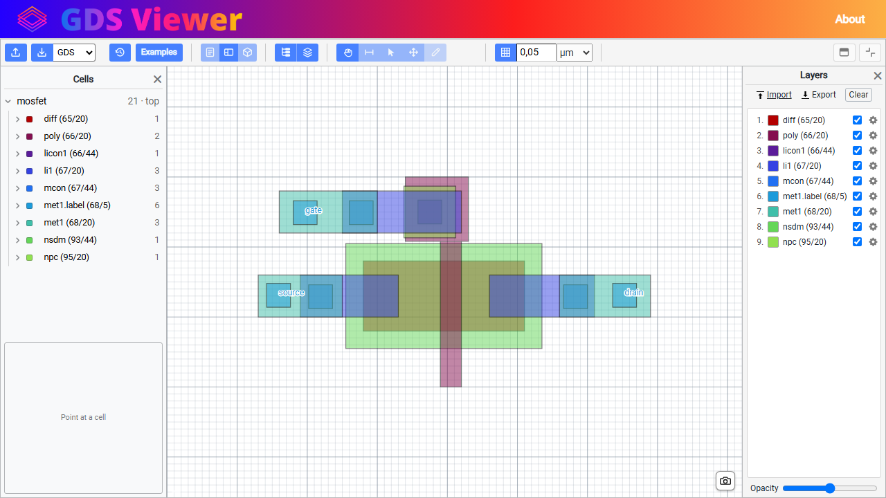
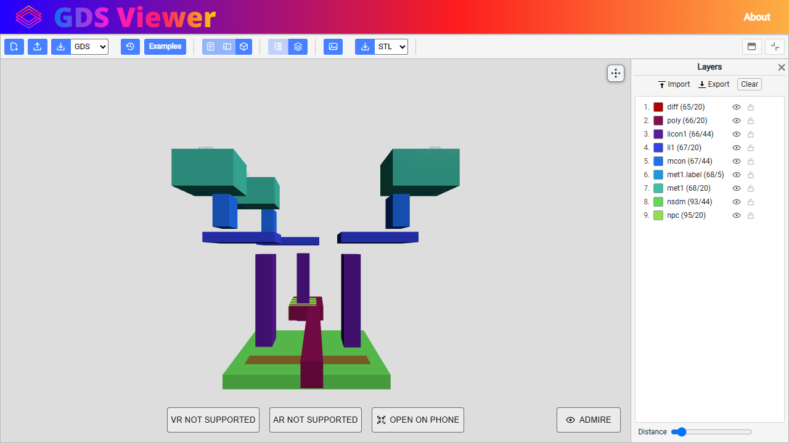
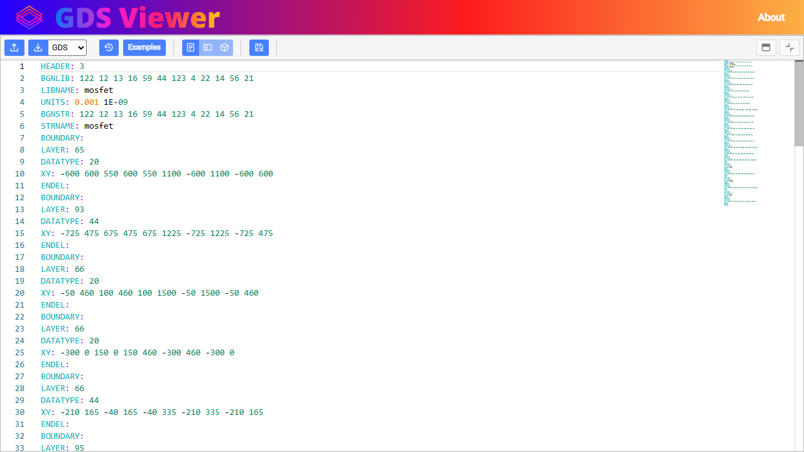

# GDS Viewer

### A free online GDSII viewer — open an IC layout file and inspect it in 2D, in 3D, or as raw records, entirely in your browser.

   

[](https://www.nuget.org/packages/GdsII) [](https://www.nuget.org/packages/GdsII.Cli)


## About


I got the idea to make an online GDSII viewer some time ago when I took a course to learn how to make an ASIC. When you create your chip design it will get output in the GDS format, which can be viewed and modified by the appropriate software. Most of it is not free and open source, except Magic and KLayout. Also, none of the software I found works in the browser, unlike my app, which is a PWA (progressive web app). This makes it cross-platform and much more accessible, as you don't have to install any software — simply visit a web page and that's it. Additionally, I added a 3D viewer, the ability to see your chip in AR/VR, and you can download the 3D model for whatever use (3D printing, maybe?).

At the time of writing, it has been more than 3 years since I started this. This viewer was meant to be embedded into another project that I later decided wasn't worth pursuing further, so this project subsequently lost some of its originally intended purpose. Combine that with my lack of time and working on other stuff, and I only occasionally worked on this, then did other things and forgot about it, came back to it, then left it again … But it's done at last.

I updated the UI and added more features, and the functionality is now also available as a [CLI tool](docs/CLI.md) and a [NuGet package](docs/NUGET.md) if you want to use some of it in your own projects.

📝 Blog post about the project: <https://eecs.blog/online-gds-file-viewer/>

> **Use it at your own discretion.** This still isn't a proper tool for making ICs, or at least I wouldn't recommend you use it for anything too serious or expensive. It is more useful for visualizing GDS files on websites, blogs and Obsidian notes, or embedded into other software that just needs a viewer to show its output.
> There is no guarantee that what it shows is correct — it may have bugs, and it may read or draw a file differently to the tool that wrote it. Double-check anything that
> matters against other software. See [Current limitations](#current-limitations).


## Try it out


🔗 Open the viewer: <https://eecs.blog/BlazorApps/GDSViewer/>


## Features

**Three views over the same file.** The 2D editor, the layout extruded into 3D, and the raw records — every
one of them editable, and every one built from the same parse.

The 2D editor: the layout as SVG, layers named from a layermap, the file's cells down the left and its layers
down the right.



The 3D view: every layer extruded to its thickness and stacked, with the Distance slider spreading them out
as you drag.



The text editor: the raw record stream in Monaco, editable and saveable back into the file.



**See [FEATURES-DEMO.md](docs/FEATURES-DEMO.md) for the rest of them, in pictures** — selecting and editing,
drawing, the grid, measuring, tracing a net, fill patterns, the cell tree and the layer settings.


### Feature List

- ⚙️ A **Blazor WebAssembly** single-page app. The GDSII parser is C# compiled to WebAssembly, so it runs
  in the browser tab — **your file is never uploaded anywhere**.
- 📲 An **installable PWA** with no CDN dependencies: Monaco and three.js are vendored into the app, so it
  keeps working offline once installed.
- ✏️ A **viewer that can also edit**. Reading, inspecting, downloading and exporting all work, and an edit
  made in the text view can be saved back into the file — within the limits in
  [Current limitations](#current-limitations).
- 🗂️ Open your own `.gds` file, or pick from **897 bundled examples** — the SkyWater
  [sky130](https://skywater-pdk.readthedocs.io/en/main/) standard-cell libraries plus a hand-made MOSFET.
  The picker filters as you type and previews each cell as you point at it. Open a sky130 cell and links to
  the relevant PDK documentation appear in the toolbar.
- 📐 **OASIS too, both ways** — `.oas` files open the same way, and a dropdown beside the download button
  chooses which format comes back out, starting on whichever the file arrived as. So opening a `.gds` and
  saving it as `.oas` is a conversion, and so is the reverse. The format going in is decided by what the
  file starts with rather than by its extension, so a renamed file still opens. Cells stay cells: the
  hierarchy is kept rather than flattened.
- 📄 **DXF in** — a `.dxf` drawing opens as a layout, in either the text or the binary flavor. Closed runs
  become boundaries and open ones paths; circles, arcs, ellipses and splines are flattened until the error
  is under a database unit; hatches become the area they fill, with their islands cut out; blocks become
  cells and inserts placements, mirroring and base points included. A layer named after a number *is* that
  number — `68/20`, `L68D20` — since that is how a drawing meant for a mask shop carries one, and the names
  come across either way. The drawing's own `$INSUNITS` sets the scale.
- 📐 **DXF out, too** — the same dropdown writes one. A release 12 drawing, which every reader still
  opens: cells stay blocks and placements stay inserts rather than being flattened, arrays become one
  repeated insert, and the layer numbers go into the layer names — `L68D20` — since that is the only
  place a DXF has to put them. So a layout can go back to whoever sent you the drawing.
- 🟦 **2D view** — the layout as an SVG, one path a layer with a subpath per element, drag to pan, scroll to
  zoom, adjustable opacity to see through stacked layers. Twenty thousand shapes pan at the screen's own
  frame rate. **Download Image** saves the whole layout, not only the part on screen.
- 🎯 **Center the view**, in 2D or in 3D, from the button in the top-right of the canvas — for when you have panned or
  orbited the layout off the edge of the window. And **where you are looking is part of the link**: frame
  something and the address says so, so a link or the QR code opens on that transistor rather than on the
  whole cell. It comes back on your next visit either way.
- 🖱️ **Tools** — **Pan**, **Measure** for a distance in units and microns, **Select** to click a shape and
  read what it is, **Move** to drag one whole, and — inside a cell — **Draw**. What is dragged follows the
  pointer rather than jumping when you let go.
- ✂️ **Edit in place** — click a shape and the panel says its layer, corner count and area, where it sits and
  how big it is, in microns you can retype to move or resize it exactly. Copy, cut, delete, turn, mirror,
  grow or shrink by a number, or group a selection into a new cell. Band-select several and they can be
  combined with booleans, lined up, spaced out or repeated into an array.
- ✏️ **Draw new shapes** — rectangles, polygons, ellipses, paths at a real width, and labels typed where they
  land. A layout format has no curves, so an ellipse is a many-sided polygon and the side count is yours to
  set — it says what it costs, too.
- 📐 **A grid to see and to snap to**, in nanometers, microns, millimeters or raw database units. It starts at
  the file's own grid rather than a round number, so the first thing you draw lands where the rest of the
  file already is. Drawing can also snap to a neighboring corner or edge.
- ↩️ **Undo that survives a refresh** — close the tab mid-edit, come back, and the edit is still there to
  take back.
- 🌳 **The cell tree** — every cell, what places it, and what is in it, down to the individual shapes. A cell
  placed by two parents appears under both. Right-click a row to rename, copy or delete it.
- 📥 **Put one file inside another** — open a second layout while one is on screen and it asks whether to add
  it to the open library or open it on its own. Added, its cells arrive whole and its top cell follows the
  pointer until you click to place it. Clashing cell names are renamed, references and all, and a file that
  measures in different units is scaled to match. The example the app opens for itself is never asked about -
  the first file you open just opens.
- 🔎 **Trace a net** — choose a shape on a conductor and everything electrically joined to it lights up,
  through vias and across layers, with any label sitting on it reported. Needs a layermap's `role` column,
  since nothing in the file says which numbers are metal.
- 🏷️ **Pin labels** — `TEXT` elements drawn in their layer's color in **both** the 2D and 3D views, so
  `A`, `Y`, `VPWR` and friends are readable on the layout, justified about their anchor the way the file
  asks. In 3D they turn to face you as you orbit.
- 🪆 **Hierarchy resolved** — `SREF` and `AREF` instances are placed with their reflection, magnification
  and rotation, at every level of nesting.
- 🔌 **Wires drawn at their real width** — a `PATH`'s centerline is expanded into the shape it occupies,
  with mitered corners and all four end-cap styles.
- 🧊 **3D view** — layers extruded and stacked in space, orbit and drag, adjustable layer spacing,
  scene backgrounds, and a cinematic camera orbit.
- 🥽 **WebXR** — enter the layout in VR or AR from a supported headset or phone. The chip is scaled from
  its own nanometer units down to something you can stand next to, and AR keeps the camera feed visible
  behind it.
- 📤 **Export the 3D model** as STL, OBJ or GLTF.
- 📝 **Text view** — the raw record stream, one record per line, in Monaco with a GDSII grammar: keywords,
  colons and numeric values colored, and typing offers every record type with its data type as
  documentation. **Save** reads the buffer back into the file, all or nothing: a line it cannot parse is
  reported with its line number and the loaded file is left exactly as it was. A save that works rebuilds
  the layer list and redraws, so an edit that adds or removes a layer shows up straight away.
- 🎚️ **Per-layer visibility** — toggle any layer on or off. A layer is a **layer/datatype pair**, the way
  every tool treats it, so `65/20` and `65/16` are separate rows with their own colors rather than one
  "layer 65" hiding drawn geometry and pins together.
- 🏷️ **Name your layers** — click a row and type, or **Import** a CSV of `layer,datatype,name` with further
  columns for a color, a height and a thickness, what the layer is for and how it is hatched. Any PDK's
  layermap converts to it — sky130's 432-row table took a single substitution — and `?layermap=` loads one
  straight off a URL. **Export** hands back the open file's own layers already in that format, every column
  filled in, so you edit a file rather than typing pairs into a blank one; **Clear** drops the lot.
  The numbers stay on the label — `diff.drawing (65/20)` — because the name is your mapping and the numbers
  are what the file says. Names persist across visits and across files, since a layer number means the same
  thing throughout a technology.
- 📋 **The bundled examples name their own layers.** Every file in the picker is a sky130 cell, so a
  twenty-row mapping that ships with the app is laid over one when it opens — a fact rather than a guess.
  Your own uploads get nothing, since sky130 names over another PDK's layout would be worse than numbers.
- 🩺 **Fill patterns** — dots, a grid, diagonals or crosshatch drawn over a layer's color, with a color and
  a screen size of their own. Color runs out before layers do.
- 🎨 **Color them yourself** — a swatch on every row opens a picker, and the colors you have used recently
  are offered again so a scheme is quick to apply. Reset any layer to the palette it started on.
- 🔤 **Labels on or off** — hide the `TEXT` elements without hiding the geometry they name, which usually
  sits on the same layer.
- 💾 **Picks up where you left off** — close the tab, come back, and the file is still open with your edit
  in it, your layers still hidden and named, and the view and sliders as you left them. Kept in your
  browser's own storage (IndexedDB), never uploaded. An edited or uploaded file is stored whole, because it
  exists nowhere else; an untouched bundled example is stored by name, since it is already on the server. A
  link still wins: opening `?file=…` gives you that file, not your last one.
- 🕘 **History** — the files you have opened, beside Examples, so one you uploaded an hour ago is a click
  away rather than gone.
- 📤 **Share the file** to another app on your device, on browsers that support it — still no upload,
  the browser hands the bytes over locally.
- 🔗 **Linkable** — `?file=sky130_fd_sc_hd__nand2_1&view=3d` opens that cell in that view, so any of the
  897 examples can be bookmarked or sent to someone.
- 📱 **QR code** of the current URL, to jump from desktop to a phone or headset — carrying the file and
  view with it, so you land on what you were looking at.


## Embedding


Drop the viewer into your own page in an `<iframe>` and set its whole opening state from the address. Nothing
needs building, configuring or hosting — every setting is a query parameter.


### Copy and paste this

```html
<iframe
    src="https://eecs.blog/BlazorApps/GDSViewer/?file=Mosfet&view=2d&mode=viewer&full=true&banner=false"
    width="100%"
    height="600"
    style="border: 1px solid #ddd; border-radius: 6px;"
    title="GDS layout viewer"
    loading="lazy"
    allow="xr-spatial-tracking">
</iframe>
```

That gives you a layout in the 2D view with the toolbar and sidebars left out — the picture and nothing else.
Drop `mode=viewer` for the whole app, or use `mode=noedit` for one that can be looked at but not changed.

`allow="xr-spatial-tracking"` is only needed if you want the VR and AR buttons to work from inside the frame;
everything else works without it.


### Every parameter

| Parameter | Values | Sets |
| --- | --- | --- |
| `file` | an example's name, e.g. `Mosfet` | Which layout opens |
| `view` | `2d`, `3d`, `text` | Which view it opens in |
| `mode` | `edit` (default), `noedit`, `viewer` | How much of the app is offered |
| `full` | `true`/`1`/`yes`/`on`, or the negatives | Whether the view takes the page's margins |
| `banner` | as above | Whether the GDS Viewer header is drawn |
| `grid` | as above | Whether the grid is on |
| `snap` | as above | Whether drawing snaps to it |
| `pitch` | a number | How far apart the grid lines are |
| `unit` | `nm`, `um`, `mm` | What that number is in |
| `tool` | `pan`, `select`, `move`, `draw`, `measure` | Which tool starts chosen |
| `background` | `none`, `background1.jpg` … `background4.jpg` | The 3D view's backdrop |
| `example` | `Name\|URL`, repeatable | A file of your own, in the picker |
| `layermap` | a URL | A layermap over the open file: names, colors, roles, patterns |
| `box` | `x,y,width,height` | Where the 2D view looks — pan and zoom, as an SVG viewBox |
| `camera` | `x,y,z,x,y,z` | Where the 3D camera stands, and the point it orbits |

Anything you do not name is left to whatever the visitor had last time, so you pin what you care about and the
rest stays theirs. `file` is the one exception: it is treated as authoritative and opens directly without
consulting the session, which is what a shared link should do.

A misspelled `tool` or `unit` costs that one setting and leaves the rest working, and so does a `box` or
`camera` that is not the right count of numbers.

**You do not have to work `box` and `camera` out.** They are the two parameters the app writes back: frame
the layout the way you want it, and the address in the bar is the link — copy it, or point the QR button at
it. Pan or zoom the 2D view, or orbit the 3D one, and a second after you stop the address says where you
are looking. The **center** button in the canvas's top-right puts the layout back in the middle of it, and
in the 2D view it takes `box` back out again, since that is the framing a fresh visitor gets anyway.


### The three modes

`mode` is the coarse control, and the one worth choosing deliberately:

| Mode | What it gives you |
| --- | --- |
| `edit` | The whole app. The default. |
| `noedit` | The whole app with everything that could change the file disabled — upload, history, draw and move. Pan, select and measure stay, because reading the layout is the point. |
| `viewer` | The canvas alone. The toolbar and layer sidebar are left **out of the markup** rather than hidden, so nothing invisible can be tabbed into. |

A `mode` this build does not recognize gives you the whole app, which is the safe direction to be wrong in: a
misspelled `noedit` that fell back to `viewer` would take the toolbar away with nothing on screen to say why.


### Your own files in the picker

```
?example=My%20cell|https://example.com/cells/my-cell.gds&example=Another|https://example.com/other.oas
```

One `example=` per file rather than one holding a list, because the value is a URL and a URL is full of the
characters a list would have to be split on. The split is on the **first** bar, so a bar inside the address
itself survives.

They appear at the top of the Examples picker under a "From this page" heading, above the files the app ships
with, and your name beats a bundled one. Only absolute `http`/`https` addresses are accepted; anything else is
refused quietly, one entry at a time.

**CORS is your job.** A file on another host has to be served with a header allowing this app's origin, or the
browser refuses the read. The app says so in the failure rather than reporting a bare network error, because a
page that has just embedded the viewer has no other way to find out.


### Naming the layers

```
?file=Mosfet&layermap=https://example.com/pdk/sky130.csv
```

**The one setting here that is not a preference.** Everything else in the table is "what should this start
as", and the visitor can change any of it. This is the difference between a feature working and not: what a
layer is *called* and what it is *for* are the two things a layout file does not carry, so a page showing one
layout has no way to say "and these numbers are metal" — and without that, Trace net is a button that grays
out with no way for the visitor to fix it.

The file is a CSV, the same one the app's Import button takes and the same one the
[`gds` command](docs/CLI.md#layermaps) reads:

```
layer,datatype,name,color,height,thickness,role,fill,patterncolor,patternsize
65,20,diff,#e69ac5,0,120,conductor
66,20,poly,#d80000,180,180,conductor
66,44,licon1,,300,180,via
```

A URL rather than the mapping itself, because a real one is hundreds of rows and a query string is not where a
PDK table goes. Same absolute `http`/`https` rule as `example=`, and the same code decides both.

It stays quiet when it works — a modal over every visitor's first sight of the layout would answer nobody's
question — and puts a dismissable line above the view when the fetch fails or the mapping matches none of the
file's layers, because the layers stay as bare numbers and nothing else explains why.

The bundled sky130 mapping is served from the app's own origin, so it works without a second host:

```
?file=Mosfet&view=2d&layermap=resources/GDS%20Files/sky130-roles.csv
```


### A few worth trying

```html
<!-- A 3D wafer, no chrome, spinning backdrop -->
<iframe src="https://eecs.blog/BlazorApps/GDSViewer/?file=Mosfet&view=3d&mode=viewer&background=background2.jpg"
        width="100%" height="500"></iframe>

<!-- Look but do not touch, with a grid in microns -->
<iframe src="https://eecs.blog/BlazorApps/GDSViewer/?file=Mosfet&mode=noedit&grid=true&pitch=0.5&unit=um"
        width="100%" height="600"></iframe>

<!-- Your own file, named from your own PDK table -->
<iframe src="https://eecs.blog/BlazorApps/GDSViewer/?mode=viewer&example=Ring%20oscillator|https://example.com/ring.gds&layermap=https://example.com/pdk.csv"
        width="100%" height="600"></iframe>

<!-- Opening on one transistor rather than the whole cell -->
<iframe src="https://eecs.blog/BlazorApps/GDSViewer/?file=Mosfet&mode=viewer&box=-300,-200,1400,1400"
        width="100%" height="500"></iframe>
```

How this is implemented, and how the precedence is tested, is in
[DOCUMENTATION.md](docs/DOCUMENTATION.md#embedding-the-viewer).


## The command line and the packages


Everything the viewer does to a file, it can do from a terminal too — read it, check it, name its layers,
draw it, extrude it, run booleans over it and convert it between GDSII, OASIS and DXF.

```bash
dotnet tool install -g GdsII.Cli
gds info cell.gds
```

| | |
|---|---|
| **[The `gds` command line](docs/CLI.md)** | Every command and option, layermaps, and what the app can do that it cannot |
| **[The NuGet packages](docs/NUGET.md)** | Using the format library from your own code, and how a release is cut |

The format library is its own project with **no dependencies** and nothing in it that touches a browser —
the web app is one consumer of it, and the command line is another.


## Documentation


| | |
|---|---|
| **[FEATURES-DEMO.md](docs/FEATURES-DEMO.md)** | Every feature, in pictures |
| **[DOCUMENTATION.md](docs/DOCUMENTATION.md)** | How to build, run and test it, and a walkthrough of every subsystem |
| **[CLI.md](docs/CLI.md)** | The `gds` command line |
| **[DRC.md](docs/DRC.md)** | Design rule checking: the deck format, the checks, and what they were measured against |
| **[WRITING-A-DECK.md](wwwroot/resources/WRITING-A-DECK.md)** | How to write a rule deck for your own PDK — a grammar you can hand to an AI |
| **[NUGET.md](docs/NUGET.md)** | Using the format library from your own code |


## Current limitations


The in-app warning banner is accurate — this is a work in progress. The most important gaps:

- **A saved edit is checked as far as one element, not beyond.** A line that cannot be read, a record
  missing or out of order, a coordinate list that is the wrong shape for its element — too few points, or a
  boundary that does not close — and an element carrying the same property attribute twice are all refused,
  naming the record and its line number. The whole save is refused rather than half applied, so a mistake
  costs you the save and not the file. What is *not* checked is anything spanning more than one element: a
  reference to a cell the file does not contain is reported rather than refused, and no rule compares one
  element against another. Check anything that matters in another viewer.
- **There is no share button.** There was one, offering the file to the Web Share API, and it is gone:
  every desktop browser refuses to share a *file* even where it will share a link, so on most machines it
  did nothing but explain that it could not. Download the file and share it from there.
- The 3D view's labels are camera-facing billboards, not extruded letters, so they do not appear in an
  exported STL, OBJ or GLTF — those contain the layout geometry only.
- **Converting between formats flattens a few things one can say and the other cannot.** Reading OASIS, a
  repeated element becomes one element per copy, and a circle or a named trapezoid becomes an ordinary
  polygon; writing it, a `NODE` has nowhere to go and is reported, a round path end becomes a square one,
  and a label loses its justification. What is drawn is the same; how it was written down is not. Size is
  no longer part of this entry: the OASIS written is packed — modal state, repetitions, manhattan point
  lists, compressed cell bodies — and comes out a little under KLayout's own output on the 897 bundled
  files.
- **VR and AR are shipped as-is, and will not be tested on real hardware.** The code handles the scaling,
  passthrough and depth range a session needs, but none of it has been run in a headset and none of it is
  going to be — so treat those two buttons as unproven rather than broken. AR also drops the layout wherever
  the headset started rather than on a surface it detects. Nothing else in the app goes through either path.
- Opening a single cell from a standard-cell library shows *"unresolved references"* geometry gaps,
  because such a file names the other cells it uses without containing them. That is how the files are
  built, not a parsing failure.


A fuller list, including the internal ones, is in
[DOCUMENTATION.md](docs/DOCUMENTATION.md#known-gaps).


## Third-party code


Vendored under `wwwroot/lib/`, with exact versions and file lists in
[`wwwroot/lib/README.md`](wwwroot/lib/README.md):

- [Monaco Editor](https://github.com/microsoft/monaco-editor) 0.41.0 — MIT
- [three.js](https://github.com/mrdoob/three.js) 0.152.0 — MIT

Also used: [Bootstrap](https://getbootstrap.com/) and
[Open Iconic](https://github.com/iconic/open-iconic) (in `wwwroot/css/`), and
[Net.Codecrete.QrCodeGenerator](https://github.com/manuelbl/QrCodeGenerator) via NuGet.

The bundled example layouts are from the
[SkyWater sky130 PDK](https://github.com/google/skywater-pdk), licensed Apache-2.0.


## License


Released into the public domain under [The Unlicense](UNLICENSE) — do whatever you want with it,
commercial or not, no attribution required.

That covers this repository's own code. The vendored libraries under `wwwroot/lib/` and the bundled
sky130 example layouts keep their own licenses; see [Third-party code](#third-party-code).

Provided as-is, without warranty. It is a development-stage tool — do not trust its output for
anything that matters without checking it against another viewer.
