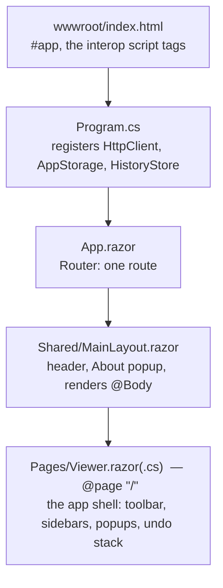
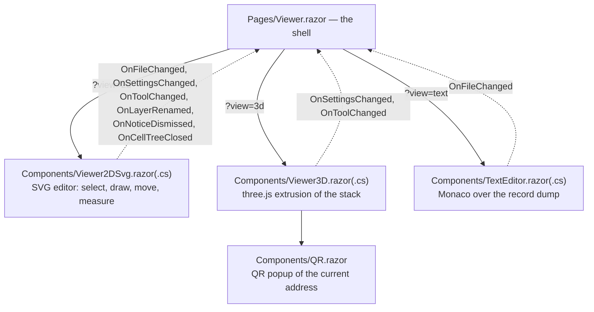
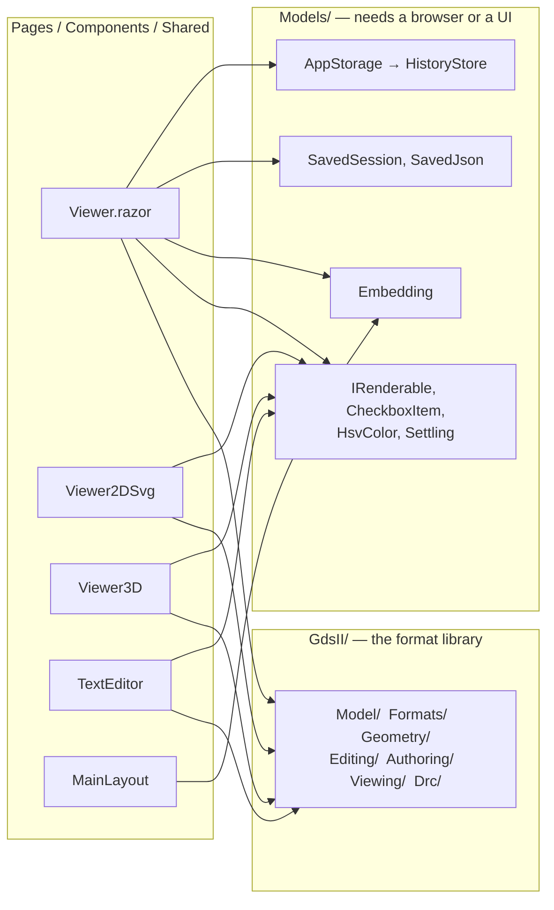
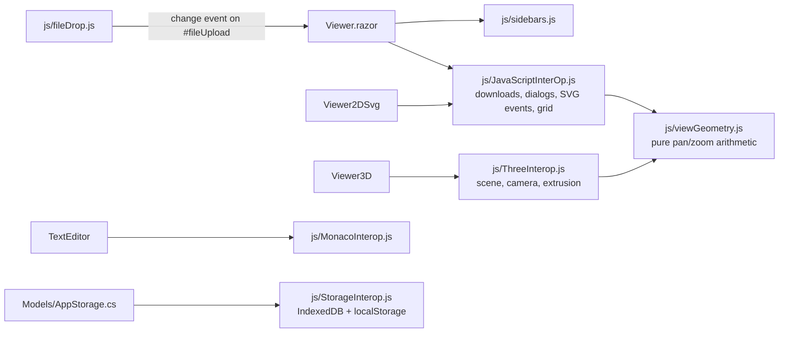

# Architecture — the map

Where every Razor component and C# class sits, and which one uses which. This is the map, not the
walkthrough: each subsystem's *why* lives in [DOCUMENTATION.md](DOCUMENTATION.md), and this file exists so
that finding a class does not require reading it. Every edge below is in the code; none of it is intent.

## From address bar to viewer

One route. The layout renders `@Body`, the router puts the one page in it, and everything else is a
component the page composes.

`Pages/` holds the one file with an `@page` directive and nothing else. Everything under `Components/` is
composed, never routed.

## The component tree

The shell renders exactly **one** view at a time, chosen by `ViewType` from `?view=` in the address. All
three implement `IRenderable`, which is the whole of what the shell knows about a view: `Render(gds,
showLayers, prepared)` and a toolbar. The QR popup belongs to the 3D view's toolbar, not to the shell.

Data flows down as parameters — the open `GDS`, the flattened layout, the layer checkboxes, the edit
history — and changes flow back up as the dashed callbacks. `onFileEdited` in the shell is the one funnel
every change goes through, whichever view raised it; that is what keeps the sidebar, the session and the
other views agreeing about what the file now contains.

## What each piece uses

Three layers, used strictly downward: components use `Models/`, both use `GdsII/`, and `GdsII/` uses
nothing of either — it has no browser, no UI, and is what the NuGet package ships.

Who uses what, at the class level — the heavy consumers first:

| File | From `Models/` | From `GdsII/` |
|---|---|---|
| [`Pages/Viewer.razor`](../Pages/Viewer.razor) + `.razor.cs` | `AppStorage`, `HistoryStore`/`HistoryEntry`, `SavedSession`/`SavedJson`, `Embedding`, `HsvColor`, `CheckboxItem`, `IRenderable` | `GDS`, `GdsFlattener`, `LayoutEdit`, `Hierarchy`, `Importing`, `Drc`/`DrcDeck`, `LayerNames`, `SvgWriter`, `Preview`, `Picking`, `Measure`, `Grid`, `Shapes`, `Fracture`, `Bounds`, the OASIS and DXF readers and writers |
| [`Components/Viewer2DSvg.razor`](../Components/Viewer2DSvg.razor) + `.razor.cs` | `Settling`, `SavedSession`, `CheckboxItem`, `IRenderable` | `GDS`, `GdsFlattener`, `SvgWriter`, `Picking`, `LayoutEdit`, `Hierarchy`, `CellContext`, `Booleans`, `Nets`, `Measure`, `Grid`, `Shapes`, `Aligning`, `Turning`, `Preview`, `Scaling`, `Bounds`, `Transform`, `Paths`, `Element` |
| [`Components/Viewer3D.razor`](../Components/Viewer3D.razor) + `.razor.cs` | `Settling`, `SavedSession`, `CheckboxItem`, `IRenderable` | `GDS`, `GdsFlattener`, `Booleans`, `Element` |
| [`Components/TextEditor.razor`](../Components/TextEditor.razor) + `.razor.cs` | `SavedSession`, `CheckboxItem`, `IRenderable` | `GDS` only — `AsText()` out, `Deserialize` back in |
| [`Components/QR.razor`](../Components/QR.razor) | — | — (renders SVG from `Net.Codecrete.QrCodeGenerator`) |
| [`Shared/MainLayout.razor`](../Shared/MainLayout.razor) | `Embedding` | — |

The asymmetry is the design: the shell owns everything that belongs to the *file* (the undo stack, the
session, the history, DRC, import and export), the 2D view owns everything that belongs to *editing*
(which is why its GdsII list is the longest), the 3D and text views mostly draw, and `MainLayout` knows
only whether an embedding address asked it to hide the header.

## The JavaScript seam

Each view has its own interop file, one per library, and they do not call each other. Two plain scripts
sit beside them: `viewGeometry.js` is pure arithmetic shared by the 2D and 3D interop (and required as-is
by the Node unit tests), and `fileDrop.js` turns a drop anywhere on the page into the same `#fileUpload`
change event the file dialog produces.

The odd one out is `Models/Counters.cs`: nothing in the app references it. It is `[JSInvokable]` and
exists to be called *from* JavaScript — `DotNet.invokeMethod('GDSViewer', 'FlattenCount')` — so an
end-to-end test can ask how many times the library was flattened, which no amount of looking at the screen
can reveal.

## Where the depth is

| For | Read |
|---|---|
| The shell, the toolbar protocol and `IRenderable` | [DOCUMENTATION.md — The page shell](DOCUMENTATION.md#the-page-shell-and-the-toolbar-protocol) |
| Each view in detail | [The 2D SVG view](DOCUMENTATION.md#the-2d-svg-view), [The 3D view](DOCUMENTATION.md#the-3d-view), [The text editor view](DOCUMENTATION.md#the-text-editor-view) |
| The library the views draw from | [DOCUMENTATION.md — The GDSII parser](DOCUMENTATION.md#the-gdsii-parser) onward, and the folder-by-folder tree in [Where everything is](DOCUMENTATION.md#where-everything-is) |
| Sessions, history and the undo stack's two lives | [Keeping a session](DOCUMENTATION.md#keeping-a-session) |
| What runs where at test time | [Testing](DOCUMENTATION.md#testing) |
