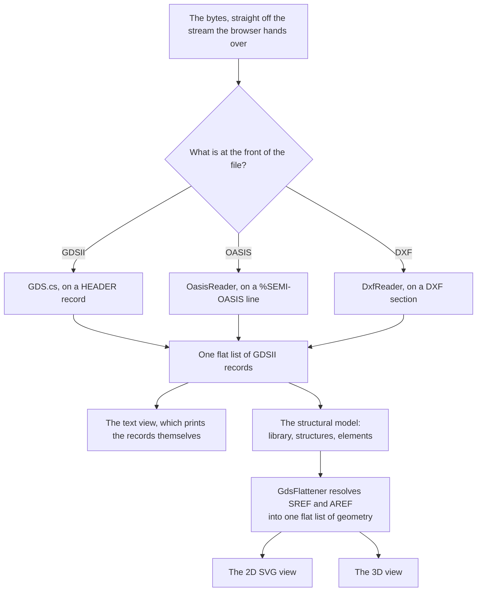
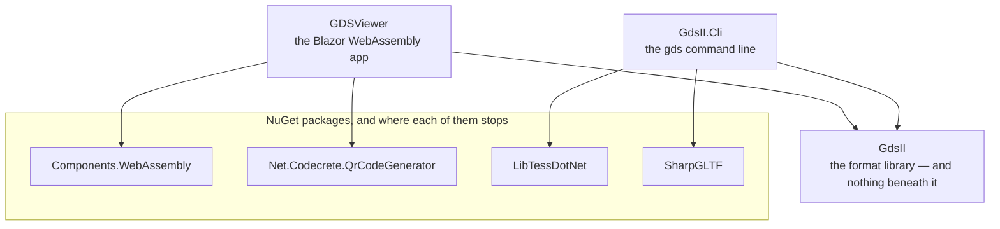
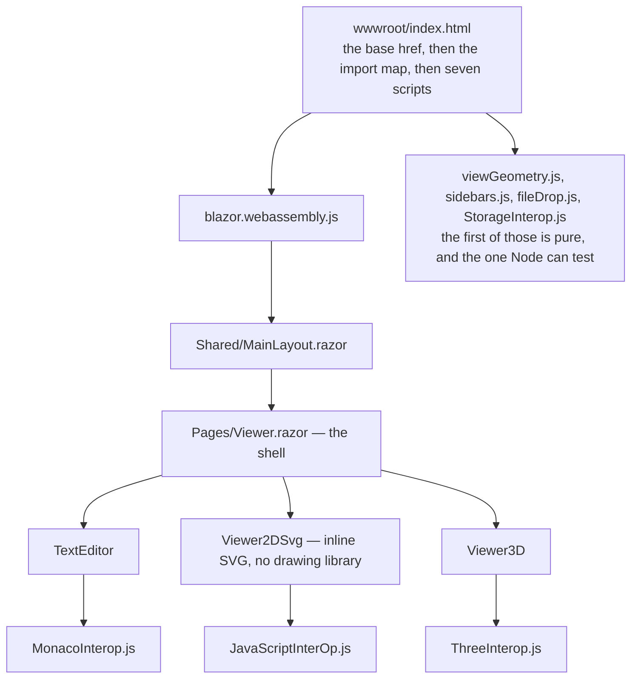
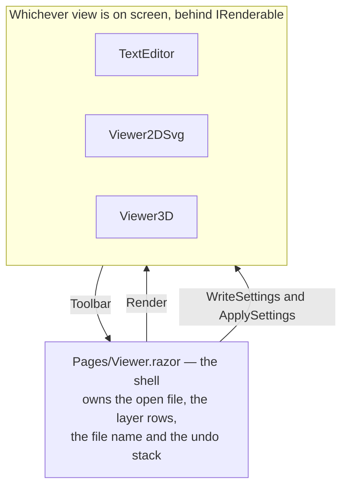
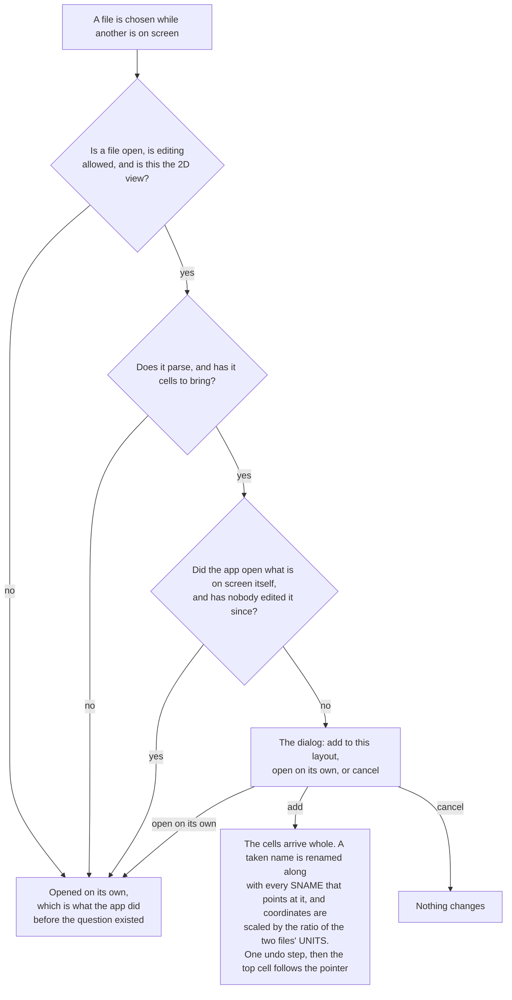
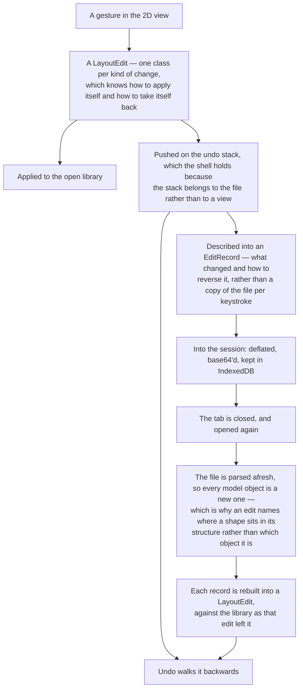
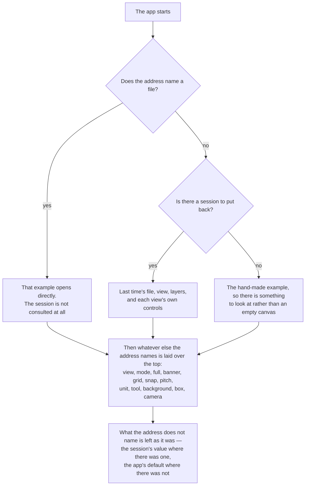

# GDS Viewer — Developer Documentation

This document describes how the app is put together, subsystem by subsystem. For the user-facing
overview see [README.md](../README.md); for code style see [CLAUDE.md](../CLAUDE.md).

## Contents

- [Overview](#overview)
- [Runtime & bootstrap](#runtime--bootstrap)
- [The GDSII parser](#the-gdsii-parser)
- [Reading OASIS](#reading-oasis)
- [Writing OASIS](#writing-oasis)
- [Boolean operations](#boolean-operations)
- [The structural model](#the-structural-model)
- [Making a layout](#making-a-layout)
- [Layers, colors and stacking](#layers-colors-and-stacking)
- [The page shell and the toolbar protocol](#the-page-shell-and-the-toolbar-protocol)
- [The 2D SVG view](#the-2d-svg-view)
- [The 3D view](#the-3d-view)
- [The text editor view](#the-text-editor-view)
- [Vendored JavaScript](#vendored-javascript)
- [Keeping a session](#keeping-a-session)
- [PWA and hosting](#pwa-and-hosting)
- [Embedding the viewer](#embedding-the-viewer)
- [Testing](#testing)
- [Build & run](#build--run)
- [Known gaps](#known-gaps)

## Overview

GDS Viewer is a **Blazor WebAssembly** single-page app (`net10.0`) that reads
[GDSII](https://en.wikipedia.org/wiki/GDSII) integrated-circuit layout files entirely in the browser.
Nothing is uploaded: the file is read straight off the stream the browser hands over, parsed by C# running
in WASM, and handed to one of three views through JS interop.
[OASIS](#reading-oasis), the format meant to replace GDSII, is read and [written](#writing-oasis) too —
converted into the same model on the way in, which is why everything downstream needs to know about only
one format, and back out of it on the way to a download.

[DXF](#reading-dxf) arrives the same way, so the whole read path is three front ends and one of everything
after them — and the place they meet is the record list rather than the views:



The extension is not consulted anywhere on that path — see
[Reading OASIS](#reading-oasis) for why a file is asked what it is rather than told.

**The format itself is a separate project.** [`GdsII/`](../GdsII) holds everything about GDSII — reading a
file into an object model, writing one back, validating it, the text dump in both directions, resolving
the hierarchy into flat geometry, rendering that to SVG, and converting to and from OASIS. The app
references it and is one consumer of it. The line is drawn at the browser: nothing in the library touches a
renderer, a UI framework or JS interop, which is what leaves it usable from a command-line tool or anything
else.

What stayed behind in [`Models/`](../Models) is what cannot cross that line — anything that is about *this app*
rather than about the format, or that reaches the browser:

| | |
|---|---|
| [`AppStorage`](../Models/AppStorage.cs) | IndexedDB and localStorage, through interop |
| [`SavedSession`](../Models/SavedSession.cs), [`SavedJson`](../Models/SavedJson.cs) | app state — a view, an opacity, a background — rather than a layout |
| [`HistoryEntry`](../Models/HistoryEntry.cs), [`HistoryStore`](../Models/HistoryStore.cs) | [the list of files opened](#the-history-list), which is a fact about the visitor |
| [`Embedding`](../Models/Embedding.cs) | [what the address is allowed to say](#embedding-the-viewer) |
| [`OtherModels`](../Models/OtherModels.cs) | `IRenderable`, `CheckboxItem`, the toolbar model |
| [`HsvColor`](../Models/HsvColor.cs) | the color picker's own arithmetic |
| [`Settling`](../Models/Settling.cs) | coalescing a drag across a slider |

`SvgWriter` did cross, and its signature changed to take a set of `LayerKey` rather than the shell's row
model: a library about GDSII should not have a type called `CheckboxItem` in its public surface. The
conversion now lives on `CheckboxItem` itself, on the app side.

All four projects target **net10.0**. The library and the CLI started on net8.0, to reach further as a
dependency — worth something while 8 was the current LTS, but it goes out of support in November 2026, and
in the meantime the floor was costing a .NET 8 install on every machine that opens the solution. Visual
Studio is what said so: it warns that a project targets a framework with no installed runtime, where the
command line stays quiet because the SDK pulls the reference pack from NuGet and compiles happily against
it. If someone does need to consume this from net8.0, the answer is to multi-target rather than to drop the
floor back and carry the same problem again.

A second consumer already exists: [`GdsII.Cli/`](../GdsII.Cli) is a console tool over the same library — its own
guide is [docs/CLI.md](CLI.md), and [docs/NUGET.md](NUGET.md) covers consuming the library from code.
Writing it found a hole in the surface immediately - there was no way to make a `GDS` from text alone.
`Deserialize(string)` replaces the contents of a library that is already open, which is what the editor's
save needs, but there was no route in from nothing. `GDS.FromText` is that route, and it exists because
something outside the app asked for it.

The CLI is also where the two package references live. `gds model` extrudes a layout into a solid, which
the app gets from three.js and a console tool cannot - so [LibTessDotNet](https://github.com/speps/LibTessDotNet)
triangulates the caps and [SharpGLTF](https://github.com/vpenades/SharpGLTF) writes the glTF. **Both are
referenced by `GdsII.Cli` alone**: the library stays dependency-free, which is the property that makes it
worth depending on, and the no-package-manager rule is about [what the app ships](#vendored-javascript)
rather than about every project in the solution. STL and OBJ are written by hand in
[`ModelWriters.cs`](../GdsII.Cli/ModelWriters.cs) - both are a triangle list with a header, and a dependency
for that would be more to keep current than to write.

Which leaves the solution one library with nothing under it, and two consumers that each pay for their own
surroundings:



The empty space under `GdsII` is the point of the drawing: anything added there is paid for by everything
that depends on it, forever.

Inside the app, the six scripts under `wwwroot/js` are shared out one to a view, with three that belong to
nobody in particular:



**Every one of those six is asked for by name, and the name is checked.** A script tag whose spelling differs
from the file only by case works on Windows and macOS and 404s on any host worth deploying to, which is a
defect that cannot be seen on the machine it is written on —
[`ShippedAssetTests`](../tests/ShippedAssetTests.cs) reads `index.html` and holds every local `src` and `href` to
the directory listing rather than to `File.Exists`, since `File.Exists` is precisely the check that cannot tell
the difference. It also asserts the other direction: a file under `wwwroot/js` that nothing loads is either
dead or a script tag somebody forgot.

Design points:

- **Two-stage parse.** `byte[]` becomes a flat `List<Record>` first, then a second pass walks that list
  into a nested model (library, structures, elements). Both stay available: the text view prints the
  flat records, the renderers walk the tree.
- **The views are interchangeable.** Each implements `IRenderable.Render(GDS?, List<CheckboxItem>?)` and
  is swapped by a `switch` in the shell. The shell owns the file, the layer list, and the toolbar.
- **The build is warning-free**, which makes a new warning worth reading. See
  [Nullability](#nullability) for the convention that keeps it that way.
- **No bundler.** Monaco and three.js are vendored under `wwwroot/lib/`; `dotnet build` is the whole
  build. See [Vendored JavaScript](#vendored-javascript).

Dependencies: **Microsoft.AspNetCore.Components.WebAssembly** and
**Net.Codecrete.QrCodeGenerator** (the QR popup). No other NuGet packages.

### Where everything is

```
GDSViewer/
  Program.cs                    # Blazor WASM host builder
  App.razor                     # Router: one route, "/" (the view goes in ?view=)
  Shared/MainLayout.razor       # Header, About popup, hosts the viewer
  Pages/
    Viewer.razor(.cs)           # The app shell and the ViewType enum
    QR.razor                    # QR code popup
  Components/
    Viewer2DSvg.razor(.cs)      # 2D SVG view
    Viewer3D.razor(.cs)         # 3D three.js view
    TextEditor.razor(.cs)       # Monaco record view
  GdsII/                        # The format library. No browser, no UI - see below
    GDS.cs                      # Records, payload decoding, structural model, validation
    RecordData.cs               # The payload types, one per GDSII data type
    BitFields.cs                # STRANS, PRESENTATION and ELFLAGS unpacked
    TextFormat.cs               # Parses the text dump back into records (the save path)
    GdsFlattener.cs             # Resolves SREF/AREF into flat geometry
    Hierarchy.cs                # The cell tree, and what places what
    PathOutline.cs, Paths.cs    # A PATH's centerline expanded to the shape it occupies
    Transform.cs, Turning.cs    # Placement composition; rotating and mirroring geometry
    Scaling.cs, Bounds.cs       # Units and extents
    Element.cs                  # Layer/datatype keys, layers, palette, stacking offsets
    LayerNames.cs               # A layermap: names, colors, the stack, roles and patterns
    SvgWriter.cs                # A flattened layout as SVG markup, and every icon
    Picking.cs                  # Which shape a click landed on
    LayoutEdit.cs, EditRecord.cs # Every edit, and an edit written down so it survives a reload
    CellContext.cs              # Which cell is being edited, through which placement
    Aligning.cs, Grid.cs        # Lining up and spacing out; the grid and snapping
    Booleans.cs, Clipper2/      # AND/OR/XOR/NOT and offsetting, over vendored Clipper2
    Nets.cs, Measure.cs         # Tracing a net; area and extent
    OasisReader.cs, OasisWriter.cs   # OASIS in and out
    DxfReader.cs, DxfWriter.cs, DxfBinary.cs, DxfCurves.cs  # DXF in and out
    LayoutWriter.cs             # Flat geometry back into a library
    Synthetic.cs, Preview.cs    # The benchmark's generator; the example thumbnails
  GdsII.Cli/                    # The gds command-line tool, over that library
    Cli.cs                      # Every command, taking writers and returning an exit code
    Cli.Convert.cs              # Format conversion, either way
    Cli.Geometry.cs             # boolean and size
    Cli.Bench.cs                # Timing a generated layout
    LayerFilter.cs              # --layers and --hide
    LayoutMesh.cs, ModelWriters.cs   # Extrusion, and STL/OBJ/GLTF
    Program.cs                  # Main, and nothing else
  Models/                       # App-only: the parts that need a browser or a UI
    AppStorage.cs               # IndexedDB and localStorage, over JS interop
    SavedSession.cs, SavedJson.cs    # What is put back when you return
    HistoryStore.cs, HistoryEntry.cs # The list of files opened
    Embedding.cs                # What the address is allowed to say
    HsvColor.cs                 # The color picker's arithmetic
    Settling.cs                 # Coalescing a drag across a slider
    OtherModels.cs              # IRenderable, CheckboxItem, ToolBarItem
  wwwroot/
    index.html                  # Host page: base href, import map, interop scripts
    js/                         # ThreeInterop, MonacoInterop, JavaScriptInterOp,
                                #   StorageInterop, sidebars, fileDrop, viewGeometry
    lib/                        # Vendored Monaco + three.js (see lib/README.md)
    css/, resources/            # Styles, icons, backgrounds, sample GDS files
                                #   resources/GDS Files/examples.json is generated by the build
  tests/                        # xUnit tests (net10.0)
  jstests/                      # Browser-JS unit tests (node --test, no packages)
  e2e/                          # Playwright end-to-end specs
  tools/                        # Takes the screenshots the docs are built from,
                                #   under playwright.screenshots.config.js
  playwright.config.js          # Starts the app itself and runs e2e/ against it
  package.json                  # Test tooling only - never part of the app build
  docs/                         # Everything written down, except the readme
    DOCUMENTATION.md            # This file
    FEATURES-DEMO.md            # Every feature, in pictures
    CLI.md, NUGET.md            # The command-line tool, and the package
    DRC.md                      # Design rule checking: the engine and what it cannot do
    (the two authoring guides live in wwwroot/resources, so the app can hand them out)
    THIRD-PARTY-NOTICES.md      # Everyone else's terms, carried along
    images/                     # The screenshots the two above are built from
  CLAUDE.md                     # Code style guidelines
  README.md
```

### The files worth knowing first

| File | Responsibility |
|---|---|
| `GdsII/GDS.cs` | The whole GDSII implementation: record framing, payload decoding (including REAL8), and the structural model. |
| `GdsII/Element.cs` | Layer discovery, the stacking offsets, the 255-color palette, and the flattened render primitives. |
| `Pages/Viewer.razor` | The app shell: file loading, view switching, layer sidebar, toolbar host. |
| `GdsII/SvgWriter.cs` | Builds the 2D view's SVG markup: layer visibility, label justification, opacity. |
| `GdsII/TextFormat.cs` | Reads the text dump back into records — the text view's save path. |
| `GdsII/LayoutEdit.cs` | Every edit as one class each, undoable, and writable to a session. |
| `GdsII/Picking.cs` | Which shape a click landed on, now that the picture is one path per layer. |
| `Components/Viewer2DSvg.razor` | The 2D editor: hosts that markup, and every gesture over it — select, band, move, draw, turn, align, array, combine, measure, and the cell context. |
| `Components/Viewer3D.razor` | Flattens geometry for three.js; background, cinematic, export and QR toolbar. |
| `Components/TextEditor.razor` | Hosts Monaco over `GDS.AsText()`. |
| `wwwroot/js/ThreeInterop.js` | The three.js scene: extruded meshes, controls, WebXR, exporters. |
| `wwwroot/js/MonacoInterop.js` | Lazily loads Monaco and registers the custom `GDS` language. |
| `wwwroot/js/JavaScriptInterOp.js` | SVG pan/zoom, SVG download, and the generic blob download. |

## Runtime & bootstrap

- **[`wwwroot/index.html`](../wwwroot/index.html)** is the host page. An inline script sets
  `<base href>` before anything else: `/` on localhost, otherwise `window.location.pathname`, so the
  app works when served from a GitHub-Pages-style subpath. The **import map must stay after that
  script** — its relative URLs resolve against the document base URL as it is parsed.
- Three interop scripts load next: `JavaScriptInterOp.js` and `MonacoInterop.js` as classic scripts,
  `ThreeInterop.js` as `type="module"` (it uses `import`).
- **[`Program.cs`](../Program.cs)** is minimal: it registers the `App` root component, `HeadOutlet`, and a
  scoped `HttpClient` pointed at the base address (used to fetch the bundled sample files).
- **[`App.razor`](../App.razor)** hosts a `Router`, which resolves `Pages/Viewer.razor` at `@page "/"`.
- **[`Shared/MainLayout.razor`](../Shared/MainLayout.razor)** draws the header (logo, About popup) and
  renders `@Body`. It used to name `<GDSViewer.Pages.Viewer>` directly, which is what left the router
  matching nothing and `<NotFound>` unreachable.

### The URL

One route, and **the view lives in the query string** — `?view=2d`, `?view=3d`, `?view=text` — not as a
path segment. That is forced by the bootstrap above rather than chosen for taste: `index.html` sets
`<base href>` from `window.location.pathname`, so any path below the app root would *become* the base and
break every relative asset URL and the import map with it. A query string leaves the path alone. It also
avoids needing the host to rewrite unknown paths onto `index.html`, which GitHub Pages does not do, so a
shared link keeps working wherever the app is served from.

`[SupplyParameterFromQuery]` feeds the slug in, `OnParametersSet` applies it, and switching views calls
`NavigateTo(..., replace: true)` — replace, because switching views is not something the back button
should have to walk back through. The slugs are spelled out in `slugOf`/`viewOf` rather than taken from
the enum names, which would put `View2DSvg` in a link meant to be read and would tie a bookmarked URL to
an identifier that is free to be renamed. An unrecognized slug falls back to the 2D view.

An address with no `?view=` is left alone rather than rewritten to `?view=2d`: a bare link already lands
where a bare link should. The `<select>` is bound to the field instead of carrying a hardcoded `selected`
option, so arriving on a link shows the view that is actually on screen.

**`?file=` names a bundled example** — the file name without its `.gds`, so
`?file=sky130_fd_sc_hd__nand2_1&view=3d` opens that cell in the 3D view. The full name rather than a short
one because `nand2_1` exists in the hd, hs and hvl libraries; a name that does not match reports itself
and shows the shape of a real one, since these names are long and a pasted link is usually wrong by a
character or two. `Mosfet.gds` is checked separately from the manifest, which excludes it because the
picker lists it above the sky130 cells.

An **uploaded** file cannot be named in the address — it exists only in the tab it was dropped into — so
uploading clears `?file=` rather than leaving the address claiming a bundled example that is not what is
on screen.

`?file=` is acted on from `OnAfterRenderAsync` rather than `OnParametersSet`, because it needs the example
manifest and it reports a bad name through a JS alert. That timing is load-bearing: `OnInitializedAsync`
yields on the manifest fetch, so **Blazor renders once before the list exists** and the first
`OnAfterRenderAsync` runs with it still empty. The slug is therefore not consumed until
`exampleListFetched` is set — without that, a linked example was reported as not existing, which is
exactly what happened on the first run.

The payoff is the QR code, which exists to get you from a desktop onto a phone or a headset: it now
encodes `NavigationManager.Uri` rather than `BaseUri`, so scanning it from the 3D view of a cell opens
that cell's 3D view.

## The GDSII parser

[`GdsII/GDS.cs`](../GdsII/GDS.cs) is the whole format implementation. `new GDS(byte[])` runs
`Deserialize`, which calls `parseRecords` then `constructGDS`, then builds `AdditionalInformation`.

Of the other implementations worth comparing this against, `python-gdsii` is the closest structural
analogue, and `gdspy`'s `gdsiiformat.py` is the reference for the eight-byte real described below.

### Record framing

A GDSII record is a 4-byte header followed by its payload:

| Bytes | Meaning |
|---|---|
| 0-1 | total record length, **big-endian**, header included |
| 2 | record type |
| 3 | data type |
| 4+ | payload (`length - 4` bytes) |

The length is read **unsigned**. It is only two bytes, and reading it signed would make any record past
32767 bytes come out negative; nothing in the format caps record size there.

Every length in the file is checked before it is trusted, because the cursor is driven by numbers the
file itself supplies. `parseRecords` rejects a stream with too few bytes left for a header, a length
below the four-byte header (zero being the dangerous one — the cursor would never advance and the loop
would spin forever), and a record claiming more bytes than remain. `constructGDS` then rejects an empty
record list and a stream that does not begin with `HEADER`, and converts the `ArgumentOutOfRangeException`
that the forward-only model walk raises when it runs off the end into a readable "ends before its
structure is closed". All of these are `InvalidDataException`, which `Viewer.selectFile` catches and
reports in an alert, leaving whatever was already loaded on screen.

### Reading off a stream

There are two readers. `Deserialize(byte[])` is for bytes already in hand — a session's base64 payload, a
fetched example. `GDS.FromStream` and `GDS.FromStreamAsync` read a record at a time off a stream, which is
what the file a user opens off their machine and what the CLI reads off disk both are.

The difference is what is alive at once. The array reader wants the whole file in memory before it starts,
so the bytes and the records they become are both held; in the browser it was three copies, since an
uploaded file arrives as a stream that had to be drained into a `MemoryStream` and then `ToArray`'d before
a single record existed. The stream reader keeps the records and nothing else.

Both exist in sync and async form because the browser leaves no choice: a Blazor WASM file stream refuses
a synchronous read outright, and a CLI has no reason to be asynchronous. What they agree on —
`checkRecordLength` — is written once, so their messages cannot drift. What they cannot agree on is the
one check that needs the whole file: an array reader knows a record declares more bytes than remain before
it reads them, and a stream only finds out by running out, so it says *"the stream ends inside it"* rather
than quoting a count it never had.

**A stream is read in a loop, never in a single `Read`.** A `Read` is allowed to return fewer bytes than
asked for and routinely does — a network stream hands over what has arrived, the browser's file stream
hands over a chunk. Read once and every record after the first short read is framed from the wrong offset,
which surfaces as a corrupt file rather than as a bug in the reader. A test stream that never returns more
than one, two, three or seven bytes at a time pins it; against a `MemoryStream`, which always answers in
full, the bug is invisible.

Anything that is not already a `MemoryStream` gets a `BufferedStream` in front of it. This reads a
four-byte header and then a payload of a hundred or so, which against a raw file handle is two round trips
per record and tens of thousands of them for one layout.

**The upload limit was the browser's default, and nobody had chosen it.** `IBrowserFile.OpenReadStream`
refuses anything over 512 KB unless told otherwise, and the GDS upload was not telling it — so a real
layout of a megabyte was refused, with a message about a limit nobody had picked. Every bundled example is
under 60 KB, which is why neither the 897-file corpus nor the e2e suite ever met it. The ceiling is a
gigabyte now, and it is not meant to be the thing that stops you: what runs out first is the browser's
memory, which no number here can move.

`parseRecords` reads bytes 2-3 as a single big-endian `short`, which is why `RecordType` packs both
bytes into one enum value — `LAYER = 0x0D02` is type `0x0D` with data type `0x02` (INT2), and
`XY = 0x1003` is type `0x10` with INT4.

Because the low byte *is* the data type, `setData` derives it rather than restating it:

```csharp
DataType = (RecordDataType)((short)Type & 0xFF);
```

It then names only the three records that need more than a straight conversion — `UNITS` (two reals),
`XY` (a run of coordinates rather than one INT4), and `BGNLIB`/`BGNSTR` (which also expose a `DateTime`
pair). This replaced a 270-line switch that hand-assigned a data type per record type, and which had
drifted from the enum for **ten** of them: `WIDTH`, `PLEX` and `RESERVED` were read as INT2 where the
type word says INT4, `ATTRTABLE` and `SRFNAME` as INT2 where it says ASCII, `STRCLASS` as INT2 where it
says BITARRAY, and `BGNEXTN`, `ENDEXTN`, `LIBDIRSIZE` and `LIBSECUR` had no case at all, so their
payloads were dropped. A test walks every value of the enum and asserts the decoded type matches the
declared one, so the class of bug cannot come back.

### Payload decoding

A payload is a [`RecordData`](../GdsII/RecordData.cs) — an abstract base with one sealed subclass per
GDSII data type:

| Class | Holds | For |
|---|---|---|
| *(null)* | — | a record with no payload |
| `BitArrayData` | `byte[]` | `STRANS`, `PRESENTATION`, `ELFLAGS` |
| `Int2Data` | `short[]` | `LAYER`, `DATATYPE`, `COLROW`, timestamps |
| `Int4Data` | `int[]` | `XY` coordinate runs, `WIDTH`, `PLEX` |
| `Real8Data` | `double[]` | `UNITS`, `MAG`, `ANGLE` |
| `AsciiData` | `string` | `LIBNAME`, `STRNAME`, `SNAME`, `STRING` |
| `RawData` | `byte[]` + the declared type | anything else — see below |

Each class owns its **decoding, its encoding and its text formatting**. Those three used to live in
three separate switches — one picking a decoder, one picking an encoder, one picking a format — none of
which knew about the others. That is the same shape that let `setData` drift from the format for ten
record types, so here a new data type cannot be added without implementing all three.

Arrays are the single shape: `Int2Data` holds `short[]` even when the payload is one value, and `Value`
returns the first. That removes a scalar-versus-array split the encoder previously had to handle twice.
The text view still prints a lone value bare and a run space-separated, which is a deliberate two-line
choice inside `AppendText` rather than a consequence of two different runtime types.

`Record.DataType` is **derived** from the payload rather than stored beside it, so the two cannot
disagree; a private `declaredDataType` covers the one case the payload cannot answer, a record that
names a type and then carries nothing. `BGNLIB` and `BGNSTR` additionally expose their twelve INT2
values through `Timestamps`, a typed `(DateTime Modified, DateTime Accessed)?`.

**`Timestamps` is an interpretation, not the data.** The raw INT2 values in `Data` are the truth — the
record writes back out as it came in and the text dump reports exactly what the file said — while
`Timestamps` applies two readings on top:

**Impossible stamps become null rather than an exception.** Files carry a year of 0, a month of 13, the
30th of February, and `new DateTime(...)` throws `ArgumentOutOfRangeException` on all of them. That used
to escape the parse and take the whole file with it, so a perfectly readable layout would refuse to open
over a field nothing here draws from. Null is returned for the pair as a whole, since half a pair is not
useful. The cases are caught from the constructor rather than checked in advance, because checking would
mean a second implementation of which days each month has, leap years included — a rule `DateTime` owns.

**A year below 1000 is read as an offset from 1900**, in `toFullYear`. Writers disagree about this field
and the sample files contain both conventions: the 896 sky130 cells write the full year (`2019`, 3584
times across the corpus), while `Mosfet.gds` writes `122` and `123` — the C `tm_year` convention, for 2022
and 2023. Read literally, that dates a 2022 file to the year 122.

It is a heuristic and worth knowing as one: nothing in the record distinguishes "2022, written the old
way" from "the year 122". It is applied because every file that actually uses small years means the
former, and a viewer reporting 122 AD is wrong in a way nobody wants. Two details of the cut:

- **1000, not 100** — `122` has to be caught, and no convention produces a year between 200 and 999.
- **Negative is left alone** — corruption under either reading, and shifting it would turn nonsense into a
  plausible 19th-century date instead of leaving it visibly unreadable.

The tests pin both edges of that cut (`999` shifts, `1000` does not) and assert both conventions against
real files, so a future reader can see exactly which values the guess changes.

### Bit fields

`STRANS`, `PRESENTATION` and `ELFLAGS` are two-byte flag words, so they decode to `BitArrayData` like
any other bit array. [`GdsII/BitFields.cs`](../GdsII/BitFields.cs) reads meaning out of them —
`Strans`, `TextPresentation` and `ElementFlags`, each with a `From(RecordData?)` that falls back to the
format's default when the record is absent or malformed.

Interpretation lives beside the payload rather than in it, on purpose: `convertData` picks a payload
class from the type word's low byte alone, and giving these three their own `RecordData` subclasses
would mean branching on the *record* type there too — reintroducing exactly the coupling that let
`setData` drift for ten record types.

The one thing worth stating loudly: **GDSII numbers the bits of these fields from the left**, so bit 0
is the most significant. Reflection is `0x8000`, not `0x0001`. Every mask in that file is written as the
bit number from the format's own tables, with `BitField.IsSet` doing the translation, because writing
them as hex by hand is where this normally goes wrong.

| Field | Contents |
|---|---|
| `STRANS` | bit 0 reflect about X (before rotation), bit 13 absolute magnification, bit 14 absolute angle |
| `PRESENTATION` | bits 10–11 font (0–3), 12–13 vertical justification, 14–15 horizontal — **no size**, that comes from the `MAG` in the text's own `STRANS` |
| `ELFLAGS` | bit 15 template data, bit 14 external data |

Only `0`, `1` and `2` are defined for the justification pairs, so a `3` falls back to the default rather
than becoming a nameless enum value.

`RawData` is what makes the set total. A data-type code comes out of the type word and can be anything
at all: `REAL4`, which no record type actually declares; a `NODATA` record that carries a payload
anyway; or a code out of a malformed type word. Keeping those bytes verbatim means such a record still
writes back out unchanged instead of quietly shrinking the file.

This replaced `dynamic`, which read more nicely at the call sites but bound every access through the C#
runtime binder and pulled `Microsoft.CSharp` and `System.Linq.Expressions` into the WASM payload — two
assemblies and 0.68 MB of a published build, for a handful of conversions on the hot parse path.

### REAL8

GDSII does not use IEEE 754. `Real8Data` decodes the format's own 8-byte real:

- bit 7 of byte 0 is the **sign**
- bits 6-0 of byte 0 are the **exponent, excess-64**
- bytes 1-7 are a 56-bit **mantissa**, read as a fraction in `[1/16, 1)`

giving `value = fraction * 16^(exponent - 64)`, negated if the sign bit is set. A zero mantissa
short-circuits to `0` whatever the exponent. The canonical encoding of `1.0` is therefore
`41 10 00 00 00 00 00 00` — exponent 65, mantissa `2^52`.

The divisor for the fraction is `2^56`, which is what the format means by a fraction and what KLayout uses
in both directions. It was `2^56 - 1` until the two were compared — see [Writing](#writing) for what that
cost, which was nothing measurable, and why it changed anyway.

### Writing

`Record.Serialize()` is the inverse of the read path: it emits the big-endian length, the packed type
word, then the payload encoded from `Data` according to `DataType`. The length is **derived from the
payload** rather than remembered from the file, so editing a value to a different size cannot leave a
stale length behind.

`GDS.Serialize()` **measures before it writes.** Every payload reports an `EncodedLength` it knows from
what it holds, so the whole library is sized up front and filled in one pass. Growing a stream instead
meant three passes over a file that can be very large: each record allocating its own array to be copied
in, the stream reallocating as it doubled, and one more full copy to get the array back out.

That makes `EncodedLength` and `Encode()` a pair that has to agree exactly — too small a buffer throws,
too large leaves trailing zeros on the end of a file — so
[`SerializeTests.cs`](../tests/SerializeTests.cs) pins them per payload type. The trap is adding a payload
type and implementing only one of the two.

`Real8Data` divides the mantissa by `2^56`, which is what the format means by reading it as a fraction and
what KLayout does in both directions. It used `2^56 - 1` until the two were compared; nothing observable
changed, since over two million random mantissas the two divisors decode to the same double every time,
the gap being `1.4e-17` relative where a double's precision is `2.2e-16`.

The round trip does not depend on that choice, which is what the old comment here got wrong: encoding
inverts decoding whatever the two divide by, as long as they agree. What it does depend on is the mantissa
carrying no more than a double can hold. That is not a given — a 56-bit mantissa does not fit in 53 bits,
and 69% of *arbitrary* 56-bit values do not survive the trip — but it is true of every mantissa a real
writer produces, because that writer held the value in a double too. Measured over 200,000 values across
the exponent range a layout uses, `double → bytes → double` and `bytes → double → bytes` are both exact.

ASCII payloads are null-padded to an even length, since every GDSII record length must be even, and
`convertData` strips that byte again on the way back in.

`REAL4` is **kept as raw bytes**, not decoded and not refused. The format lists it as unused and no record
type declares it, so there is no value to read out of one — but a record carrying it would still be lost if
the payload were dropped, and a file is not something to shrink on the way out. `RawData` holds the bytes
for it, for a `NODATA` record that carries a payload anyway, and for a data-type code from a malformed type
word; all three round-trip in [`SerializeTests.cs`](../tests/SerializeTests.cs).

Fidelity is pinned by a round-trip test over the whole bundled corpus — all 897 files parse, serialize,
and come back **byte for byte identical**. That includes the REAL8 records.

### Interoperability

Until this was checked, "correct" only ever meant "self-consistent": `Serialize()` round-tripped all 897
bundled files byte for byte, but nothing except this parser had ever read a file it wrote. **Checked
against KLayout 0.30.9, both directions, and both open questions came back clean.**

Ours, read by KLayout — a library our writer assembled from scratch, with no input bytes to copy:

```
begin_lib 0.001
begin_cell {TESTCELL}
box 42 0 {0 0} {1000 500}
end_cell
```

- **The REAL8 divisor question is settled.** KLayout reports the database unit as exactly `0.001` at 17
  significant digits — not `0.0009999999999999998` — so the `2^56 - 1` encoding is read identically by a
  reader that does not share the assumption.
- **The padding question is settled, both ways.** KLayout read our unpadded file without complaint, and
  the files *it* writes are 268 and 1386 bytes — neither a multiple of 2048, and both ending in a bare
  `ENDLIB`. It neither expects padding nor emits any, so this parser refusing trailing bytes is not a
  problem in practice. An older tool that pads would still trip it.
- **An edited file survives the trip.** A sample edited through the text view and written out opens in
  KLayout with layer `65/20` become `200/20`, the other eight layers, 18 shapes, 3 texts and the same
  bounding box.

KLayout's, read by us — the direction that can be automated, and is, in
[`InteropTests.cs`](../tests/InteropTests.cs) against two files kept in
[`tests/fixtures/`](../tests/fixtures):

- Both parse with **no unknown record types** and **round-trip byte for byte through `Serialize()`**, which
  says the two implementations agree about record framing, payload encoding and padding at once.
- Geometry this writer would never produce is read correctly: a three-point triangle, and a rectangle
  KLayout chose to emit as a `BOX` rather than a `BOUNDARY`.
- KLayout's own `UNITS` read back to `0.001` and `1e-9`.

And a **DXF** it wrote, in [`DxfRealFileTests.cs`](../tests/DxfRealFileTests.cs) — `Mosfet.gds` saved out as
`klayout-written.dxf`, so the DXF reader has a file from an exporter rather than one hand-written to
exercise a branch, and the original beside it to compare against. Every shape lands on the same
coordinates, every label keeps its text and position, and the layer numbers come back through the names
KLayout puts them in. Regenerated with:

```python
layout = pya.Layout()
layout.read("wwwroot/resources/GDS Files/Sky130 GDS/Mosfet.gds")

options = pya.SaveLayoutOptions()
options.format = "DXF"

layout.write("tests/fixtures/klayout-written.dxf", options)
```

Two things it settled that a hand-written fixture could not have raised: KLayout names its DXF layers
`L65D20`, which is a GDSII pair spelled out and the only place a DXF has to carry one — and it winds its
rings the opposite way to the GDSII it read them from, which is the same polygon and is why the comparison
normalizes rather than matching point sequences as written.

The **writer** goes the other way through the same tool, in `Klayout_reads_a_dxf_this_wrote`. That test is
the only one of the writer that is not circular: everything in [`DxfWriterTests.cs`](../tests/DxfWriterTests.cs)
goes out through this project's writer and back through this project's reader, which says the two halves
agree with each other and nothing about whether either is right — a wrong idea shared between them
round-trips perfectly. KLayout has never seen the code, reads the drawing, and comes back with the same
geometry on the same layers, the numbers taken out of the `L65D20` names.

That file is also what the **binary** DXF reader is checked against, in
[`DxfBinaryTests.cs`](../tests/DxfBinaryTests.cs). Nothing on hand writes binary DXF, so the test converts the
text one and reads it both ways: the two produce a byte-identical library, over every group code a real
exporter emits and in the order it emits them. That covers breadth and nothing else — a code both paths
had in the wrong range would be encoded wrongly and read back wrongly and would still match — so the type
of each range is pinned separately by hand-built bytes in the same file.

The reciprocal half — what KLayout makes of our output — began as a check done by hand, with `strmcmp`,
`strm2txt` and a Ruby script reporting `dbu`, cells, layers, shape counts and bounding box at full
precision. **It is a test now**, traited `Needs=KLayout` the same way the OASIS tests are, so it re-runs
wherever KLayout is installed:

- A library built here from nothing — cells, an `AREF` placing one of them, boundaries across four layers —
  is written, read by KLayout, written back out, and compared flattened against our own reading.
- And a **converted** file, where a DXF supplies no layer numbers, no units and no cell structure, so the
  entire record list is this project's invention.

Built rather than borrowed on purpose. The corpus comes back byte for byte, so handing one of those to
KLayout would only ask whether KLayout reads a file that KLayout-compatible tools already wrote; the bytes
worth asking about are the ones this project *chose*.

It is a comparison between two readings of the same file rather than against an expected answer, so it is
worth being clear about what that does and does not catch. It catches a file KLayout will not read at all,
and anything the two read *differently* — a transform applied the other way, an array off by a pitch, a path
outlined to a different shape. It does not catch a value both read identically: a wrong `UNITS` leaves it
green, because the comparison is in database units and both sides scale alike. Shifting one written
coordinate fails both tests, which is the check that the check works.

**KLayout is the reference, and deliberately the only one.** gdstk, gdspy and python-gdsii would each be
another data point, but a second reference is a second thing to keep agreeing with, and where two of them
differed this project would have to pick anyway. One mature implementation, checked in both directions and
read at the source, is the standard being held to. What that leaves genuinely unknown is narrower than it
sounds: not "is this correct" but "does anything else read the format differently", and the answer only
matters if a real file turns up that this refuses and something else opens.

#### Reading its source, not just its output

Running KLayout says whether two implementations agree on the files at hand. Reading it says *why*, and
answers the questions a corpus cannot reach — the ones about records no bundled file contains. Its GDSII
support is four files under `src/plugins/streamers/gds2/db_plugin`. Four things came out of it.

**`AREF` placement is right, and was unverified.** `read_ref` takes the three `XY` points as an origin plus
the far end of each run and divides each vector by its count from `COLROW`, so the stored vector is the
whole span and not one step. `GdsFlattener.appendArray` does the same. No bundled file has an `AREF`, so
until this the rule came from the format's prose alone.

**The bit-field masks are right.** `STRANS` reflection is `0x8000` and the absolute-magnification and
absolute-angle flags are `0x0004` and `0x0002`; `PRESENTATION` carries horizontal justification in the low
two bits and vertical in the next two. All four match [`BitFields.cs`](../GdsII/BitFields.cs), which is worth
having pinned because the format numbers bits **from the left** and that is exactly the sort of thing that
is wrong for years without anyone noticing.

**The year field had a third convention.** `get_time` reads a year under 50 as a two-digit 2000s year and
only then falls back to years-since-1900. This code had only the second rule, so a file stamped `24` came
out as 1924. Fixed, and the cut is now KLayout's rather than a guess of ours — see the year heuristic in
[`GDS.cs`](../GdsII/GDS.cs).

**The REAL8 divisor is `2^56`.** Both directions of KLayout agree on it, so the deviation this had is gone;
see [Writing](#writing).

What it also showed is how much more forgiving a mature reader is, which is its own entry under
[Known gaps](#known-gaps).

## Reading OASIS

[`GdsII/OasisReader.cs`](../GdsII/OasisReader.cs) reads OASIS (SEMI P39), the format that was meant to replace
GDSII. [`GdsII/OasisWriter.cs`](../GdsII/OasisWriter.cs) writes it; that half is [below](#writing-oasis).

**An OASIS file becomes a GDSII library rather than a model of its own.** Everything downstream — the
structural model, the flattener, both views, the layer sidebar, the text editor, the exporters — speaks
GDSII records, and a parallel model would mean a second copy of all of it. So the reader emits the record
list a `.gds` would have produced and hands it to `GDS.FromRecords`, which runs the same structural pass a
parsed file gets. Which means the conversion comes free in both directions: an OASIS file downloads as
valid GDSII the moment the format picker beside that button is switched to GDS, and the name follows the
bytes rather than the file they came from, because handing back a `.oas` holding GDSII would be a file
every tool refuses on sight.

**Which format a file is comes off the file, not its name.** The two are told apart at the front —
`%SEMI-OASIS\r\n` against a GDSII `HEADER` — and an extension is a guess about something the file has
already answered. A `.oas` mailed as `.gds` opens either way. In the browser and the CLI that means reading
the first thirteen bytes and putting them back in front of the stream, since neither a browser file stream
nor standard input can be rewound.

### What the format does differently

Three things make an OASIS reader a different shape from a GDSII one, and all three are places to be wrong
quietly rather than loudly:

- **Numbers are variable-length.** Seven bits a byte, the top bit saying more follows. Signed quantities
  carry the sign in the *low* bits of the first byte, and deltas carry a direction there instead — one bit
  for a sign, two for a compass direction, three to include the diagonals, four for the general case. All
  of it goes through one `ReadPacked(skipBits)`, because they are the same encoding with a different number
  of bits held back.
- **Almost every field is optional.** A record's first byte says which of its fields are present; the rest
  are whatever the last record set. That is where the compactness comes from and where a reader fails
  silently: miss one and every element after it lands on the wrong layer, at the wrong place, or both. The
  modal variables are reset at a cell boundary — but only the positions and the addressing mode, not the
  layer or the sizes or the point lists, which deliberately carry across.
- **A CBLOCK is a deflated run of ordinary records.** The cursor moves into the inflated bytes and comes
  back out where the compressed ones ended, so nothing above that level knows the difference. Raw deflate,
  no zlib header, which is what `DeflateStream` reads natively — no dependency needed.

### What conversion costs

A few OASIS ideas have no GDSII spelling and are expanded on the way through. **A repetition becomes one
element per position** — GDSII's `AREF` covers only a rectangular grid of *references*, where OASIS repeats
any element in eleven different patterns. **A CTRAPEZOID or a CIRCLE becomes an ordinary boundary**, a
circle at 64 segments. That is lossless for what is drawn and lossy for how it was written down, which is
the right trade for a viewer and the same one every GDSII exporter makes. Expansion is capped, because a
fill pattern repeated a few million times is one record that would become a few million elements.

Two smaller ones. **A label's anchor is written down**, because OASIS hangs a label from its bottom-left
corner and GDSII from its top-left — a converter that says nothing moves every label up by its own height.
And **the timestamps are invented and fixed**, at 1970, because OASIS records none and converting the same
file twice should produce the same bytes twice.

## Writing OASIS

[`GdsII/OasisWriter.cs`](../GdsII/OasisWriter.cs) is the other direction. Reachable three ways: `gds convert
cell.gds -o cell.oas`, the format picker beside the app's download button, and `OasisWriter.Write` in the
library.

**The hierarchy is kept.** A cell goes over as a cell and a placement as a placement, so a library of two
hundred standard cells placed a thousand times stays two hundred cells and a thousand placements rather
than becoming a million polygons. That is the whole reason to write the format, and it is why the writer
walks the structural model rather than the flattener's output the way
[`LayoutWriter`](../GdsII/LayoutWriter.cs) does for `boolean` and `size`.

OASIS gets its size from three things: modal variables, where a record omits a field that has not changed
since the last one; repetitions, where one record stands for a grid of copies; and compression. Before any
of them it is already smaller than the GDSII it came from, because a variable-length integer beats a fixed
four, a coordinate is a delta rather than an absolute, and a rectangle — which is most of a layout — is a
position and two lengths rather than five points.

### Modal state, and what compression left of it

**A record leaves out the layer, datatype and sizes the one before it already set.** 87% of consecutive
elements in the bundled corpus share the previous element's layer and 90% its datatype, so most records
carry neither.

**Measured, it is worth 22.7% — and 1.5%.** Both are true and the difference is the whole point. Written
without compression the corpus goes 2,444,116 bytes to 1,889,143, which is what the technique is worth on
its own. With the cell bodies compressed it goes 1,392,811 to 1,371,339, because a run of records that all
repeat the same layer byte is exactly what DEFLATE was already removing. The techniques overlap almost
entirely, and the one that came first took nearly all of it.

That is worth knowing before reaching for the next one. Anything that saves bytes by *not repeating
something* is being paid for twice, and the second payment is small.

**The reader resets none of this at a cell boundary, so neither does the writer.**
`OasisReader.resetCellState` resets the addressing mode and the six x/y variables and nothing else — layer,
datatype and the sizes carry from the last record of one cell into the first record of the next. A writer
that reset them would leave out a field the reader still thinks it knows. Compressing the bodies changes
nothing here: the state belongs to the reader, not to the buffer it is reading from.

**Labels have their own pair.** `textlayer` and `texttype` are separate modal variables from `layer` and
`datatype`. A writer sharing one pair between them goes wrong only when a label's numbers match the shape
before it — then it omits them and the reader fills them from its own text pair, which is whatever the last
label said. `Layers_carry_across_a_cell_boundary_the_way_the_reader_expects` is built around exactly that
order, because a label on some third layer proves nothing.

**Placements are left alone.** `placement-cell` is modal too and the name could be omitted when it repeats,
but the corpus has seven placements in one file and no arrays at all, so there is nothing here to check it
against. Untested modal state is the kind this writer's own history warns about.

The path extension scheme also stays on every path. It is one byte, the two extensions behind it are a pair
of signed numbers with their own modal state, and paths whose ends differ are common enough that leaving it
out would trade a byte for a class of bug.

### Measuring the size

Two of these, because a size claim that nothing repeats is a size claim that stops being true quietly.

**`gds convert` says what it wrote**, in bytes and as a percentage of what it read, for all three formats.
That makes the command the measuring stick for anything done to a writer: convert the same file with two
builds and the difference is on screen, where before it needed converting twice and running `ls`.

**`gds bench` times the OASIS write and prints its size**, beside parse, flatten, svg and merge. Compaction
costs time as well as saving bytes, and the same write runs in a browser tab when somebody presses
download, so the two numbers belong next to each other rather than one of them being the story. On a
generated 20,000-shape layout: 65 ms, and 810 bytes against 1,280,106 of GDSII — the generator lays a uniform grid, and repetition detection swallows a grid whole, so the number says more about the input than the writer. 49,772 before repetitions were detected, which is the honest comparison for a layout with no pattern in it.

**And the corpus total is pinned by a test.** `The_corpus_is_no_larger_than_it_was_measured_at` writes all
897 bundled files and holds the sum under a ceiling, because nothing else in the suite can see size at all:
the round trips ask whether the shapes come back, and they come back whether the file is packed or not. It
is a ceiling rather than an equality so that getting smaller is never a failure, with a couple of per cent
of room for a .NET version whose DEFLATE differs.

### Manhattan point lists

**A step that is purely horizontal or purely vertical is written as its length alone.** The general point
list carries a g-delta per step — a direction and a distance together — where kinds 0 and 1 alternate the
axis and write only the number. Kind 0 starts horizontal, kind 1 vertical.

**A closed outline leaves its last corner out entirely.** The reader walks the steps and then adds one more
point along whichever axis has not just been used, so a ring of N corners writes N−2 numbers where the
general kind writes N−1 g-deltas.

**Measured, 1,285,977 bytes to 1,191,819 — 7.3%**, and 1,682,755 to 1,421,780 written plain. Like
repetitions and unlike modal state, most of it survives compression, and for the same reason: it does not
remove a repeated byte, it removes a piece of information. There is no axis in the file at all for DEFLATE
to notice was predictable.

**Strict alternation, or it falls back to the general kind.** Two steps along the same axis in a row — a
collinear pair, which is a corner that is not a corner — cannot be written this way, because the reader
takes each step's axis from the alternation rather than from the file. Nor can a step of zero length, which
is a repeated point. A closed ring is checked all the way round including the edge the reader invents, and
an odd number of corners is refused outright since it cannot alternate and close.

**None of that is reachable from the bundled corpus**, where every boundary is manhattan and none has a
collinear pair, so both fallbacks are covered by fixtures written for them:
`An_outline_with_a_collinear_pair_falls_back_and_still_round_trips` and `A_diagonal_outline_still_round_trips`.
The first of those needed six corners rather than five — at five it fell back on the parity check and never
reached the alternation it was written to test.

**And the corner count is asserted in order**, by `A_manhattan_polygon_keeps_its_corners_in_order`, because
`GdsTestData.Geometry` compares corners as a sorted de-duplicated set and cannot see this class of mistake
at all. One step *too few* corrupts the shape and five tests catch it, KLayout among them. One step too
many turns out not to corrupt anything: the corner the reader invents lands exactly on the first one, so
the file is correct and one number longer. That is a size fault rather than a correctness one, and it is
what the corpus ceiling is for.

### Repeated rectangles

**A row of the same rectangle is written once, with a count and a pitch behind it.** Rectangles only —
they are 86% of the boundaries in the bundled corpus and all of what a via array or a fill pattern is made
of, and a polygon run would need whole point lists compared rather than four numbers. Runs of three or
more, along one axis, at a constant pitch; two would spend a repetition record to save one rectangle.

**Measured, 1,371,339 bytes to 1,285,977 — 6.2%.** Written without compression it is 1,889,143 to
1,682,755, so unlike modal state this one keeps most of its value through DEFLATE: it removes whole
records rather than repeated bytes, and compressing five records is still five records where a repetition
is one. That is the difference between the two techniques and it is why this one was worth its risk and
modal reuse was marginal.

**This is the only thing the writer does that reorders the file.** A run is written where the first of its
members sat and the rest are skipped, so a shape can move earlier within its cell. Nothing in OASIS makes
the order of geometry within a cell mean anything — it is a set — but a diff between two conversions is no
longer a diff of the layout.

**Along x first, then along y among what is left.** A grid of vias satisfies both, and taking the rows
leaves each column with one member, which is not a run. The other order collapses the same grid the other
way for the same saving.

**The anchor is the lowest coordinate, not the first element.** A repetition lays its copies out from the
record it hangs off, stepping one way, so the record has to be the member the run starts from. The position
it is *written at* is the lowest element index — a different rectangle whenever the file does not store its
shapes in coordinate order, which sky130 does not. Anchoring on the wrong one lays the whole run out from
the wrong end, and the corpus said so exactly: the same number of shapes, in the wrong places.

### Placements

**A placement leaves out the cell it names when the last one named the same**, and a row of the same cell
at a constant pitch collapses into one record with a repetition, exactly as a row of rectangles does.

**Neither can be measured on the bundled corpus.** All 897 files have one cell; seven placements exist in
one of them and there are no arrays at all. So the size numbers everywhere else in this section have
nothing to say here, and both features are held by fixtures written for them rather than by the corpus. On
a 20×20 grid of placements written out one at a time, collapsing takes 1,426 bytes to 413.

**The modal name is one variable for both placement records and both ways of naming a cell** — see
readPlacement, where whichever of the name and the reference number is given clears the other. This writer
only ever writes names, so a transformed placement can follow a plain one that already said which cell, and
does.

**A placement's repetition bit is 0x08 where a shape's is 0x04.** The two records do not share an info
byte. Reading one layout for the other gives a file that parses into nonsense rather than one that fails,
which is the kind of mistake that is cheap to make here and expensive to find.

**Only the right-angle, unit-magnification form is collapsed.** A transformed placement carries a real
magnification and a real angle, and whether two of those are "the same" is a floating-point question this
has no reason to ask: layouts that place a cell along a row place it the same way up.

**An `AREF` is still the better form, and the gap is now one dimension.** It arrives as a repetition
covering a grid both ways, where run-finding takes the rows and leaves twenty of them: 335 bytes against
413 for the same four hundred copies. That comparison used to be 335 against 1,435, and the change is the
longhand being collapsed rather than the array being worse.

**A test of its own, because nothing else can fail on it.** Writing the name every time is *correct*, only
longer, so every round trip passes and KLayout is content — and the corpus, where a size regression would
otherwise surface, has almost no placements. `A_placement_leaves_out_the_cell_the_last_one_named` places
one cell twice against placing two cells with names of equal length, so the only thing that can differ is
whether the second record carries a name.

### Compressed cell bodies

**Each cell's records go into the file as a `CBLOCK`** — record 34, DEFLATE, the uncompressed and
compressed counts, then the deflated bytes. Measured over the 897 bundled files: **2,444,116 bytes to
1,392,811, 43% off**. On a 200,000-shape layout it is 2,778,822 to 484,276 — against 12,800,106 of GDSII,
which is 26× smaller.

**It is the one compaction technique that changes no record**, which is why it came first. Every byte
inside a block is a byte this writer already produced and 897 files already round-trip through KLayout, so
a bug here cannot make a wrong shape — only a block that will not inflate, and that fails at the first
record read rather than quietly. That is the opposite of the modal-state bargain above, and it is what
makes this worth taking on its own.

**`CELL` stays outside the block.** A reader has to know which cell it is in before the geometry arrives —
this one resets its per-cell modal state when that record is read — so the name has to be readable without
inflating anything.

**Whole records only, and never nested.** The reader steps out of a block the moment its inflated bytes run
out and carries on from the outer buffer, so a record straddling the end would be read half from one and
half from the other: quietly wrong rather than refused. A body is built from complete records, so it cannot
arise. Nesting cannot either — `Cursor` holds a single outer buffer, and one block per cell has nothing
inside it that compresses anything.

**Only when it pays.** DEFLATE on a few dozen bytes is usually longer than what it compresses, and the
header costs four or five more. A library holding one rectangle comes to 308 bytes stored plainly and 314
as a block, so the plain body goes in whenever the packed one is not smaller. Most of this repository's own
examples are standard cells, which is exactly the size where that matters.

**`Optimal` rather than `SmallestSize`**, which is not what the names suggest. On the 200,000-shape layout
SmallestSize is neither smaller nor faster — 484,276 bytes in 284/334/283 ms against Optimal's 482,662 in
187/233/184 — and `Fastest` is worse on both counts again, since what it saves in searching it spends
writing the extra bytes out. SmallestSize does win on the corpus of small cells, by a little over one per
cent, and that is not worth a third again as long on every file written.

One thing this changed elsewhere: an `AREF` written as a repetition used to be a *tenth* of the same
placements written longhand, and is now a quarter. Four hundred identical placements are exactly what
DEFLATE is best at, so compressing the longhand closes most of the gap. The repetition is still the better
form — it is what a reader expands rather than four hundred records it walks — but the tenth was a number
about uncompressed files.

**An array is only a repetition when the steps come out whole.** GDSII stores where an array *ends* and
divides; OASIS stores the step, and a step is a whole number of database units. Three copies across four
hundred units is a step of 133⅓, which no repetition holds — so those are written out a placement at a
time, each rounded to its own nearest unit. Rounding the step instead would not merely move a copy but move
each one further than the last.

**What has no OASIS spelling.** A GDSII `NODE` marks an electrical connection rather than an area, and
there is nothing to write it as; those are counted and reported — by `gds convert`, and by a line in the
page under the app's toolbar — rather than dropped in silence. A `TEXT` loses its `PRESENTATION`, since an
OASIS text is an anchor and a string with no justification of its own. A round-ended `PATH` becomes a
half-width extended one, the closest of the three ends the format offers: the same reach, square corners
instead of a semicircle.

### What the corpus does not cover

Worth writing down, because it was a surprise. Of the 897 bundled files, exactly **one** has a placement in
it, **none** has an array, a box or a node, and **none** has more than a single cell. Run against the
corpus alone a writer could get every placement record wrong and pass 897 times. So the hierarchy, the
arrays, the four right angles, the mirror, the magnification and the four kinds of path end are exercised
by a library built in [`OasisWriterTests.cs`](../tests/OasisWriterTests.cs) that has one of each — and KLayout
reads that file, which is the only check that is not this project agreeing with itself.

Writing the explicit-extension path also surfaced a **pre-existing bug in the reader**: it emitted `WIDTH`
*after* `BGNEXTN`/`ENDEXTN`, which is out of the order GDSII fixes and this project's own parser enforces.
Nothing had reached it, because KLayout writes flush or half-width path ends and never the explicit pair —
so that branch was only ever taken by a file written here, and until there was a writer there were none.

## Boolean operations

[`GdsII/Booleans.cs`](../GdsII/Booleans.cs) does the four set operations on layout geometry — AND, OR, NOT,
XOR — and grows or shrinks a shape. Between them they are what a PDK is written in: a transistor gate is
not a drawn layer but `poly AND diff`, and a design rule is a size followed by a boolean, so *"closer than
200 nm"* is answered by growing one shape by 200 and asking whether it now touches the other.

**The arithmetic is [Clipper2](../GdsII/Clipper2/README.md)'s**, vendored as source. Robust polygon clipping
is not something to write — coincident edges, self-intersections and rounding all have to be right at
once — and everyone who needs it uses the same library. What is here is the translation. **Nothing is
scaled**: layout is on an integer grid and Clipper works in 64-bit integers, so a database unit goes in
and comes back unchanged.

**Every input is wound the same way first.** GDSII says nothing about which direction a boundary runs and
real files carry both, and the non-zero fill rule counts windings — so two overlapping shapes drawn in
opposite directions cancel and leave a hole where there is solid metal. This only bites when both are in
the *same* set, which merging a layer is; Clipper sorts out a subject against a clip by itself, which is
why the first test of this passed with the normalization removed and had to be rewritten to use `Merge`.

### Holes, and why GDSII cannot have one

A boundary is a filled outline and nothing else. There is no hole record, and a hole written as a second
boundary on the same layer is drawn as solid — so a shape with a hole has to reach in and come back out
along the same line. That is a **keyhole**, and it is what every tool emits and expects.

Each hole is bridged by casting a ray to the right from its rightmost corner and cutting in at the first
edge the ray meets. The holes are taken rightmost-first and each is spliced into the ring the last one left
behind, so a ray that would have crossed another hole meets the boundary of the hole already folded in.
The landing point is rounded to the grid like everything else, which moves the boundary by under a
nanometer at one point and keeps the ring simple, because the point is still inserted between the two
corners it lies between.

The two things worth asserting about a keyhole are that the area afterwards is the outer less the holes —
the channel encloses nothing — and that reading the result back finds the same shape again. Both are
tested; removing the keyholing reddens four.

A shape sitting inside a hole is an outline again, not part of the ring around it, and comes back as its
own shape. An island in a lake.

### Merging a layer before extruding it

The 3D view runs `Booleans.MergeByLayer` over the flattened layout and extrudes the result, because **two
slabs at the same height fight over which is in front**. A layer's shapes are allowed to overlap — 171 of
the 897 bundled files have a layer that does — and extruded separately their top faces land on exactly the
same plane, which is the one thing a depth buffer cannot decide. The result flickers between them as the
camera moves. Merged, there is one face.

**Held rather than recomputed.** It depends only on the file, and the spacing slider redraws the whole
scene on every step of a drag while changing no geometry — running a clipping pass there would be the most
expensive thing in the app happening for no reason.

**The holes go over as holes, not as keyholes.** A three.js `Shape` takes them directly. The keyhole a
GDSII file has to use is a channel whose two edges lie on top of each other, which is the case an
ear-clipper handles worst — and merging the bundled corpus produces 55 of them, so this is not
hypothetical. It is also why merging could have made things *worse*: a ring drawn as four rectangles
renders correctly today as four slabs, and folding it into a keyholed ring would have put a degenerate
polygon through the triangulator to fix an artifact that file never had.

That the hole is really cut was measured rather than assumed. Ignoring the hole list and re-rendering
`sky130_fd_sc_hd__and3_1` moves the total top-face area from 38,231,650 to 38,646,600 square database
units; the difference is the hole.

**The model exporter does the same, and it matters more there.** A mesh with two faces in the same place
is not a solid — it is non-manifold, which is what a slicer refuses and a mesh checker reports as a defect,
and the volume is wrong on top of it because the overlap is counted twice. On screen the same geometry is
only a flicker. `LayoutMesh` walls every ring including a hole's, and hands the hole to LibTessDotNet as a
contour of its own, for the same reason three.js gets a `Path`.

**One consequence worth knowing:** the 3D view no longer draws one mesh per GDSII boundary. `Mosfet.gds`
has two shapes on 66/20 that meet along an edge, so eighteen boundaries become seventeen slabs covering
the same ground — which is why the e2e suite holds `MOSFET_MESHES` apart from `MOSFET_POLYGONS` rather
than deriving one from the other. The two views deliberately draw the same layout differently now.

### Reaching them

[`LayoutWriter`](../GdsII/LayoutWriter.cs) is the other half and was missing: flattening a hierarchy was
one-way, so anything computed from flat geometry had nowhere to go. It writes a flattened layout back as a
one-structure library, keeping the source's header and units — the units are *copied* rather than
recomputed, because a GDSII real is lossy and rebuilding one from a value read out of another moves it in
the last bit.

`gds boolean` and `gds size` are the command-line surface. Both write a flat file, because a boolean
between two layers means nothing until the references that place them are resolved, and putting the
hierarchy back would mean deciding which cell a derived shape belongs to — a question the operation does
not answer. The result is added to the rest of the layout unless `--only`, since a derived layer is nearly
always looked at against what it came from and this app opens one file at a time.

## The structural model

`constructGDS` walks the flat record list once, with a shared `ref int i` cursor threaded through every
model constructor. Each model consumes its own records and leaves the cursor on the next one, so the
whole tree is built in a single forward pass with no backtracking.

### Reading the record list

Because that pass is positional, every read goes through one of three private helpers on `GDS` rather
than indexing directly. This is what makes the grammar enforced rather than merely assumed:

| Helper | Reads |
|---|---|
| `take(ref i, records, expected)` | a required record, which has to be of the type named |
| `next(i, records, type)` | whether the cursor is on a record of this type, for the optional ones |
| `takeXy(ref i, records)` | an `XY`, additionally requiring an even number of coordinates |

The models used to index straight into the list — `LAYER = records[i]; i++` — which assumed the record
was a `LAYER` without ever asking. A file missing one therefore slid every later record into the wrong
field, and the cursor kept sliding until the parse ran off the end of the library and reported *"the
stream ends before its structure is closed"*: true of where it stopped, and no use at all for finding
the record at fault. Reordering was not detected at all.

Now a mismatch names both sides and where it is — *"Record 8 is DATATYPE where LAYER was expected: the
records are either missing one or out of order"*. **The record number is the line number in the text
view**, which is what makes it actionable for someone who has just edited it.

`takeXy` is there because an `XY` is a list of coordinate pairs, so an odd count leaves one unpaired. That
is a valid INT4 payload, so nothing about the *bytes* rejects it; read past, it leaves a point short of
what any outline needs and the element silently stops being drawn.

It also checks the *shape* the element's geometry has to have, which `geometryOf` states in one place:

| Element | Least pairs | Must close |
|---|---|---|
| `BOUNDARY` | 4 | yes |
| `BOX` | 5 | yes |
| `AREF` | 3 | no |
| `PATH` | 2 | no |
| `NODE`, `TEXT`, `SREF` | 1 | no |

**Minimums and closure only — no upper bounds.** The format's tables cap a boundary at 200 pairs, but
that limit belongs to an era this app does not live in: modern writers go well past it, the bundled cells
already reach 193, and refusing a file for being detailed would be a worse failure than the one being
prevented.

The rules were checked against the corpus before being written down, which is what says they are not
over-strict: of **112544 boundaries not one is unclosed** and the smallest holds 5 pairs, paths run 2 to 4
pairs, and `SREF` and `TEXT` carry exactly 1. `BOX`, `NODE` and `AREF` appear in no bundled file, so those
three rest on the format's word alone — which is why they get the loosest reading that still means
anything.

**Properties are checked the same way.** An attribute number identifies a property *within its element*, so
an element carrying the same one twice is two values for one name with nothing to say which is meant, and
that is refused. The pair itself is already covered — `PropertyModel` takes a `PROPVALUE` straight after
its `PROPATTR`, so an attribute with no value fails where it is read. The rule is per element on purpose:
repeating a number across elements is how properties are normally used at all, attribute 2 meaning "net
name" on every one of them. The format's other rule about properties is an upper bound — 128 bytes per
element, 512 for `SREF`, `AREF`, `NODE` and `BOX` — and upper bounds are not enforced here, for the same
reason the 200-pair cap is not.

No bundled file carries a property at all, so unlike the geometry rules this one cannot be checked against
the corpus; it is written the loosest way that still means something. KLayout is looser still — it inserts
each value into a set keyed by attribute, so a duplicate silently overwrites and the first value is lost
without a warning.

Enforcing this is a real trade, and the direction is the opposite of the one taken for
[timestamps](#the-gdsii-parser): a file with an unclosed boundary is now refused where before it drew,
slightly wrong. That is deliberate. A timestamp is metadata nothing draws from, so refusing a file over
one would be absurd; geometry that cannot close is geometry the renderers cannot draw correctly, and
saying so beats drawing something subtly wrong. If a real file is ever rejected by one of these, the fix
is to relax that specific rule — not to stop checking.

Asserting what the code already assumed cannot reject a file that previously parsed correctly — it can
only turn a silent misparse into a named error. All 897 bundled files still parse and round-trip byte for
byte, which is the evidence for that.

The nesting mirrors the format's grammar:

- **`StreamFormatModel`** — `HEADER`, `BGNLIB`, `LIBNAME`, then the optional `REFLIBS`, `FONTS`,
  `ATTRTABLE`, `GENERATIONS` and `FORMAT` block, then `UNITS`, then structures until `ENDLIB`.
- **`FormatTypeModel`** — `FORMAT` plus an optional `MASK` to `ENDMASKS` run.
- **`StructureModel`** — `BGNSTR`, `STRNAME`, optional `STRCLASS`, then elements while
  `ElementModel.IsElementRecord(...)` holds, then `ENDSTR`.
- **`ElementModel`** — dispatches on the element start record to one of the seven element models,
  then collects any `PROPATTR`/`PROPVALUE` pairs into `Properties`, then `ENDEL`.

The element models all derive from `ElementType` (which carries `ELFLAGS`, `PLEX` and a virtual `XY`):

| Model | Start record | Notable extras |
|---|---|---|
| `BoundaryModel` | `BOUNDARY` | `LAYER`, `DATATYPE` |
| `PathModel` | `PATH` | `LAYER`, `DATATYPE`, optional `PATHTYPE` / `WIDTH` |
| `SrefModel` | `SREF` | `SNAME`, optional `StransModel` |
| `ArefModel` | `AREF` | `SNAME`, optional `StransModel`, `COLROW` |
| `TextModel` | `TEXT` | `LAYER` plus a `TextBodyModel` |
| `NodeModel` | `NODE` | `LAYER`, `NODETYPE` |
| `BoxModel` | `BOX` | `LAYER`, `BOXTYPE` |

`TextModel` overrides `XY` to read and write through to `TextBody.XY`, because for `TEXT` the
coordinates live inside the text body rather than beside the layer.

**A derived model must not redeclare `ELFLAGS` or `PLEX`.** Six of the seven did, which hid the base
properties: since a constructor assigns whichever declaration is nearest in scope, the record landed on
the derived property and `ElementType.ELFLAGS` stayed null on every element ever parsed. Everything that
holds an element polymorphically — `ElementModel.Element` is typed `ElementType`, and so is what the
flattener and the views see — therefore read nothing, which is why `ElementFlags` had no working call
site when it was written. The corpus contains no `ELFLAGS` record at all, so nothing failed and no test
noticed; it was wrong by construction rather than by observation. `ArefModel` was the one that had it
right. The guard is
[`Every_element_type_carries_its_elflags_and_plex_on_the_base_class`](../tests/StructureModelTests.cs),
which reads through an `ElementType` reference — the older test read through the derived cast and passed
either way.

### Nullability

**The build is warning-free, so a new warning is a real signal rather than noise to scroll past.** Keeping
it that way needs one decision per member, and there are only three answers:

| Situation | Declare it | Why |
|---|---|---|
| The format allows the record to be absent | `Record?` | The null is the point — it *means* "the file omitted this" |
| The format requires it and a parsing constructor always assigns it | `Record` | Callers should not test for a state that cannot occur |
| Built by object initializer rather than a constructor | `required` | Same guarantee, enforced at the call site instead |

`= null!` is the fourth answer and the last resort: it belongs only where a value is genuinely always
assigned but through a path the compiler cannot follow. There are three in the whole codebase —
`GDS.StreamFormat` and `GDS.AdditionalInformation`, which `Deserialize` assigns on every constructor
path, and `ElementType.XY`, which cannot be assigned in the base class because `TextModel` overrides it
to read through to its text body. Each carries a comment saying so.

This is why a blanket sweep would have been the wrong way to reach zero: most of these warnings were
optional records, where `Record?` adds real information that `= null!` would have thrown away. A
sizeable minority were not nullability problems at all — thirteen never-assigned properties on `GDS`, and
the by-hand constructors of `StreamFormatModel`, `StructureModel`, `BoundaryModel` and `ElementModel`,
none of which anything called. Those constructors were the *reason* `ENDSTR` and `ENDEL` looked
unassigned, so deleting the dead code was the honest fix and annotating it would have cemented a lie.

`IRenderable.Render` takes `GDS?` and `List<CheckboxItem>?` for the same reason: the shell calls it
before a file is open, and a view re-rendering itself for its own reasons — a slider moving — passes null
to mean "use what you already have".

### `IHasLayer`

`BoundaryModel`, `PathModel`, `TextModel`, `NodeModel` and `BoxModel` implement `GDS.IHasLayer`;
`SrefModel` and `ArefModel` deliberately do not, because a reference has no layer of its own. Both
renderers and layer discovery filter on that interface, so it is load-bearing: an element type that
forgot to implement it would silently vanish from every view.

## Making a layout

Every way into this app used to need a file. The picker, the examples, a link, a drop — all of them start
from something that already exists, so beginning a layout of your own meant opening somebody else's and
deleting it. Three things were missing, and they are missing together: somewhere to put shapes, a layer to
put them on, and a rule to check them against.

### An empty library

`GDS.NewLibrary(name, topCell, metersPerDatabaseUnit, stamp)` builds one: `HEADER`, `BGNLIB`, `LIBNAME`,
`UNITS`, one empty cell, `ENDLIB`. It goes out through `FromRecords`, so it is structurally checked on the
way and arrives with a `StreamFormat` and an `AdditionalInformation` like any library that was read.

**One number decides the unit, not two.** `UNITS` says the size of a database unit twice — once in user
units, once in meters — and a skeleton typed by hand can say a nanometer in one field and something else in
the other, which nothing complains about and which makes the file measure differently depending on which
half a reader believes. Here the meters are the parameter and the user units are derived from them on the
convention that a user unit is a micron, so the two cannot disagree. The default is a nanometer, which is
what nearly every real file uses and what makes a process table in nanometers read as it stands.

The **New** button in the toolbar is this: one cell called `TOP`, no layers, nothing drawn, named
`Untitled.gds`. It clears `?file=` from the address, because what is open is no longer a bundled example —
and so the layer panel stops offering that example's mapping. **No sky130 names are guessed onto it**, for
the same reason an upload gets none: a blank layout is not a sky130 cell.

### A layer nothing is drawn on

The layer list is built from what the layout draws, so a new layout has no rows at all and an existing one
offers only the numbers it happens to carry. The draw tool draws onto a row of that list — so without a way
to add one, an empty layout was somewhere you could not put anything, and drawing on a pair a file does not
already use was impossible.

`AdditionalGDSInformation.AddLayer` is the one place that decides what a layer arriving late looks like: it
gets the plain gray `NewLayerColor` rather than a share of the gradient, since the gradient is divided by
how many layers there were. `LayoutEdit.Register` — what a shape drawn onto an unused pair reaches — calls
the same method, so the sidebar's **Add layer** and the draw tool cannot disagree about it. Adding a pair that
is already listed returns false rather than overwriting the row, which would silently throw away the name,
color and height it was carrying.

**The control sits at the foot of the list rather than in the row of controls above it.** Import, Export and
Clear act on the mapping as a whole; this puts one row in a list, so it belongs at the end of that list where
the row will appear.

**An empty layer is not something GDSII can record, and the tooltip says so.** The format stores elements,
and a layer is only the number written on one — so a layer added and left empty is gone when the file is
written and read back. Draw on it and it is in the file like any other; name it and it survives too, since
a name is carried in the layermap a session stores.

### Taking a layer out, and putting it back

The **×** at the end of a row takes every shape on that layer, in every cell — a layer belongs to the library
rather than to the cell you happen to be inside, so removing it from one cell would leave it in the list, in
the file, and drawn the moment you stepped into another. The question says how many shapes go with it.

**It asks even for an empty layer.** It did not while it lived behind a gear and two clicks, on the reading
that an empty row is nothing to lose; on a × beside the checkbox it is a mis-click away from the thing next
to it, and a row with a name, a color and a height on it is not nothing even when no shape carries it.

The shapes go through the edit history as one step. **The row itself does not, and that is the part worth
recording.** Putting an element back registers its layer — see `LayoutEdit.Put` — so an undo restores the row
on its own, but with the gray a new layer gets and no name, no height and no role, because none of that is in
the file. Undoing a removal on a mapped file therefore lost the mapping for that one layer, silently, which is
the kind of thing nobody notices until the 3D view is wrong. So the removed `Layer` object is held and put
back over the bare row that returns — `restoreRemovedLayer`, run after every edit rather than hooked onto the
undo, because the shell does not own the undo and asking "is the row I am holding back, and bare?" needs no
agreement with the view that does.

### A rule, typed in the deck's own grammar

**One box holding a line, rather than a form of dropdowns.** A rule is a check, some layers, a number and a
description, and it can also carry `except`, a window and a step — so a form covering the grammar would be
most of a form builder, and one that did not would be a panel that quietly cannot express half the decks
people write. The grammar is documented, the guide is a press away in the same panel, and the parser already
says exactly what is wrong with a line.

**Read back as a whole deck rather than appended to the parsed one.** The text *is* the deck — it is what
gets exported, saved and read again — so a rule existing only in the parsed list would vanish the next time
anything re-read the text, and a rule naming a layer the deck derives would be accepted here and rejected
there. Adding a line parses the whole proposed deck and keeps it only if the parser reports nothing; the
complaint shown is the parser's own words, because a second wording invented here would be a second thing to
keep in step and the wrong one would be the one somebody is reading.

Removing works the same way and goes **by line, not by id**: `DrcRule.Line` records which line of the deck a
rule was read from. Matching by id would nearly work and fail on a deck carrying the same id twice — which is
exactly the deck somebody is in the panel to fix.

The × sits inside the row, and the row is a link to the first violation under it, so the click is stopped
from reaching it: without that, taking a rule out would be the same press as going to look at a fault it is
about to stop reporting. It asks first, for the same reason removing a layer does — a rule removed by
accident is a check that silently stops being made.

### Shapes, curves and routes

[`Shapes`](../GdsII/Shapes.cs), [`BezierBuilder`](../GdsII/Bezier.cs) and
[`PathBuilder`](../GdsII/PathBuilder.cs) build geometry for code that is *writing* a layout. They live in the
library rather than in the app, and the app does not use them — the drawing tools were there first and go
through the edit classes directly. What these add is a way to say what a shape *is* rather than where its
corners are.

**A layout format has no curves**, so the side count is a decision somebody has to make and these take it as
an argument. Everything hands back corners rather than elements: the corners are what varies, and putting one
on a layer is `AddElement` whichever shape it was.

A circle's corners sit **on** it, so the polygon is inscribed — to within a database unit, since a corner at
45° on a radius of 500 is at 353.553 and the nearest whole coordinate is 0.63 further out. Rounding inward
would buy the stronger claim by shrinking every shape systematically, for a sub-nanometer artefact nothing
measures.

A `PathBuilder` carries a **heading**: `Straight` goes the way the last segment pointed and `BendDeg` turns
from there, which is the whole difference between a route and a list of points. `Build` cuts a long one into
pieces that overlap by a point, because a cut that does not overlap is a dotted line — on a wire, an open
circuit that reads as a rendering artefact.

#### One outliner, generalized rather than duplicated

A width that changes along a route needed offsetting that a single half-width cannot express, and the obvious
move — a second offsetter beside `PathOutline` — is the one to avoid: two of them would agree on the straight
cases everybody looks at and drift apart on the sharp corners nobody does.

So `PathOutline.Build` takes **a width per point**, and the constant case goes through it with one number
repeated. The generalization is small: where the width changes along a segment, that segment's offset edge is
no longer parallel to it — it runs from the start point offset by the start's half-width to the end point
offset by the end's — and a corner of the outline is where two such edges meet as lines. With equal widths
the edges are parallel to their segments again and the arithmetic is what it always was, which is what
`A_width_that_never_changes_outlines_the_way_a_constant_width_does` pins.

The widths are dropped in lockstep with the points that rounding collapses. A fine bend can land two steps on
the same database unit and the repeat has to go — a zero-length segment has no direction — but dropping the
point while keeping its width puts every later width on the wrong point, which draws the taper over the wrong
part of the route and looks deliberate.

**A tapering wire is not a GDSII path.** The format's `WIDTH` is one number for the whole element, so a wire
that narrows has to be written as a boundary. That is what `BuildPolygon()` produces.

## Layers, colors and stacking

[`GdsII/Element.cs`](../GdsII/Element.cs) holds the presentation-side model.

### A layer is a pair

**`LayerKey` is the layer number *and* its data type**, because that is what identifies a layer in GDSII.
Every element pairs its `LAYER` with a second number saying what the shape is for — drawn geometry, a pin,
a label — and `65/20` being `diff.drawing` where `65/16` is `diff.pin` is the whole reason tools key on
both. This kept only the number, having parsed the other and thrown it away: across the bundled corpus that
collapsed **46 distinct pairs into 21 entries**, so one checkbox hid drawn geometry together with the pins
annotating it, and the two were forced to share a color.

The awkward part is not the dictionary but that the format spells the second number differently per
element — `DATATYPE` on a `BOUNDARY` and a `PATH`, `TEXTTYPE` on a `TEXT` (and in its text body rather than
on the element), `BOXTYPE` on a `BOX`, `NODETYPE` on a `NODE`. `IHasLayer.DataTypeRecord` is what hides
that: each model points it at whichever record it already holds, so nothing downstream has to know which of
the seven elements it has. A model wired to the wrong record shows up as its elements landing on
`LayerKey.UnknownDataType` instead, which is negative and so cannot collide with a real data type.

`LayerKey` is comparable as well as equatable. A record struct gives value equality but **not** ordering,
so `OrderBy` on the key compiles and then throws at runtime — worth knowing, because that is how it first
went wrong here.

`GetLayers` collects the distinct pairs into `Dictionary<LayerKey, Layer>`, then makes two passes over them
sorted by number and then data type. **The two halves are treated differently on purpose:**

- **Stacking offset — per layer *number*.** Every data type of one layer sits at the same height, because
  `65/20` and `65/16` are geometry and a pin on one diffusion layer, not two depths in the wafer. A step
  per pair would float pin shapes above what they annotate and stretch the stack to however many purposes
  a file happens to use — 46 planes rather than 21 across the corpus. The 3D view's "Layer Distance"
  slider calls the same `SetStackingOffsets`; it used to walk the layers itself, one step per entry, which
  is exactly where the two definitions could drift apart.
- **Color — per *pair*.** This is the half where telling geometry from a pin is the point, and it is what
  every layer-properties file does: KLayout's sky130 `.lyp` colors all 413 entries separately. The palette
  is a fixed gradient (`layerColors`, from a nine-stop multi-hue ramp) walked with a step of
  `paletteLength / layerCount`, so however many layers a file has they spread across the whole ramp. The
  lowest-numbered layer always gets `#b30000`.

`Element` is the flattened render primitive: a `Layer` plus a `List<Element.Point>`. Both renderers
build these from `XY.Data` rather than drawing from the record tree directly.

### Naming layers

**A GDSII file does not say what its layers mean.** It carries numbers; that `65/20` is diffusion is PDK
data, recorded nowhere in the format. So this does what every other tool does and takes the mapping from
outside the file — KLayout from a `.lyp` or a reader layer map, Magic from its techfile, Cadence from a
layermap — rather than compiling one PDK's table in. See [Known gaps](#known-gaps) for why bundling
sky130's would be the wrong trade.

[`GdsII/LayerNames.cs`](../GdsII/LayerNames.cs) reads `layer,datatype,name` per line, with optional further
fields for a color, then the layer's **height** and **thickness**, then what it is **for**, then its
**fill pattern**, and last two more saying how that pattern is drawn — the color of its marks and how many
screen pixels one repeat covers. That is a Cadence-style layermap with
commas, chosen because a PDK's own table converts to it mechanically — sky130's 432-row `layers.py` took
one substitution — while staying short enough to type by hand. Blank lines, `#` comments, any line ending,
whitespace around fields and a spreadsheet's header row are all handled; the header is *recognized* rather
than required, by its first two fields being words rather than numbers, so a layer honestly called `name`
still reads. Every column past the third is optional, so a three-column mapping written for an older build
still reads.

**And the same file reaches the command line**, which for a long time it did not. `LayerNames` has been public
since it was written and any consumer of the library could load one, but `gds` had no way to hand one over — so
`gds svg` drew a palette the tool had invented and `gds model` stacked the layers evenly whatever the wafer
actually looks like, which made the tool a worse citizen of its own library than the app was. `--layermap`
closes that: names reach `gds layers`, names and colors and fills reach `gds svg`, and the height and thickness
columns reach `gds model`, where a layer the mapping placed keeps its own height and `--spacing` only spaces out
the rest. `gds layers --write-layermap` is the export side. See [docs/CLI.md](CLI.md#layermaps).

One ordering detail carries the whole feature: the mapping is applied *before* `SetStackingOffsets`, because a
row's stack columns set `StackIsCustom` and the spacing walk steps past a layer that carries it. The other way
round, the even spacing would overwrite the wafer.

**A name is one of the things a row can set, not the price of entry.** It used to be required, which meant
an export with heights in it could not be read back: `Export` writes a row per layer and leaves
the name blank for the ones that have none, so every height it carried was thrown away at the door. A row
with no name still applies its color and its stack; a row that sets *nothing* is still reported, because
that is what a file with its columns shifted looks like.

### The process stack

The 3D view spaces layers evenly until it is told otherwise, which says only what order they are in. A real
process gives each layer a **height** — where it starts up the stack — and a **thickness**. Those are
`Layer.Offset` and `Layer.Depth`, in database units, which for a file whose `UNITS` make a database unit a
nanometer (every bundled example does) means a process table can be typed in as it stands. It is the same
thing [GDS3D](https://github.com/trilomix/GDS3D) asks for in its process definition file.

They arrive two ways: typed into a layer's settings popup, or in the fifth and sixth columns of a layermap.
Both set `Layer.StackIsCustom`, and that flag does more work than it looks like — **the whole stack is
recomputed every time the 3D view's spacing slider moves**, so without it a height typed in would last
exactly until the next nudge of that slider. What the flag protects is the *resting* height: a placed layer
rests where it was told and every layer, placed or not, spreads from where it rests. Skipping the placed ones
was tried and is what made the slider a lie on any file with a stack in it — the layers that had heights
stayed put while the rest spread past them, so dragging pulled a layout apart around a clump that never
budged.

**And the spread counts up the stack, not down the layer numbers.** The multiplier used to be the layer's
place in the ordered list, which is layer number then datatype. That is the same sequence as the resting
stack only while the heights are synthetic; a real process table parts the two immediately. sky130 puts its
implants at `93/44`, `94/20` and `95/20` — the highest numbers in the file and the lowest things on the
wafer — so multiplying those by 22, 23 and 24 sent them climbing past met3 as the slider was dragged, and
pulling the stack open scrambled the order it exists to make legible. The rank is taken over levels read
from the bottom up instead.

A level is **shared only where every layer on it was told to be there.** A pin and a label carry their
metal's height and have to travel with it, or the first step of the slider would lift a pin off the wire it
names. A height that merely *lands* on one the automatic stack computed is a coincidence between two
unrelated layers, and separating those is exactly what somebody drags the slider to see — so a computed
height always takes a rank of its own.

#### A layer the file says nothing about is left out of the 3D view, not given a place in it

A mapping covers the layers a technology defines. A layout carries whatever else it likes — markers, area
ids, a pin or label purpose nobody wrote a row for — so **a file with a process table in it still has
layers with no height.** There is no height that is right for one of those. It is not on the wafer at all,
so every number the app could invent puts a slab somewhere it does not belong, and the only question left
is which lie is least visible.

So the 3D view leaves it out. Its shapes and its labels are skipped; **its row stays in the layer sidebar
and its 2D drawing is untouched**, and giving it a height in the layer settings brings it back — because
then somebody has chosen one. This applies **only where the file carries a process table at all**: without
one every layer is in this case, the even stack is the only statement about order there is, and drawing all
of it is what the view is for. `AdditionalGDSInformation.HasProcessStack` is the whole of that condition.

**This replaced a rule that parked such layers above the top of everything measured, and the replacement is
the point.** Parking was visible, and badly. On `sky130_fd_sc_hd__nand2_1` eight of the twenty-two layers
had no row, and four of those — `nwell.pin`, `pwell.pin`, `areaid.standardc` and the cell outline at
`236/0` — are drawn to the full cell. Parked, they became a ladder of cell-sized plates hanging over the
layout with sky above and below each one, which reads as a broken render rather than as a layer nobody
measured. Before parking they were spaced by `50 × index`, which put them *inside* the wafer — `78/44` at
700 and `122/16` at 1000, straddling li1. Both are the same mistake in opposite directions: a layer with no
height being given one anyway.

**Five of those eight were not markers at all**, which is the other half of the fix. `nwell.label`,
`nwell.pin`, `pwell.label`, `pwell.pin` and `hvtp` are ordinary sky130 layers that the bundled map had
simply never had rows for — the map covered the metals' pin and label purposes and not the wells', and
pwell's two are not even both on layer 64 (the label is `64/59`, the pin is `122/16`). They now take the
height of what they annotate, and `hvtp` takes the source/drain implant depth the cross-section script
gives, so only the three real markers are left out. A map that covers its file completely is worth more
now than it was: a missing row is a shape that stops being drawn in 3D, not a shape that lands somewhere
harmless.

**Applying a mapping has to be followed by a restack**, which is a separate ordering this rests on.
`ApplyTo` writes heights onto layers; only `SetStackingOffsets` reads them back as a stack, and
`GetLayers` runs it *before* a mapping is ever applied. So the three places a mapping lands — an import, a
session restore, and the bundled one laid over an example — each restack afterwards at the spacing in
force. Without that the mapped layers keep the even heights from the earlier pass and the process stack
never appears at all.

**Height and thickness travel together or not at all.** A height with no thickness is a plane rather than a
slab, and guessing the missing half would put a layer somewhere nobody asked for — so the row keeps its name
and its color and the stack column alone is reported. A thickness of zero is refused for a related reason:
it draws nothing, which reads as the layer having gone missing rather than as a number being wrong.

#### A stack written out is the one that was asked for, not where the slider had pushed it

**This is the bug that made a layout come apart, and it compounded.** A layer is drawn at its height plus
the spread its rank earns from the spacing slider — `Layer.Offset` — and the height it was asked for is kept
separately in `Layer.CustomHeight` precisely so the two never mix. `LayerNames.appendRow` wrote `Offset`.

So a map exported, or a session saved, while the slider was off its minimum recorded the spread as though it
were a measured height. Reopening applied it as one, the slider spread it again, the next save recorded
*that*, and every open pushed the stack further apart. On `Mosfet.gds` the bundled sky130 heights had walked
from `-120..1370` to `-16..2180`: diff sitting above where it belonged, met1 eight hundred nanometers too
high, and the metals adrift from the contacts that are supposed to reach them. It reads as a viewer that
cannot draw a transistor rather than as a number being recorded twice.

It reached the picture two ways at once. The export is one, and the session's shorter row — written by the
same method, for the layers a mapping placed — is the other, which is what carried the drift from one file
open to the next.

`Layer.Resting` is the height without the spread in it: equal to `CustomHeight` where there is one, and to
the layer's place in the order where there is not, so it is the right answer for both kinds of row a layermap
can hold. `SetStackingOffsets` writes it beside `Offset`, being the only thing that knows the difference, and
the row builder writes `CustomHeight ?? Resting` — `CustomHeight` first because `ApplyTo` sets a height
without recomputing the stack, so `Resting` only catches up when the next restack runs.

The property worth pinning is not "what was on screen" but **the same stack, reproduced**: load an export
back, stack at the spacing it was taken at, and you get the picture it was taken from — at every spacing,
where the old behavior only held at the slider's own minimum. `LayerStackTests` asserts that directly, and
asserts it survives five round trips, because a round trip that moves a layer moves it again on the next one:
the failure was never one wrong number, it was a stack that never settled.

**An existing session keeps its drift.** The numbers are stored, not computed, and the names a session
carries win over the bundled mapping for the layers they cover — so a file that had already walked comes back
walked. **Clear** on the layer sidebar, then **Example**, puts the shipped stack back; it is a one-time thing.

#### Every layer its own step, and what that costs

The automatic spacing is **one step per layer/datatype pair** — every row of the layer list separates from the
one below it by the same amount, which is the whole of what the spacing slider promises.

**It was one step per layer *number*, and the reversal is worth recording.** The reasoning for sharing was
physical: 65/20 and 65/16 are drawn geometry and a pin on the one diffusion layer, not two depths in the
wafer, so they sat at the same height. That is right about a pin and wrong about the case that matters, and
the sky130 mapping is what made it visible — a contact is a `/44` purpose of the layer *below* it, so licon1
sat at poly's height and mcon at li1's, and a via drawn inside the metal it is supposed to climb out of is not
a physical reading of anything. Half the rows of a sky130 cell did not move apart when the slider was pulled,
which is a complaint about the picture rather than about the model.

**The cost is the old reasoning's, and it is real**: a pin or a label purpose floats a step above the
geometry it annotates, and the stack is as tall as the file has purposes — 46 planes rather than 21 across the
bundled corpus. This is what a file with no process table gets, and pulling it open is what the slider is for.

**The bundled examples no longer get it**, because the shipped layermap now carries sky130's own stack. The
numbers are read out of the PDK's KLayout cross-section script — `sky130/klayout/sky130.xs` in the vendored
`skywater130-main.zip` — which builds the wafer as a sequence of deposits and etches: bpsg 0.94 puts li1 at
940, ild2 0.43 puts met1 at 1370, and so on to met5 at 5365. Each via runs from the top of the metal below it
to the bottom of the metal above, and those thicknesses fall out as exactly the extra term in the
corresponding ild — 270, 420, 390, 505 — which is the arithmetic checking itself. Wells and implants sit at
negative heights, because that is where they are.

Two rows are a judgement rather than a measurement, and are marked as such in the file: a pin or a label
takes the height of the layer it annotates, and `npc` is given poly's, since the cross-section models it as a
mask rather than a film of its own. `83/44` is left with no height at all — it is where a name goes when it
belongs to the drawing rather than to any layer, and there is nowhere on a wafer to put it.

**The two writers fill different numbers of columns, and the difference matters.** `LayerNames.Export` is
the file the user is handed and fills all six for every layer, including the heights nobody set — it wrote
only the placed ones at first, which made the export useless for the thing it is for: the header said
`height,thickness` and not one row had them, so building a stack meant knowing to type two columns that
were not there. `LayerNames.Named`, which is what a session keeps, writes the stack only for a placed
layer, because recording the automatic heights there would pin every layer of the *next* file opened to
where this one's happened to sit, with nothing to say it was a guess.

The cost of a full export is real and worth naming: reading one back marks every layer as placed, so the 3D
view's spacing slider stops moving them. Reset stack on a row, or Clear on the names, puts that back.

#### Three ways the session writer wrote down more than anybody chose

All three were live, and the first had a symptom that read as a bug somewhere else entirely.

**The columns are positional, so a role dragged the stack along behind it.** A role is column seven; it
cannot be written without columns five and six in front of it, and those two were being *filled in* from
wherever the even spacing had put the layer. Read back, a height in that column means the layer was placed by
hand — so a session stored while the shipped sky130 mapping was loaded came back with most of a file's layers
pinned, and the 3D view's spacing slider then moved nothing at all. It looked like the slider being broken,
and it is a second, independent cause of the same complaint that
[per-pair stacking](#every-layer-its-own-step-and-what-that-costs) was the first cause of.

The fix is that written is not the same as filled in: the two columns go out **empty** when nothing was
chosen, which `readStack` already treats as "this row does not place the layer", and the columns after them
still land where they belong. What made it survive is worth recording — `A_layer_on_the_even_spacing_writes_no_stack`
asserts exactly this rule and passed throughout, because it names a layer and stops, and a name alone never
reaches the branch that writes those columns.

**And a layer with nothing but a pattern was skipped entirely.** `Named` decided which layers were worth a
row by asking for a name or a role, which was the whole answer while those were the only two columns. A color
by hand, a stack, a fill and the two pattern columns each arrived afterwards without coming back to it — so a
hatch chosen on a layer nobody had named was stored nowhere and gone on the next refresh, and the row builder
was already willing to write it, which is what made the setting look like it had worked. That test is now
`Layer.WasSaid`, whose seven clauses are the seven things `Apply` can put back: anything restorable has to be
something the writer will write down.

**And the color was the same mistake, one column to the left.** Column four was filled in from whatever the
palette gave the layer, so read back it marked the layer as recolored by hand — exactly what
`Layer.ColorIsCustom` exists to deny. Nothing is lost by leaving it out: the palette is a gradient divided by
the layer count, so the same file reopened arrives at the same shades. What it *did* do is carry one file's
palette onto a **different** file's matching pairs, because a mapping is kept per technology and the next file
need not have the same layer count.

This one was recorded as a known gap first rather than fixed, on the grounds that two tests asserted the old
behavior deliberately and nobody had seen the wrong. That was the wrong call and it is fixed: the tests were
pinning a mistake, and the fix is the same empty column the other two use. `A_palette_color_does_not_follow_a_mapping_onto_another_file`
is the case in as many words — and its first version was wrong, because *every* palette starts at the same
place, so 65/20 as the first layer of one file and the first of another is the same color whatever the count.
The assertion that the two files disagree is what caught that, rather than a green test over a case that was
not the case.

The two sidebar controls are **Import** and **Export**. They were Names and Template, and both words had
stopped being true — the pair carries a color and a stack as well as names, and what the second button
writes is this file's layers as they currently stand rather than a blank to fill in.

**Reading is not all-or-nothing**, unlike [saving an edited file](#saving-an-edit). That refuses everything
because a half-applied edit would corrupt a layout; this only labels what is already drawn, so a file with
one bad row is still worth its good rows. Bad rows are reported by line number and stop being listed after
five, since a file with the wrong delimiter fails identically on every line.

The message when a mapping applies to nothing says so specifically. Rows matching nothing is *normal* — a
mapping covers a whole PDK where a file uses a handful of layers — but **zero** matching means the wrong
technology or the columns the wrong way round, and left unexplained that reads as the feature being broken.

A name can also be typed straight onto the row in the sidebar, which is where it is useful: you look at the
shape to work out what it is. Enter keeps it, Escape abandons it, and blank clears that one row — the only
way to undo a single name without dropping the whole mapping. Typed names are kept in `localStorage` **as
the same CSV the loader reads**, so there is one format rather than a second private one and what is stored
can be pasted into a file. They are stored per *technology* rather than per file, which is the useful
behavior: the numbers mean the same thing across a PDK, so naming them while looking at one cell names them
for all 897. The storage calls are wrapped on both sides, because `localStorage` throws outright in a
private window and losing a rename to that would be worse than losing the persistence.

Whatever the source, the label keeps the numbers visible — `diff.drawing (65/20)` — the way KLayout's own
layer panel shows both. A name is somebody's mapping where the numbers are what the file says, so dropping
them would hide a disagreement between the two.

### Labels, and colors by hand

**Labels have their own switch**, separate from the layers they sit on. Worth having because a `TEXT`
element usually shares a layer with the shapes it names, so hiding that pair to be rid of the writing takes
the geometry with it — and on a dense cell the labels are what turn the view into a wall of text.

**It is one switch per layer**, in that layer's settings, not one for the file. Which labels are worth
reading depends on the layer: the pin names on one metal layer can be the reason the view is open while
every other layer's are noise, and a single switch could only ever be all of them or none. `SvgWriter.Build`
therefore takes a *set* of labeled pairs alongside the visible ones, built by `CheckboxItem.LabeledLayers`
the same way `VisibleLayers` is. The two are intersected, so a layer that is switched off cannot leave its
labels floating over the geometry that is left.

That also removed an oddity from `IRenderable.Render`. Labels used to ride along as a third `bool`
argument, because a `[Parameter]` is only pushed to a child when the parent re-renders and the shell calls
`Render` directly — so the view drew with the previous value and caught up a render later, where
`showLayers` gets away with it by being a list the shell mutates in place. Labels are in that list now, so
the exception is gone.

**Each row carries a swatch of its layer's color and a gear.** The swatch only reports; the gear opens the
layer's settings, which hold the labels switch and the color picker. The swatch used to be the button, which
left a narrow row with two things to press and no way to tell which did what — and the one that looked most
like a control was the readout.

The picker is not a bare `<input type="color">`: it also carries a **History** row of the colors used
recently, because a layout gets colored to a scheme and picking the same green out of a gradient four times
is nobody's idea of a good time. The list is capped — past a handful it stops being something you can choose
from at a glance, which is the only thing it is for.

It is a popup, like About and the QR code, rather than something that grows out of the sidebar. Inline it
pushed the layer list around as it opened and closed, and it had only the sidebar's width to lay a row of
history swatches out in.

**The list itself is a grid.** It was bootstrap rows of `fit-content` columns, which left it ragged: every
cell sized itself to its own contents, so the index, the swatch, the label and the checkbox each landed
somewhere different on every line. Fixed tracks line all four up and the grid is centered in the sidebar as
a block — the alignment is in `.layerRow` rather than in per-element styles, so a row cannot drift again.

Only colors that were *chosen* are stored, which is what `Layer.ColorIsCustom` marks. The palette is
derived from how many layers a file has, so storing one of its colors would be storing something already
known — and would then fight the palette if the file changed and the layer count with it. "Reset to
palette" reassigns the whole gradient and puts the other custom colors back over it, rather than
recomputing one entry, so the spacing stays right.

### Fill patterns, because color runs out before layers do

A palette is the hue wheel divided by however many layers a file has, and past about a dozen the steps are
smaller than the difference an overlapping stack of half-transparent shapes makes to any of them: 66/20 and
67/20 are two greens and nothing on screen says which is which. [`LayerFill`](../GdsII/Element.cs) is a second
axis — the same green, dotted or hatched rather than solid — which survives a low opacity and a screenshot
somebody prints in gray. Seven patterns and solid, which is what KLayout's stipples and Cadence's fill
styles are for.

**The color goes *into* the pattern rather than under it.** The obvious build is a solid fill with a
pattern painted over the top, and it needs two paths per layer — where the picture is one path per layer
precisely because twenty thousand nodes is what pan could not afford. A tile that already holds a washed
ground and the motif keeps the node count exactly where it was.

**A tile is a fraction of the layout, and then a fixed size on screen.** A database unit is not a length —
the bundled Mosfet is a couple of thousand units across and a die is tens of millions — so
`SvgWriter.TileFor` sizes the tile at a thirty-second of the layout's own extent, which is the right answer
for a picture with no viewer: a downloaded SVG, or one `gds svg` wrote. In the 2D view there *is* a viewer,
and `scalePatterns` in the interop sets each pattern's `patternTransform` from the current viewBox so a
repeat stays nine pixels however far you zoom. Left in layout units it would be a wall of solid tone at the
fit and four enormous stripes across a single via. It is called where the viewBox changes *size* — a zoom,
a fit, a resize — and guards on the ratio so a pan costs one float compare.

The first attempt put a hundred repeats across the layout, and the seven patterns rendered as the same
faint tone at any size a picture is actually looked at. That is the kind of thing only a picture shows: all
seven were drawn side by side, and the fix was a number.

**One thing this exposed was already broken.** A `<style>` inside an inline SVG is hoisted into the
document by the HTML parser, and an id resolves document-wide — so two pictures of one file wrote the same
`path.l65_20` rules and the later won for both. Measured: opening the cell tree and pointing at a row took
the *whole layout* from the slider's 0.5 to the thumbnail's 0.85, and moving the pointer away put it back.
Patterns would have handed it the thumbnail's tile as well, which is a different pitch because a cell is
smaller than the file it is in. `Build` now takes a picture token — empty for the main view, so its markup
is unchanged — that scopes both the rules and the pattern ids; `Preview.Of` passes the name of whatever it
is a picture of.

The swatch beside each layer shows the pattern too, or the list stops describing the drawing. Both it and
the eight choices in the popup are drawn by `SvgWriter.SwatchFor`, which is the same code that fills the
layer — a hand-drawn icon is a picture of what somebody believed the fill does, and the two drift the first
time either is touched.

Stored in the session as `65/20=Dots`, and carried by the layermap CSV as an eighth column. No
"is custom" flag, unlike the color and the stack: there is no automatic pattern to record a deviation from,
so a layer named at all is a layer that was told.

**The marks can be a second color, and the repeat a chosen size.** Two greens told apart by a hatch is the
whole idea, and it still leaves the hatch itself invisible on a dark layer — so `Layer.PatternColor` paints
the motif while the ground stays the layer's own, and the settings popup aims its one picker at whichever
of the two with a Background/Pattern switch. **Null rather than a copy of the color**, which is what makes
"follows the layer" a state: a layer given the color's own value would look identical today and stop
following the moment it was recolored. `Layer.PatternPixels` is the other half — the size in *screen*
pixels, which is the end of the arithmetic a person actually judges, since the tile is written in layout
units and `scalePatterns` rescales it. It travels on the `<pattern>` tag as `data-pixels` rather than in a
table beside it, because the thing that reads it is already walking those nodes; absent means the usual
nine, so a picture where nobody changed anything carries no such attribute at all. Both extend the same
session entry — `65/20=Dots:#00ff00:18`, with an empty middle where only the size was set — and both are
columns nine and ten of a layermap.

The columns are positional, so a gap is a shift: anything written means everything in front of it is
written too, even where that is an explicit `none` the reader treats as an absence. `appendRow` works that
cascade out once rather than repeating it as a longer condition on each column, which is how the fill
column came to carry the role's condition inside its own.

## Resolving the hierarchy

A GDSII library is a tree, not a drawing. A structure places other structures with `SREF` (one
instance) and `AREF` (a grid of them), each carrying an optional transform, so the same cell can appear
many times in different places and orientations. [`GdsII/GdsFlattener.cs`](../GdsII/GdsFlattener.cs)
turns that tree into a flat `List<Element>` whose coordinates are all in top-level space, and both
renderers consume it. Doing it once here rather than in each view means the 2D and 3D pictures agree
and neither has to know how a transform composes.

`GdsFlattener.Flatten(gds)` returns a [`FlattenedLayout`](../GdsII/GdsFlattener.cs) — the elements, the
structure names that could not be resolved, and whether nesting hit its depth limit.

**Top-level structures.** Only structures nothing else references are walked. Without that a
referenced cell would be drawn twice: once where it is placed, and again at the origin in its own
right. If every structure is referenced — a circular library — everything is treated as top level so
that something is still drawn.

**Transforms.** [`GdsII/Transform.cs`](../GdsII/Transform.cs) is a 2×3 affine matrix. GDSII specifies a
placement as *reflect about the X axis, then magnify, then rotate counterclockwise, then translate*;
`Transform.ForPlacement` bakes that order in once. Nesting is then matrix composition, which is what
makes a parent's rotation correctly turn a child's offset — keeping reflection, magnification and angle
as separate fields would mean re-deriving their interaction at every level.

The placement's flags come from [`Strans.From`](../GdsII/BitFields.cs); `MAG` and `ANGLE` default to 1 and
0 when absent. A magnification or angle marked **absolute** is measured against the world rather than
the containing structure, so `placementOf` divides the parent's own scale or rotation out before
composing — the composition then puts the intended value back. `Transform.Scale` and
`Transform.AngleInDegrees` read those off the matrix, which works because a GDSII placement is always a
similarity: uniform scale, rotation, optional reflection.

**Arrays.** An `AREF`'s `XY` holds three points: the origin, the far end of the column run, and the far
end of the row run. One step is that span divided by the corresponding `COLROW` count, and an instance
is placed at every lattice position.

**Paths.** A `PATH` is a centerline plus a `WIDTH`, not a shape — drawing its `XY` list as a polygon
encloses no area, which is why wires used to show as hairlines.
[`GdsII/PathOutline.cs`](../GdsII/PathOutline.cs) offsets the centerline by half the width to either side
and joins the two sides into one closed polygon.

One polygon rather than a rectangle per segment, deliberately: the 2D view fills at partial opacity, so
overlapping quads at every corner would show through each other as darker patches. Interior corners are
**mitered** — the two offset edges extended until they meet — with a limit of four half-widths past
which the corner is beveled instead, because a nearly-reversing path would otherwise grow an
arbitrarily long spike. Collinear points contribute no corner and drop out.

`PATHTYPE` selects the ends: 0 flush with the endpoint, 1 a semicircular cap, 2 extended by half the
width, 4 extended by `BGNEXTN` and `ENDEXTN` (which `PathModel` now reads). Every path in the sample
files is type 0, so 1, 2 and 4 are covered by unit tests only.

Outlining happens in the path's own coordinates, *before* the placement transform is applied — that is
what lets a magnified reference scale the wire's width along with its length.

**Text.** A `TEXT` element becomes an `Element` with `Text` set and a single anchor point rather than an
outline. The 2D view draws it as an SVG `<text>`; the 3D view skips it, since a label has no geometry to
extrude.

**Loops.** A structure may appear many times in one layout but not inside itself. The flattener tracks
what it is currently expanding and refuses to re-enter it, and stops at 64 levels regardless, setting
`DepthLimitReached` either way.

## The page shell and the toolbar protocol

[`Pages/Viewer.razor`](../Pages/Viewer.razor) owns the session: the loaded `GDS`, the current
`ViewType`, the per-layer `CheckboxItem` list, and the file name. It renders the top toolbar (upload,
download, example picker), the view selector, the active view, and the layer sidebar.

**Every control carries a `title` saying what it does**, not what it is called — "Slowly orbit the camera
around the layout. Press again to stop" rather than "Admire". Half the toolbar is unlabeled icons and the
rest is one or two words, so without it a control's name is all there is to go on. The two the three.js
`VRButton` and `ARButton` build get theirs assigned after creation, since their own label says only
"VR NOT SUPPORTED" without saying what would support it.

A few specs find a control by its title, so changing one of those strings breaks them — deliberately.
There is no separate list of what the controls are for that could drift from the controls themselves.

Views are swapped by a `switch` over `ViewType` and captured into an `IRenderable? viewer` field via
`@ref`. `RenderGDS()` then calls `viewer.Render(gds, checkboxItems)` whenever the file or the layer
selection changes.

**The sidebar is built from `AdditionalInformation.Layers`, not by walking the structures again.** It
used to be a second copy of the discovery in `Element.cs` — same walk, same filters — inside a `catch`
that discarded whatever it went wrong on. Two independent answers to one question is the hazard, because
the two are used against each other: `Layers` is where a rendered element takes its color and stacking
offset from, while `checkboxItems` is what it is filtered against. Any disagreement shows up as geometry
drawn in a color whose layer has no checkbox, or silently not drawn at all. Ordering by layer number came
with it; the walk produced whatever order the elements happened to appear in.

**The toolbar is declared by the view, not pushed into the shell.** `IRenderable` has a
`RenderFragment Toolbar` alongside `Render`, each view returns its own controls from it, and the shell
draws them with a single `@viewer?.Toolbar`. No view holds a reference back to the shell.

Every arrow between the two goes through that interface, and only one of them points back up — `Render`
whenever the file or the layer selection changes, `WriteSettings` and `ApplySettings` around a saved
session, and `Toolbar` on the way back, which the shell draws without knowing what is in it:



That leaves one piece of Blazor timing to handle: `@ref` is not assigned until a render has completed,
so the pass that switches views draws no toolbar. `OnAfterRenderAsync` compares the view instance it last
drew a toolbar for against the current one and calls `StateHasChanged` when they differ. Comparing
instances rather than setting a flag means it settles by itself — the extra pass sees them equal and
stops.

The 3D view is the only one that needed anything else from the shell, for naming its exported model, so
it takes a `FileName` parameter instead of the whole parent.

`IRenderable` lives in [`Models/OtherModels.cs`](../Models/OtherModels.cs) alongside `CheckboxItem` and
`ToolBarItem`. Each view declares the interface in a tiny `.razor.cs` partial (for example
[`Components/Viewer3D.razor.cs`](../Components/Viewer3D.razor.cs)) and implements both members in the
`.razor` file.

The example picker's entries come from a manifest rather than the markup — see
[Build & run](#build--run).

### Where a control lives, and giving the view the window

Two of the shell's controls are placed rather than merely present, and both were moved after being looked
at rather than reasoned about.

**Opacity is under the layer list, and so is layer distance.** Both were overlays laid across the view —
each a control sitting on top of the very thing it changes, so reading its effect meant looking past it,
and in the 3D view it also sat on a surface where every drag belongs to the orbit controls. They are the
same control answering the same question one way each: how to see past the layer on top. 2D fades it, 3D
pulls the stack apart. So whichever view is open, that control is the row under the layer list.

It is *outside* `.layerList` rather than in it: that list takes whatever height the sidebar has left and
scrolls, so a control inside it would scroll away with the rows on a file with enough layers, which is
exactly the file you would want it on. Each view still owns its own value and the shell reaches it through
a cast, for the same reason it reaches the draw layer that way — neither question is one every view can
answer. `.layerOpacity` and `.layerSpacing` are two names on one rule, since only one of them is ever on
screen.

**Full screen is the page's own margins, not the browser's.** The button at the far end of the toolbar
takes `.content`'s four rems top and bottom and Bootstrap's `px-4` at the sides away; on a 720-pixel window
that is 128 pixels of height and 48 of width back, and the view goes from 805×447 to 831×575. Which rule to
override was measured rather than guessed: every one of the nine ancestors between the window and the view
is at zero padding and zero margin except that one.

Not the browser's own fullscreen, which hides the tab strip and the address bar — that is the browser's
business, it needs a user gesture it is entitled to refuse, and the padding is what is actually in the way.
The top bar stays either way, since it is the thing being kept: the point is more room for the editor, not
fewer controls over it.

The page marks itself with a class and `body:has(.viewerPageFull) .content` looks *upwards*, because the
padding belongs to a layout component the page is rendered inside and Blazor cannot reach up to it. A class
on the body would mean interop for what is a piece of styling. On a browser without `:has()` the button
does nothing visible, which is the right way for this to fail — it is a preference about room, not a
feature anything depends on.

**Taking the padding away is not enough on its own, and taking too much away is worse.** Two things were
still holding the sides once it was gone, and neither of them was padding:

- `#mainAppContainer` is capped at `max-width: 80%`. At 1905 wide that held the whole app to 1543, with 181
  pixels of bare page either side — in full screen and out of it. It goes to 100% here.
- Bootstrap lays a `.row` out on **negative margins** and relies on an ancestor's padding to absorb them.
  With the article's padding gone, the outermost row ran from −12 to window+12 and the page grew a
  *horizontal* scrollbar. That bar then costs fifteen pixels of height, so the page that fitted exactly was
  fifteen too tall and grew a vertical one as well, and the opacity slider at the foot of the sidebar went
  under it. Reported as vertical overflow, which it was — as a consequence. `.page` is `height: 100dvh` and
  cannot be pushed taller; the only way the app loses its bottom edge is a scrollbar taking it.

Only `.viewerPageRow` gets its margins zeroed, because only its parent is the article. Zeroing
`#mainAppContainer`'s padding as well was tried and put the *toolbar* twelve pixels past the window instead
— every row below the top one still has that padding to work against, and `#viewContainer`'s negative
gutter is what carries the view out to the edge. Measured after: 0 overflow both ways, view at x=1, sidebar
flush right, on a 22-layer cell at 1280×600 and at 1024×450.

Both overrides go through `body:has(…)` rather than `.viewerPageFull` alone, for specificity rather than
reach. The 80% is a *scoped* style, so Blazor writes it as `#mainAppContainer[b-qutmcw59j5]` — one id and
one attribute, which ties `.viewerPageFull #mainAppContainer` exactly, and `GDSViewer.styles.css` is linked
after `app.css` so the tie goes to the 80%. The leading element breaks it, and keeps the whole full-screen
story in one block instead of scattering a rule into the component's own sheet to win on source order.

**Center is on the drawing, not in the bar.** One button, two answers: the 2D view fits the drawing into its
`viewBox`, and the 3D view works out how far back a camera has to stand to see the whole stack. That is the
same shape as opacity and layer spacing — one question each view answers its own way.

Unlike those two it is *not* under the layer list, and unlike full screen it is not in the toolbar. It
belongs to what is on screen rather than to the page around it, which is the reading that already puts
Download Image on the canvas rather than beside the format picker; full screen and the banner switch stayed
in the bar because those two really are about the page. It shares `.viewAction` with Download Image and
takes the top-right corner, which is the one nothing else uses — the selection panel is top left, and both
Download Image and the 3D view's Admire button are bottom right.

It sits in `.viewPane`, the box both views are rendered into, rather than inside either of them: it is one
button and one handler answering a question both views have, and a shared control cannot be laid out against
a box that only exists in one of them. That is also what makes it survive a view switch without being
written twice, and it is why `.viewPane` is positioned.

**A cast rather than an interface member.** It is reached by testing `viewer is Viewer2DSvg` / `is Viewer3D`,
the way the draw layer is, rather than by putting `CenterView` on `IRenderable`. The text editor implements
that interface too and has no framing at all, so the only implementation it could carry is one that does
nothing — and the button is left out of the markup there for the same reason. A method that means nothing on
a third of the things holding it is worse than a test for the two it does mean something on.

The icon is four triangles closing on a point. It was a crosshair first, which reads as *aiming* at
something rather than gathering it back — and while the button was still in the bar, its ticks at sixteen
pixels were thin enough to be taken for the full-screen corners two buttons along.

The two views differ in what centering *is*, which is why only one of them clears the address. The 2D fit is
where a file opens, so centering returns to a state a fresh visitor already gets and `box=` comes back out.
The 3D opening position is a fixed guess — `z` at 2000, looking at the origin — which suits a layout sitting
on the origin at about the size of a standard cell and puts anything else off the side of the window; a
centered camera there is new information, so it is written down and shared like any other.

## The 2D SVG view

Pure Blazor with no drawing library, split in two:
[`GdsII/SvgWriter.cs`](../GdsII/SvgWriter.cs) builds the markup, and
[`Components/Viewer2DSvg.razor`](../Components/Viewer2DSvg.razor) is the glue around it — parameters, the
cached layout, `StateHasChanged`, the pan/zoom and download interop, and the toolbar.

**The split is deliberate, and it is about testing.** All of this view's actual rules — which layers are
drawn, how a label is justified and encoded, how a number is written — are plain string building over a
flattened layout, needing no browser, renderer or DOM. Inside the `.razor` file the only way to check any
of it was to load the app and look, which is how three culture bugs in it survived a suite of 340 tests.
Outside, [`SvgWriterTests.cs`](../tests/SvgWriterTests.cs) exercises it directly.

`SvgWriter.VisibleLayers` turns the `CheckboxItem` list into a set of layer numbers once per redraw,
which the 3D view uses too so that "visible" means one thing in both. It replaced a scan of that list per
element: the bundled cells are far too small to notice, but this view rebuilds its entire markup on every
tick of the opacity slider, and it takes whatever file the user opens rather than only those.

`SvgWriter.Build` skips elements on deselected layers, then appends one `<polygon>` per geometry element
colored by `Layer.Color` and filled at the current opacity. A `TEXT` element becomes a `<text>` instead,
in its layer's color with a white halo (`paint-order: stroke`) so it stays readable over whatever sits
beneath. A label's string is HTML-encoded — it is the only value out of the file that reaches the markup
as text, so it is the only place a stray angle bracket could close an element early.

`FormatOpacity` and `TryParseOpacity` live there too, as a pair: the slider is rendered with the first and
its input read back with the second, and if they ever disagreed about the decimal separator the slider
would move once and then stick.

A label is justified about its anchor from its `PRESENTATION` record, mapped onto SVG's `text-anchor` and
`dominant-baseline`. The vertical mapping is **inverted on purpose**: this view puts GDSII's upward Y
straight onto SVG's downward Y, so text the format says hangs below its anchor has to sit above it on
screen to land in the same place relative to the geometry it labels.

A label's own `STRANS` — reflection, rotation and magnification — is deliberately **not** applied. The
sample files carry magnifications of 0.1 to 0.3, reflections on 146 labels and quarter-turn angles: those
are instructions for a mask writer, and honoring them would render pin names a few units tall, mirrored,
or sideways. A viewer's labels exist to be read, so only the positioning is taken. The values are
unpacked and available if that trade is ever worth reversing. The result is injected as a `MarkupString` inside a
fixed `viewBox="-2000 -1000 4000 4000"` `<svg id="gdsSVG">`.

The flatten happens only when a new file arrives, not on every opacity or layer change — `Render` is
called for both, and resolving the hierarchy depends only on the file.

Note the view maps GDSII's upward Y directly onto SVG's downward Y, so a layout is drawn vertically
mirrored relative to how a layout tool shows it. That is long-standing and applies to labels and
geometry alike.

Pan and zoom are handled in [`wwwroot/js/JavaScriptInterOp.js`](../wwwroot/js/JavaScriptInterOp.js),
which `registerSVGEvents` wires up on first render: pointer (or mouse plus touch) drag adjusts the
`viewBox` origin, scaled by a ratio that accounts for both window resizes and the current zoom, and a
wheel handler on `#svgWrapper` grows or shrinks the `viewBox`.

**It has to be safe to run more than once**, because leaving the 2D view and returning is a first render
again. The listeners on the SVG go away with the element Blazor replaced, but the one on `window` does
not — so the resize handler is registered once behind a flag rather than accumulating a copy per visit,
each doing the same work forever. The SVG is also found by id: the QR code and any inline icon are `svg`
elements too, and `querySelector('svg')` handed the pan and zoom to whichever came first in the document.

**The `viewBox` deliberately survives a file being loaded.** It lives at module scope and nothing resets
it, so opening a new file keeps wherever you had panned and zoomed to rather than framing the new layout.
That is on purpose: standard cells are the same size and sit at the same coordinates, so stepping through
a library keeps the same framing and lets them be compared, where re-framing each one would undo the view
every time. It does mean a file at unrelated coordinates opens off-screen until it is panned back.

The same file holds `downloadSvg` (serializes `#gdsSVG` to a data URL), `BlazorDownloadFile` (the generic
blob download used by the GDS and 3D-model exports), and small DOM style helpers.

### What the Draw tool makes

**A new shape goes in a cell, so the tool refuses outside one — out loud.** It was left out of the bar
entirely at first, which is a worse puzzle than a tool that does nothing: five icons became four, the row
changed width, and the one that went was the one somebody was looking for. It was disabled next, with the
reason in its tooltip. Better, but a tooltip is read by somebody who already suspects there is something to
read, and pressing a disabled button produces nothing at all — the same silence the missing button had, and
exactly how it was reported: *"the draw tool just doesn't put down anything."* It is live now, and the press
is what answers, in the place the drawing hints are said and naming the way out rather than only the rule.

The `D` shortcut answers identically, through the same method — it never went near the button, so a disabled
one could not have stopped it either. It needs its own `StateHasChanged`: `OnShortcut` is called from JS, and
a `[JSInvokable]` does not re-render the way an `@onclick` does, so without it the button spoke and the key
stayed quiet. Still disabled where editing itself is off, which is a fact about the whole app rather than
about this file's cells — there is no way out of it to describe. Mostly this is now a state you have to ask
for: a file [opens in its own top cell](#the-list-of-cells).

Five things, and only the first two are what most people picture. A rectangle and an ellipse are dragged
out; a polygon is clicked corner by corner; a [path](#drawing-a-path) is clicked turn by turn; a label is
clicked into place and typed where it lands. All five end up as one `AddElement` on the undo stack, which is
one class rather than five because what an element *is* differs only in the records that go in — everything
after that is the same work, and the two halves silently disagreeing about any of it is the failure that class
exists to make impossible.

#### Which shape, under the pencil — and each shape's own settings on its row

The five were a column of five words in the toolbar, which was the widest thing the bar ever carried and was
there for as long as the tool was, whether or not anybody was about to change it. It belongs to the pencil
rather than beside it, so it hangs *from* the pencil: opened by choosing Draw and by pointing at it, closed by
choosing a shape, by moving off the tools column, or by a press anywhere else — and a press meant for the
canvas draws and closes it on the way past, which is what dismissing on a click ought to mean. Each line
carries a drawing of its shape in the same 16-unit box and 1.4 stroke as every icon in the bar, because the
shapes those five words name are the one thing about them that can be shown rather than said.

**And a shape's own properties hang off its row rather than sitting in the bar.** A path has a width and an
end style; an ellipse has a side count; the other three have nothing. Those controls used to appear in the
toolbar as the shape in hand changed, which put a question about paths on screen at all times and rearranged
the bar every time the answer to a different question changed. They are now a panel on the shape's own row,
held open by hovering it, with a chevron on exactly the two rows that have one — a promise the other three
have not got.

Two things make the panel behave:

- **It is a *child* of the picker, not a sibling.** These close on mouse-out, and an absolutely positioned
  child is still a descendant, so moving the pointer into the panel never fires the leave. Same reason the
  two file lists are rendered inside the column their buttons are in.
- **`:hover` or `:focus-within`, with no state of its own.** A panel opened by a flag would need a state
  machine to decide when it closes, and the CSS already knows: a field being typed into keeps its own panel
  up even if the pointer wanders off it.

The specs went through the toolbar to reach these, so `openShapeSettings` and `setShapeSetting` in
[`e2e/helpers.js`](../e2e/helpers.js) are where the menu's manners now live — a test about paths should not have
to know them. `setShapeSetting` also *closes* the picker and waits for it to go, because the tools column hangs
over the top of the view: a spec that went straight from typing a width to a drag would press while the menu
was still on screen and the press would land on the menu. Moving the pointer only starts the closing, which is
a Blazor render away.

Two visibility specs had their premise retired rather than deleted — they asked whether the toolbar carried
these controls, and the honest question afterwards is which *row* carries them. Both now check it in both
directions, since a panel on every row would satisfy "Path has one" just as well.

#### Typing a label where the label is

The words used to be typed into a box in the toolbar and then clicked into place. That split one decision
across the screen: you typed up there, looked down here, and had to remember which half you had already
done. A click now puts a label down reading `label` and opens a box over it, so the name is typed where the
name is going. Double-clicking any label opens the same box on it — with any tool but the Label shape, where
a click means *place another one*.

**It says something before it is typed.** Placing an empty element and typing into nothing would mean
something invisible in every view for as long as the box is open, and — if the box were abandoned — one
findable only by reading the records.

**One press of undo, not two.** Placing and naming is two edits underneath and one gesture on the screen, so
committing the box on a label that was just placed takes the placement back and puts it down again saying
the right thing. Retyping a label that was already there is genuinely its own edit and is written as one
record, keeping the element's place in the file, its justification and its identity. Escape closes the box
either way, and on a label just placed it takes the placement with it — what was there before is nothing.

**Three things fought this, all of them about *when* rather than *what*:**

*The box opened and vanished a few milliseconds later, every time.* `@onblur` committed it, and a blur was
not a person deciding to stop — the picture is rebuilt on every edit, and a rebuild takes the box's element
with it. Dismissal is a `pointerdown` somewhere other than the box, which is the gesture that was actually
meant. A rebuild still moves the keyboard, so `keepFocusIn` puts it back without re-selecting, or the next
keystroke would land nowhere.

*The box never opened at all.* It was being opened from `OnAfterRenderAsync`, since the node it is positioned
against is only in the page after the render — but `StateHasChanged` from a continuation of a render callback
is not reliably flushed. The whole gesture now stays inside the event that placed the label, and `labelBox`
waits on the browser side for the node to be drawn. This one hid behind its own investigation: it worked
while a probe's `console.log` awaits were in the method and broke the moment they came out.

*A double-click on a label reported the `<svg>` as its target.* The first click chooses the label, choosing
rebuilds the picture, and the second click therefore lands on a different node than the first — and a
double-click whose two clicks have different targets is dispatched on their common ancestor. `elementsFromPoint`
asks what is under the pointer instead of trusting what the event named.

**A label is a `TEXT` element, and the parts that go wrong are all invisible in the view that made it.**
The second half of the layer pair is a `TEXTTYPE`, not a `DATATYPE` — the format spells that field
differently for every element, and a label carrying the wrong one is a label no reader pairs with its
layer. It is centered on the point that was clicked, which means writing a `PRESENTATION` rather than
leaving it out, because the format's own default for a missing one is left and top. And it carries no
`MAG`: this view draws every label at one readable size on purpose, so a size control here would be a
number that changed nothing on screen and something elsewhere.

**A GDSII string is ASCII, and the encoder maps anything else to a question mark without saying so.** So a
label typed with a micron sign in it becomes one that reads `?` and nobody finds out until they open the
file somewhere else. `AddElement.AsAscii` drops those where they are typed instead, so what lands on screen
is what went into the file.

*This argued the other way until the box moved onto the canvas.* Typing first was defended on the grounds
that an input over the geometry hides the thing it is being placed against, and that the common case — one
name onto a row of pins — is a click, a click, a click. The first is true and small: the box is one line of
text over a layout, and it goes as soon as Enter is pressed. The second was the better point and it is the
one that lost, because a name that is typed somewhere other than where it lands is a name nobody is looking
at while they place it.

### Which layer a shape goes on

**The sidebar's rows, and nothing else.** The layers are already listed down the side of the screen, so
going up to a dropdown in the toolbar to name the one you are looking at was a detour — the row is the
control now, and the mark on it is the readout. The toolbar's `On layer` picker is gone rather than left
beside it saying the same thing twice, which also means the mark is the only thing on screen that answers
"where will this land": exactly one row carries it, and `startDrawingShapes` puts it on the file's first
layer until something says otherwise.

**Only while drawing.** The row already had a click on it, for renaming a layer in place, and a click cannot
mean two things — so `startRenaming` steps aside while a shape is being drawn, and the rest of the time the
list behaves exactly as it did. The checkbox and the settings gear stop the click going further: hiding a
layer and taking it as the one to draw on are opposite answers to give to one press.

**The shell asks the view, by a cast.** `drawingView` is `viewer as Viewer2DSvg`, not a member on
[`IRenderable`](../Models/OtherModels.cs) — drawing is not something every view does, and a text editor and a
three-dimensional model would each have to answer for a question that cannot apply to them.

The mark is a tint and an inset bar rather than a border. `.layerRow` is a fixed grid, and a border on one
row moves every other row by its width, so the list would shuffle each time a different layer was picked.

### Landing on what is already there

A switch in the toolbar, off by default, that makes a shape become one with whatever it lands on rather than
a second shape laid over it. It is how a wide thing gets built out of pieces, and how a square dropped into a
gap closes two runs into one shape instead of leaving three that touch.

**However the shape got there.** Drawing and dragging are two ways of putting a shape somewhere, and a switch
that meant only one of them would be a switch whose scope you had to remember. So it sits outside the Draw
group, offered by the three tools that can bring shapes together — Draw, Select and Move — and not by Pan or
Measure, which move the view rather than anything in it.

**Off by default, because the union cannot be taken apart again.** Undo takes it back, but nothing afterwards
can say where one piece ended and the next began — so a shape staying the shape it was is what somebody who
has not asked for anything else means. It is also why the switch matters more on a drag than on a draw: a
shape that was already its own thing, and had been for a while, is the one you would mind losing the edges of.

**One edit, not an add followed by a merge.** Drawing the shape and then unioning it would put the same
picture on screen and two entries on the undo stack, which means two presses to get back to a state that was
reached by drawing once. `drawOutline` issues a single `CompoundEdit` — the shapes it lands on come out, the
union goes in — through the same `replaceWith` the Union button uses. The history entry reads
`Draw joined 2 shapes` rather than `Draw`, so what one press will restore is visible before pressing it.

**A joined move is one edit too, and it is worked out before the move rather than after it.** The shapes have
to be where they are going before anything can say what they touch, and applying the move first would mean a
second edit behind it — two presses of undo for one drag. A moved outline is its corners plus the distance,
which is exact, so `joinMoved` answers the question without moving anything and hands back one `CompoundEdit`
reading `Move joined`. Shapes on a layer that land on nothing keep their plain `MoveElement`: identity and
place in the file are worth keeping when rewriting them buys nothing.

**The shape being moved must not find itself.** Its record still holds the coordinates it had before the
drag, so a nudge onto a neighbor leaves the old footprint sitting under the new one — and a shape that turns
up in its own search goes into the union twice and is deleted twice. `joinedTo` takes the moved set as an
exclusion for that reason. A long drag never notices, which is exactly why the spec that pins it is a short
one; without the guard it comes out at nine shapes where seven were expected.

**Only the shapes that enclose an area, and the switch disappears for the others.** A path is a centerline
and a width rather than a region, and a label is a string; merging either into a boundary would change what
it *is*, quietly, at the moment somebody was drawing something else. A label or path dragged on the same
layer as a boundary simply moves rather than being swept into the union — the shapes going in come back as
one outline, and a string is not part of an outline. Instances are out for the same reason —
an instance is another cell, not geometry to add to.

**It follows the chain rather than taking one pass.** Two shapes can already be touching without being one:
drawn before the switch was on, or brought together by a drag. A third drawn onto one of them has to make
all three one thing, so `joinedTo` walks outwards breadth-first — what the new shape reaches, and what
*those* reach — taking each shape out of the running as it is reached, so every shape is tested at most once
however long the run gets. A single pass leaves a pair where there should be one shape, and that is the case
the spec pins.

**Bounding boxes decide what touches what**, not the real outlines. `Bounds.Intersects` counts touching, so
two rectangles sharing an edge are in, and being generous costs nothing that shows: a shape pulled in that
turns out to meet nothing comes back out of the union unchanged, as its own outline. What it costs is that
such a shape is rewritten rather than left alone, which is a bigger undo step and not a different picture.

### Turning and mirroring

Four buttons on whatever is chosen, and **only quarters and only mirrors about the axes**. Every one of
those maps whole numbers onto whole numbers about a whole-numbered point, so a shape comes out of one
exactly on the grid it went in on; a turn of some other angle rounds every corner by a different amount and
leaves geometry no mask shop would take. The pivot is the middle of what will actually move, rounded to a
whole unit for the same reason — the shape lands at most half a unit from the exact middle, which on a chip
is half a nanometer.

**Each corner goes out into the layout, turns there, and comes back.** Turning a shape where it sits comes
out as a different quarter on screen for a cell placed sideways, and as the *opposite* direction for one
placed mirrored — so a button marked "turn right" would turn some cells left. [`Turning`](../GdsII/Turning.cs)
does the round trip through the placement, which is exact for a cell placed square: every value in it is a
whole number. Removing that conjugation fails ten tests, and the ones that catch it hardest are the
mirrored placements at no rotation at all, where turning in place looks entirely plausible.

The library names the four by **what they do to the coordinates**, not by a direction, because
[the view draws Y downwards](#the-2d-svg-view) where the format counts it upwards — so the quarter turn the
arithmetic calls positive is the one that *looks* like a turn to the right. A name borrowed from either side
is wrong on the other. The button, its arrow, its wording and its operation sit on one line in the markup so
the four can be read against each other.

**The undo stores both sets of coordinates**, not one set and a way to compute the other. A quarter turn is
exactly reversible about a whole-numbered point in a cell placed square, and only then; anywhere else,
turning back is a second rounding rather than the first one undone. Two copies cost more room and are exact
for any shape in any cell.

### Lining up and spacing out

Six buttons to bring a set of shapes onto one edge, two to even out the spacing between them, and both are
offered only once more than one *element* is chosen — see below for why that is not the same as more than
one shape.

[`Aligning`](../GdsII/Aligning.cs) is arithmetic over rectangles: boxes in, offsets out, nothing in it that
knows what a shape is or which cell it belongs to. Lining up goes against the whole set rather than one
chosen member of it, because "leftmost" is what somebody who selected a handful of shapes and pressed
**Left** means, and naming a key object would need a way to say which.

**Spacing evens out the middles, not the gaps between the edges.** For shapes of one size the two are the
same answer, which covers most of what gets spaced out on a chip — a row of vias, a row of pins. Where they
differ, middles is the one that behaves: chip geometry overlaps by design, every contact sitting inside the
metal it connects, and boxes that overlap have no free space between them to divide. Spacing the edges then
works out a *negative* gap and marches the middle shapes outward past the two on the ends, which is a
button labeled "space out" flinging a stack of layers across the cell. That is not a hypothetical — the
first version did exactly that, and the e2e specs against a real cell are what found it.

Middles are handled **doubled** and halved once at the end, because a box of odd width has no whole-numbered
middle of its own. Rounding each middle first and subtracting them leaves two shapes meant to sit on one
line a unit apart for no reason anybody could point at.

**One box per element, not one per shape on screen.** A cell placed three times draws three of everything in
it, and all three answer to the same records — so asking "each shape" to line up would be asking three
copies of one element to sit in three different places. Each distinct element is measured once, from its own
coordinates put through the placement being looked through, and moves once. That also makes the answer the
same whichever instance the pointer happened to land on.

The result is a group of ordinary `MoveElement` edits in one `CompoundEdit`, so persistence, undo and the
byte-exact round trip all come for free. A shape already where it is being asked to go contributes no edit
at all, which is what makes pressing the button twice add nothing to the stack.

### Editing the hierarchy

Until now the editor could descend into cells and change what was in them, and could not make one, place
one, or take one apart. Three operations close that loop.

**Make cell** takes the chosen shapes into a cell of their own and puts an instance where they were. Their
coordinates are kept exactly as they are and the instance goes at the origin — re-basing the contents to the
corner of the selection would read better inside the new cell and would add a rounding to every coordinate
in it, twice over if it is ever ungrouped. Keeping them means the picture does not move by a unit.

**Place** puts an instance of any cell into the one being edited. It lives on the context bar rather than
the selection panel, because placing needs a cell to be *inside* and not a shape to be chosen. A cell that
already contains the current one is left out of the list: placing it would make a hierarchy with no bottom,
which the format cannot refuse, every writer stores happily, and every reader abandons at a different depth.
`Hierarchy.Reaches` walks with a set of what it has seen, so a library that *already* holds a cycle — which
is a file this app can be handed — is answered rather than followed forever.

**Flatten** is the inverse: the instance goes, and a copy of what it placed is written into the placing cell
with the placement applied. Its records are taken from the library rather than rebuilt from the parts a
model exposes, so a path stays a path and a label a label.

**A flattened cell goes with its last instance.** This app draws a cell nothing references as a top of its
own, so leaving the emptied cell behind put every shape on screen twice — once inline where it had just been
written, and once more as the orphan drawing itself. A cell something else still places stays.

**Rename** changes the cell's `STRNAME` *and* every `SNAME` that names it, as one edit. A library refers to
a cell by writing its name into each reference, so changing the `STRNAME` alone leaves every instance
pointing at a cell that no longer exists — a file that still parses, still opens, and draws nothing where
they were. The context is rebuilt on the new name afterwards, because everything about where you are is held
by name: the breadcrumb, what counts as editable, which shapes are drawn faded. Left alone, the next redraw
would be looking for a cell that no longer answers to that.

**Delete** is refused while anything still places the cell, with the count on the button so the answer to
"why not" is there before it is pressed — deleting a referenced cell leaves the same dangling instances a
half-done rename would. Deleting the cell you are in leaves the context with it, since there is nowhere to
be any more.

**Arraying a placement writes one `AREF`** rather than a copy per place: a hundred by a hundred is a single
record instead of ten thousand elements. That became possible the moment cells could be made — an `AREF`
places a *cell*, and until then there was never one to point at. The array panel offers it whenever exactly
one shape is chosen and it was reached through an instance the current cell holds; loose geometry still
copies, because there is nothing to reference.

Two things about the record are easy to get wrong. It is built from the placement's **own records**, so a
reflection, an angle or a magnification comes across untouched rather than being rebuilt from a transform.
And its `XY` is **three points, not a pitch**: where the first instance sits, where the columns would reach
one step past the last, and the same down the rows — a reader divides by the counts to get the step back.
Writing the pitch there gives a grid a tenth of the size it should be, and it draws, which is the worst way
to be wrong.

`AddStructure` and `RemoveStructure` are the first edits that act on the *library* rather than inside one of
its structures. Both build their records and parse them through the very constructor every structure in
every file goes through. Two things about them are easy to get wrong and were:

- **A restored `AddStructure` must find the cell by name.** An edit read back from a session was never the
  one that put the cell there — the file it is undone against was parsed afterwards, so its `BGNSTR` and its
  model are different objects. Reaching for the ones the instance holds worked for a cell made in this
  session and silently did nothing for one restored from a stored stack.
- **A removed cell goes back where it was.** Where it sits among the cells is derived from where its records
  go rather than carried as a second number, so the live and restored paths are the same code. A restored
  edit that guessed "on the end" put the first cell in the file back as the last: the same cells, different
  bytes.

### How big a layout can be, measured

Every performance claim about this app used to be about a file that did not exist. The 897 bundled cells are
all under 60 KB, the largest count any end-to-end test asserted was 74 shapes, and the wall is somewhere
around twenty thousand — so nothing had ever been measured where it mattered.

`Synthetic.Layout` makes a layout to order and `gds bench` times the stages over it; `e2e/large-layout.spec.js`
does the other half, in a browser. Generated rather than committed, because a half-million-element file does
not belong in a repository and the interesting question is where the curve bends, which needs a family of
sizes rather than one specimen. Shapes overlap along a row on purpose: a layer whose shapes never touch is a
layer `MergeByLayer` finishes instantly, which would hide the one measured cliff from the benchmark built to
find it.

**The library, .NET 10 Release, x64 desktop:**

| Elements | parse | flatten | svg | merge | SVG characters | peak heap |
|---|---|---|---|---|---|---|
| 20,000 | 53 ms | 38 ms | 31 ms | 158 ms | 3.2 M | 78 MB |
| 50,000 | 123 ms | 81 ms | 82 ms | 514 ms | 8.0 M | 111 MB |
| 100,000 | 210 ms | 97 ms | 257 ms | 1,062 ms | 16.1 M | 286 MB |
| 576,000 | 2 ms | 500 ms | 551 ms | **5,238 ms** | **96.7 M** | 493 MB |

Everything is linear. Nothing is quadratic, so the fix is to do less work rather than to do it faster.

**File size is the wrong metric.** That last row is a **64 KB** file: one `AREF` of a thousand-shape cell,
twenty-four by twenty-four. It parses in 2 ms and expands to 576,000 elements. A megabyte of flat geometry is
a much smaller problem than sixty kilobytes of arrays.

**The same 20,000 elements, in the browser:**

| | |
|---|---|
| Open, upload to drawn | **10.8 s** |
| Markup handed over | 3.3 M characters, **20,000 nodes** |
| Pan | **59 ms per pointer move** — about 17 fps |
| One shape dragged, drop to redrawn | **8.4 s** |

**These are dev-server numbers** — a Debug build, untrimmed and interpreted, which is what `npm run test:e2e`
runs against. They are the right numbers for comparing one change with the next, which is what the rest of
this section does. They are the wrong numbers for asking how the app performs: a published Release build
opens the same file about four times faster, and those figures are at the end.

**That is the finding that decides everything else.** Most of that 10.8 s is the browser: marshalling a
multi-megabyte string, parsing it, and laying out twenty thousand nodes. So the work below aims at *handing
the browser less* rather than at computing faster, and that is where nearly all of it came from.

**One inference from it was wrong**, and it is left here rather than quietly corrected, because the mistake
is an easy one to make twice. The library's share of an open was priced at 122 ms — the desktop rows above,
added together — and AOT was ruled out on that basis, as something that could only touch a fiftieth of the
time. But those are *desktop* milliseconds, and the C# doing the work in the browser is not desktop .NET: it
is WebAssembly, interpreted. Measured instead of inferred, the library's real share of a browser open is
around six hundred milliseconds, and AOT takes nearly half of an open away. **A number measured somewhere
else is not a measurement.**

Two consequences worth stating plainly. An edit takes **8.4 seconds** at twenty thousand elements, which is
well below anything anyone would call a large layout — the editor gives out long before the viewer does. And
96.7 M characters is about 193 MB as a .NET UTF-16 string, before the builder's own chunks, the `ToString`
copy and the marshalled JavaScript copy; on a 64-bit desktop that peaks the heap at 493 MB, and WebAssembly's
address space is 32-bit.

#### Two sliders that did it all again per step

Both sliders in the app are bound `@oninput`, and both handlers did work proportional to the whole file. So
dragging either was that work over again for every notch it passed through.

The 3D Layer Distance slider was the worse of the two, and its comment claimed the opposite. `Viewer3D.Render`
guarded its flatten and its `MergeByLayer` on `gds is not null` — but every caller passes the field it already
holds, so the condition was true every time and the note above it saying both were "done once per file" was
simply untrue. `flattenedFrom` and a `ReferenceEquals` guard fixed it, which is the same mistake and the same
fix the 2D view had already been through with its opacity slider. The layers are held by reference, which is
what lets the spacing change at all without re-merging: `SetStackingOffsets` writes new heights onto the very
`Layer` objects the merged outlines point at.

That guard alone was not enough, because what dominates a 3D redraw is not anything computed in C# — it is
handing three.js the whole scene again. So both sliders are now debounced through `Settling`: the last event
in a burst wins, after 120 ms of quiet.

**Debounced rather than switched to `@onchange`**, which would also have fixed it and would have cost the live
preview on every file small enough to afford one. A delay keeps the feedback immediate where the work is
cheap — each step lands before the next arrives — and coalesces it only where it is not.

Measured at twenty thousand elements, the same harness both ways:

| Drag | Before | After |
|---|---|---|
| Opacity, 10 steps | 49.0 s | **2.1 s** |
| 3D spacing, 12 steps | 42.8 s | **5.9 s** |

The risk of a cache is caching too much, and here that would look like a slider that still redraws while the
slabs stop moving — so `render-3d.spec.js` asserts the stack actually spreads, and fails if the heights stop
being applied.

#### Two more things done twice

**A thumbnail was drawn on every file open, and is only ever seen inside a popup.** `buildExamplePreview` ran
a flatten and a full-fidelity `SvgWriter.Build` over the whole layout to fill a two-hundred-pixel picture that
lives inside the Examples and History popups — about half the cost of opening a large file, paid every time,
for something most people never look at. It was deferred to `drawSelectedPreview`, which ran when a popup
opened. Still once per file rather than once per keystroke, which is why it had been hoisted out of the
popup's own render in the first place: the point was never to do it eagerly, only to stop doing it
repeatedly.

**And then it stopped being drawn at all.** That thumbnail existed to fill the *idle* state of the two popups
— what the frame showed while the pointer was on no row. Which meant a popup for choosing a file spent most
of its time showing a shrunk copy of the file you already had, over the drawing it was sitting on top of; it
reads as though a row is selected when none is. The idle state says `Point at a file` now, in the cell tree's
words for the same empty state, and the deferral, the cache and the second method went with the picture. See
`clearPreview` in [Viewer.razor](../Pages/Viewer.razor). Opening a popup costs nothing to draw now, which was
the expensive case the deferral existed for.

**An edit built the whole SVG twice.** `afterEdit` drew, then told the shell, which rebuilt the layer list and
called back into `Render`, which drew again — so the browser was handed two whole documents to parse per
edit. The shell's pass is the one worth keeping, because it comes *after* `getLayers`: an edit can put a shape
on a layer the file did not have, and the view's own copy of the layer list does not know about it yet, so
drawing first showed the file for an instant without the new shape on it. The view now draws only when
nothing is listening for `OnFileChanged`.

| At 20,000 elements | Before | After |
|---|---|---|
| Open, upload to drawn | 10.8 s | **7.5 s** |
| One shape dragged, drop to redrawn | 8.4 s | **5.4 s** |
| Pan | 59 ms | 57 ms |
| Markup handed over | 3.3 M chars, 20,000 nodes | unchanged |

Pan and the markup are unchanged on purpose — neither has anything to do with duplicated work. What is left
in that 7.5 s and 5.4 s is the browser being handed twenty thousand nodes.

**What was left undone, and why.** Hoisting the flatten cache to the shell would stop a 2D → 3D → 2D switch
re-flattening, and the plan called for it — but the measurements priced that at 38 ms at twenty thousand
elements and 500 ms at half a million, against an open that cost seconds. It was real and it was not where
the time was, so it waited behind the work that was.

**It has since been done, and this is what it looks like.** [`IRenderable.Render`](../Models/OtherModels.cs)
takes a third argument: a `FlattenedLayout` the caller has already worked out. `null` means "work it out
yourself", which is what a view passes when it re-renders for its own reasons — a slider moving — and what
the shell passes when it has nothing current to hand over.

The shell flattens once as a file opens, keeps the result beside the `GDS` it was made from, and hands it to
whichever view is mounted. `ReferenceEquals` is the test, not a flag: the cache is only good for the library
it was built from, and comparing the object itself cannot be fooled by a file that happens to look the same.
So a view switch now draws from what is already there instead of walking the hierarchy again, in both
directions — which is the 500 ms this paragraph used to be about, though it took counting to make the
return leg true as well.

**An edit drops it.** The library is changed in place, so the copy the shell holds is of the file as it was —
keeping it would draw the layout as it was before the edit. The next draw flattens once more, which is the
right answer and is why the edit timing in the table above did not move.

**And the flattening is where the shell's own reporting comes from**, which is the other reason it belongs
there rather than in a view. A reference loop, a cell the file places but does not contain, a layout too
large to draw all of — each of those is something somebody has to be told about whichever view they happen
to be looking at, and only the thing that resolved the hierarchy knows.

**It is pinned now, and pinning it found something.** A flatten that quietly came back would cost time and
change no picture, so every correctness test stays green through it and the timings `large-layout.spec.js`
prints are reported rather than bounded. [`GdsFlattener.Flattens`](../GdsII/GdsFlattener.cs) counts
whole-library flattens wherever they are called from, `Counters.FlattenCount` hands the number to
JavaScript, and [`flatten-count.spec.js`](../e2e/flatten-count.spec.js) asks for it either side of an open,
a view switch and an edit. Counted at the flattener rather than at the call sites, so a flatten added
somewhere new is counted without anybody remembering to.

An open cost one and an edit cost one, as intended. **A view switch cost nothing on the way out and one on
the way back**, which is not what this section claimed before anybody counted.

The reason was the view's own initialization rather than anything the shell does. A view is destroyed when
it is switched away from and built again on the way back, and a view built for the second time has flattened
nothing yet — so its guard, which asks whether the library it holds is the one it last flattened, is true.
Its `OnInitializedAsync` rendered, rendering with no prepared layout resolved the whole hierarchy, and the
shell's own call arrived afterwards carrying the layout it had kept all along, too late to save the work.

**Fixed by handing it over earlier.** `Render` takes a prepared layout and that is enough for every call the
shell makes — but a view builds itself before the shell can call anything. So the shell passes the same
layout as a *parameter* as well, which Blazor sets before it initializes a component, and the view renders
its first frame from what already exists. The two now come from one place, `preparedLayout`, because a
parameter and an argument that disagreed are what the defect was made of.

The spec asserted exactly one flatten on the way back until the day this was fixed, which is how the fix
announced itself: the test that pinned the cost failed, and changing its number was the deliberate act of
somebody who had removed it. It asserts zero now, and reverting the one-line change turns it red again.

**`preparedLayout` is null after an edit, and null means "work one out" — not "there is nothing here."** The
library is changed in place, so the copy the shell holds is of the file as it was, and `onFileEdited` drops
it; `RenderGDS` then hands the view a null and the view re-flattens for itself. That is correct for drawing
and it was quietly wrong for checking. `runDrc` read the same null as a reason to return, so **DRC Check did
nothing from the first edit onward** — no marks, no message, and the deck still listed above saying the
rules were loaded — and it took `check on edit` down with it, since that runs through the same method. The
guard now flattens rather than returning, and keeps the result, which the next edit drops again. A silent
early return where the failure looks exactly like a legitimate empty case, which is the shape worth
recognizing: the two callers of a null had different questions and only one of them was being answered.

**Its tests were green throughout.** `an edit is rechecked when it is on` asserted the notice was still up
and the markers still there after an edit — both true of a run that did nothing at all, because both were
left over from turning the switch on. It reads the message away first now, so what comes back can only be
this edit's answer, and `the button still checks after an edit` presses the button on the far side of one.
Reverting the guard turns both red and leaves the rest of the file green.

**The counter counts previews too**, which is worth knowing before reading it. The Examples popup draws what
it is pointing at through the same whole-library flatten, so opening a file through the picker measures
three rather than one — all honest work, and only one of it the question this asks.
`Flatten(gds, structureName)` is a different overload and is not counted at all.

#### The markup was mostly the same words over again

Each shape carried its own `fill`, `opacity`, `stroke` and `stroke-width` - about a hundred bytes of
attributes per element, where the coordinates of a rectangle are forty. The color is per layer, so it is a
class per layer now; everything else is the same on every shape in the view, so it is a rule.

**Rules rather than a wrapping group**, which would have been fewer bytes still and a different picture:
opacity on a group composites the group as one, so overlapping shapes on a layer would stop double-darkening.
A rule matching each shape keeps the compositing exactly as it was. The `!important` declarations in
`app.css` - the faded context, the outlined instances, the selection - still win over these, the same way
they already won over the attributes they replace.

**And scoped by the generated class alone, with no ancestor.** Scoping to `#gdsSVG` is the obvious way to
write them and is wrong twice over: a downloaded image and anything `gds svg` writes has no element with
that id, so a standalone file came out with no color at all - every shape black-stroked and unfilled, while
the app looked perfectly fine. A bare `polygon{...}` would have been worse, because the drawing preview, the
rubber band and the snap mark are polygons JavaScript puts inside the same SVG, and a stylesheet rule beats
the attributes those set. A class no other element carries needs no scope at all.

| At 20,000 elements | Before | After |
|---|---|---|
| Open, upload to drawn | 7.5 s | **5.9 s** |
| One shape dragged, drop to redrawn | 5.4 s | **3.6 s** |
| Markup handed over | 3.3 M characters | **2.4 M** |
| Pan | 57 ms | 57 ms |
| Nodes | 20,000 | 20,001 |

**Pan did not move, and that is the finding.** Bytes and nodes are separate costs: opening and editing came
down with the bytes, and panning is unchanged because it is the browser re-rastering the same twenty thousand
nodes. Fewer bytes cannot help it. Fewer nodes is the only thing that will — which is what the section after
next does, and it turns out to take the bytes down again on the way.

The tests that read a color or an opacity now ask the browser what a shape *computes* to rather than reading
an attribute off it - which is the stronger question anyway, since it proves the rule reached the shape where
an attribute only proved it was written down.

#### One path per layer, and the end of a node per shape

Panning was the one number that never moved: 59 ms a frame before any of this work and 55 ms after all of
it. Everything else came down and it did not, because it is bound by nothing the rest of this touched -
a pan is a `viewBox` attribute set in JavaScript, with no Blazor round trip, no rebuild and no C# at all.

**Measured properly before anything was built**, in the page rather than through Playwright's mouse API,
because `page.mouse.move` is a round trip per step and some fixed part of that 55 ms might have been the
harness. It was not: in-page the frame is **50.8 ms**, so the harness was about 6 ms of it and the number
stood. What the frame is made of settled the rest — `RasterTask` at **143 ms a frame** across the worker
threads, with neither `UpdateLayoutTree` nor `Layout` clearing a millisecond. Raster, and nothing else.

Then the fix was prototyped from JavaScript over the live DOM before a line of C# changed: walk the
polygons, build one `<path>` per layer, delete the originals, time it again. **16.8 ms**, which is the
display's own limit rather than the drawing's. That is a few dozen throwaway lines for a decisive number,
and it also caught the first mistake for free — the merged paths came out black, because the generated
rules are typed `polygon.l65_20` and a `<path>` matches none of them.

So the picture is one `<path>` per **(layer, editing state, open or closed)** now, with a subpath per shape:

```
<path class="l67_20" fill-rule="nonzero" data-elements="6 7 8" d="M-1050,700L-350,700L…Z M300,700L…Z"/>
```

- **Subpaths, not a union.** `Booleans.MergeByLayer` would also give one shape per layer and would dissolve
  every internal outline with it. A subpath each keeps every shape's own stroke.
- `fill-rule` is `nonzero`; `evenodd` would turn an overlap between two of a layer's shapes into a hole.
- Coordinates stay comma-separated, which SVG allows, so a corner reads exactly as the `points` attribute
  wrote it.
- `data-elements` keeps the provenance: the nth subpath is the nth number. Nothing reads the *numbers* - the
  hit test is C#'s now - but a downloaded image still says which element drew which outline, for about six
  bytes a shape. The attribute is load-bearing all the same: it is what tells a path the layout drew from
  one JavaScript put in, which is how the snapping index knows where to look.

**What it costs is that a layer composites once rather than per shape**, so two shapes on one layer that
overlap stop double-darkening. That was put to a screenshot rather than an argument: on the generated
fixture, whose neighbors overlap by design, the banding flattens and every outline still shows; on a real
cell the two pictures are indistinguishable, because shapes on a single layer are the same conductor and do
not overlap. It is also what KLayout does, and what this app's own 3D view has always done.

| At 20,000 elements, published build | Before | After |
|---|---|---|
| Pan, per pointer move | 55.0 ms | **16.6 ms** — 60 fps |
| One shape dragged, drop to redrawn | 754 ms | **318 ms** |
| Open, upload to drawn | 748 ms | **561 ms** |
| Markup handed over | 2.4 M characters | **1.3 M** |
| Nodes | 20,001 | **9** |

**Opening and editing were not what this was for**, and they moved the most in proportion. The prediction
was that bytes would barely drop, since the coordinates are the same either way - but the per-shape
boilerplate is about forty-five characters against roughly seven for a subpath and an index in a shared
list, and that is nearly half the document.

##### The three things that were nodes for a reason

Per-shape nodes were carrying three jobs, and each needed somewhere else to go.

**The hit test.** A pointer event named the node it landed on. [Picking.cs](../GdsII/Picking.cs) answers it
from the layout instead - the cached `Element.Box` first, which rejects nearly everything for almost
nothing, then Clipper's `PointInPolygon` for the few that could be it. Asked **synchronously** through
`invokeMethod`, because the answer decides at pointer-down whether the drag that follows is a shape being
moved or a band being pulled; that works only because Blazor WebAssembly runs .NET on the page's thread,
which is worth knowing before anyone tries to host this server-side.

It is a better answer than the DOM's, too. While a cell is being edited its shapes win over anything drawn
over them, which is what clicking through a faded context means and which stacking order cannot express.
And it is directly testable, which the browser's answer never was.

**Which shape is chosen.** The highlight was a class on the shape's own node; a class on a merged path
would outline the whole layer. The few shapes that are chosen are drawn again over the top, in a group of
their own. Few is the point - a selection is one shape or a band's worth, never the layout - so a selection
stays instant, where rebuilding the markup to change what is chosen would cost the whole file per click.

**Where the corners are, for snapping.** That index was built by reading the `points` of every polygon, and
silently found nothing once there were none. It walks subpaths now, splitting on each move - reading a
path's coordinates as one run would invent an edge between the last corner of one shape and the first of
the next, and offer a snap along a line that is not drawn anywhere.

##### A label swallowing a click

The bug worth writing down, because it was invisible until the geometry stopped being nodes.

Labels are still their own `<text>` elements - a few thousand at worst against hundreds of thousands of
shapes, and a name is a box of text rather than an outline. So a click can turn up two answers: whatever
the browser found, and whatever the layout says. While both were nodes the browser settled it by stacking
order. With only labels left as nodes, a label won every time - and a name's box, at sixty layout units
with a twelve-pixel halo, is far larger than the anchor it hangs from, so it swallowed clicks meant for
shapes drawn over it.

`Picking.Preferred` settles it in one place, using the rule the DOM used to apply: whatever is drawn later
wins, and later in the layout is later in the drawing. The cell being edited still outranks both.

##### What culling turned out to be for, and the thing it was hiding

Culling and the sub-pixel level of detail were added when every element was a node and nodes were the wall.
With the picture at nine nodes whatever it holds, that reason is gone, so the question is whether they still
earn their place. Measured, on the published build at twenty thousand elements:

| | Shapes drawn | Nodes | Characters | Frame |
|---|---|---|---|---|
| At the fit | 20,000 | 9 | 1.3 M | 16.9 ms |
| Zoomed in | 16 | 5 | 2,731 | 16.7 ms |

**Culling no longer does anything for panning.** A frame costs the same with twenty thousand shapes on screen
as with sixteen, because both are already at the display's limit — raster stopped being the constraint at
this size when the nodes went. What it still does is cut the *bytes*, by a factor of five hundred here, and
bytes are what an edit pays: a rebuild while zoomed in marshals a couple of kilobytes instead of a megabyte.
So it has quietly changed jobs, from a raster saving to a rebuild saving, and it is worth keeping for the
second reason rather than the first.

What it does not cost is a rebuild per pan. `reportViewBox` grows the reported box by half a viewport each
way, so an ordinary drag stays inside what has already been drawn and nothing is rebuilt at all — measured
by watching the SVG for a change after letting go, and nothing came.

**And asking the question turned up a real bug.** `downloadSvg` cloned what was on screen, which is a fine
definition of the picture right up until the view stops drawing all of it. Zoomed into a twenty-thousand
element layout, a saved image held **sixteen shapes** and said nothing about the rest — the exact failure
this whole section is otherwise about avoiding, arrived through the fix for it. The markup is built again
for the download now, with no viewport and no smallest size, which is the whole layout. That also makes the
list of overlays it used to strip out unnecessary: the grid, the ruler, the handles, the band, the drawing
preview and the selection are things somebody is doing *to* the layout, and none of them are in what C#
builds. The selection highlight had just joined that list and was not in it, so it would have been saved
into the file.

**Where the button is says the same thing.** It sits in the bottom-right corner of the view rather than in
the bar above it, as a camera with the words in its tooltip. Everything in that bar changes what is on
screen; this takes what is there. Bottom right because it is the one corner nothing else uses — the
breadcrumb runs along the top and the pointer readout holds the other bottom one — and faint until the
pointer is over it, since a control at full strength sitting over the geometry is something to look past
every time the layout is read.

##### The test surface, which was the bulk of it

About 290 assertions read `#gdsSVG polygon` directly, and nothing addressable by a selector corresponds to a
shape any more. They go through helpers in [e2e/helpers.js](../e2e/helpers.js) that read either form, and
**that migration was committed on its own, against markup that had not moved**, so the suite could say it
changed nothing. It found three bugs that way, which is the whole reason for the order.

One of those helpers then became a lesson in the same shape as the rest of this section. `shapeCount` handed
every shape back to be counted, and `openAndTime` polls it - so a twenty-thousand-element open measured
**3.2 seconds** against the 0.7 it actually took. The number was the instrument. It counts in the page now.

#### Saying when it is not the whole layout

The flattener has always worked out three things nobody was ever told. Only the CLI read them: the app
opened a file whose cells were missing, or one whose nesting was cut short because a cell contains itself,
and drew what it had without a word. In a tool for checking layouts, geometry quietly absent is the worst
thing that can happen — so all three are on screen now, in a banner that is not dismissable, because unlike
the download notice it is about what is on the screen right now rather than about something that finished.

The third is new. `MaximumDepth` caught a hierarchy that reaches itself; nothing caught **breadth**. One
`AREF` of a thousand-shape cell, a hundred by a hundred, is ten million elements out of a sixty-kilobyte
file, and nothing in the format limits the counts. Without a ceiling the tab does not fail, it dies.
`GdsFlattener.MostElements` is a budget on the count rather than a cap on an array, because a deep nest of
ordinary `SREF`s reaches the same place with no array anywhere in it.

**And the number is measured in a browser now**, which is the only place it means anything — see
[Where a layout actually stops](#where-a-layout-actually-stops).

**And it stops rather than throwing**, which is where it differs from `OasisReader.MaximumRepetition`. That
refuses a file over its limit, which is right for a *reader* — a half-read file is not a file. This is a
viewer, and a layout you can see most of, with the app saying so, is more use than one that will not open.
What must never happen is the quiet version.

#### Where a layout actually stops

The ceiling was two million elements, and that number was inferred rather than measured: half a million
elements is half a gigabyte of managed heap **on a desktop**, so two million looked like roughly the right
order for a browser. Every other number in this section was eventually found to be wrong for exactly that
reason, so this one got the same treatment — layouts of doubling size, opened in the published build.

Generated as arrays, which is the case a ceiling is for: **every one of these files is 64,198 bytes**, and
they hold between fifty thousand and three million two hundred thousand elements. File size is the wrong
metric, stated as plainly as it can be stated.

| Elements | Drawn in | Markup | WebAssembly memory |
|---|---|---|---|
| 200,000 | 1.3 s | 14.3 M characters | 239 MB |
| 400,000 | 2.4 s | 29.6 M | 495 MB |
| 800,000 | 4.8 s | 60.3 M | 919 MB |
| 1,600,000 | 9.4 s | 123.1 M | **1,732 MB** |
| 3,200,000 | **never finished**, at five minutes | | |

Nine nodes at every size, so the DOM stopped being the constraint when the picture became one path per
layer. What is left is dead linear, at about **1.1 KB an element** — and the build links with
`--max-memory=2147483648`, which makes two gigabytes a wall rather than a slowdown. Three million two
hundred thousand does not crash; it asks for three and a half gigabytes of a two gigabyte space and never
comes back, which is the worst of the available failures.

**So the old ceiling was past the real one.** 2 GB at 1.1 KB an element is about 1.9 million with nothing
left for the markup being built or the copy of it that crosses into JavaScript, and the guard was set at
two million — a file that size would have hung for minutes rather than stopping and saying so, which is the
precise failure the guard exists to prevent. It is **1,500,000** now: around 1.6 GB, inside the largest size
measured to work, with headroom for the rest.

Measured against the *published* build, because a Debug one is a different runtime, and read as WebAssembly
linear memory rather than as JS heap — the layout lives in the former and a JS-heap figure cannot see it.
`performance.measureUserAgentSpecificMemory` would have covered the whole tab and is the better instrument,
but Chrome refuses it here even with the page cross-origin isolated.

#### A published build, run for the first time

`npm run test:e2e` has always run against the dev server, so no **published** build had ever been exercised
by anything — and a Release publish trims. Serving the published output on the port the suite expects, which
[playwright.config.js](../playwright.config.js) reuses rather than fights over, puts every spec against the real
artifact instead. **All of them pass** — 459 specs at the time, and the suite has grown since. That is now the
check the next two sections both rest on.

It also turned up something the ordinary publish log does not say. Blazor sets
`SuppressTrimAnalysisWarnings` by default, so a clean publish proves nothing; asking for them
(`-p:SuppressTrimAnalysisWarnings=false -p:EnableAotAnalyzer=true`) produced **thirty**. Most are Blazor's
own — `Router` and `LayoutView` set their parameters by reflection, in generated code no project owns, which
is exactly why the SDK suppresses them. Fifteen were this app's, at four places:

| | |
|---|---|
| [SavedSession.cs](../Models/SavedSession.cs) | the session — the open file's bytes and its undo stack |
| [HistoryEntry.cs](../Models/HistoryEntry.cs) | the history index |
| [Viewer.razor](../Pages/Viewer.razor) | the manifest the example picker reads |

All three used `JsonSerializer` with no `JsonSerializerContext`, so the trimmer had to guess what to keep
(IL2026) and the AOT compiler had to assume code would be generated at run time (IL3050). Nothing was broken
— the shapes are plain enough that the trimmer kept everything, and Blazor's AOT falls back to an interpreter
rather than failing — but the failure it warns about is the worst kind. It appears only in a published build,
only for the property that got trimmed, and it looks like a session that quietly forgot something rather than
like an error. It would have arrived with whichever field someone added next.

[SavedJson.cs](../Models/SavedJson.cs) makes it structural: the generator walks the graph from those three roots
and writes the reader and writer out at compile time. All fifteen are gone; the fifteen that remain are
Blazor's, and are not ours to fix.

**What the tests assert is that the output did not change**, not that it round-trips. Sessions written by
every earlier version are already in people's browsers, and a round trip through the new serializer alone
would pass just as happily if both ends had moved together — so a fully populated session and a history index
are serialized both ways and compared byte for byte. Putting a naming policy on the context makes that fail,
which is the check that the check works.

#### AOT, turned on

`RunAOTCompilation` in [GDSViewer.csproj](../GDSViewer.csproj), measured both ways against a published build on
the same machine and the same fixture — twenty thousand elements, median of three, boot the median of five:

| | JIT | AOT |
|---|---|---|
| Open, upload to drawn | 1,366 ms | **748 ms** |
| One shape dragged, drop to redrawn | 751 ms | 754 ms |
| Pan, per pointer move | 56.8 ms | 55.0 ms |
| Boot to first shape drawn, on localhost | 827 ms | 848 ms |
| `_framework`, as served with brotli | 3.20 MB | **6.34 MB** |
| `_framework`, on disk | 17.7 MB | 41.7 MB |
| `dotnet publish` | 47 s | **190 s** |

Those are the figures as they stood when AOT was measured. The picture became one path per layer afterwards,
which took the same open to 561 ms, the edit to 318 ms and the pan to 16.6 ms — see
[One path per layer](#one-path-per-layer-and-the-end-of-a-node-per-shape). The comparison here is left as it
was measured, because what it is comparing is the two compilers and not the two pictures.

**An open is 45% faster; an edit and a pan are not faster at all.** That is the same split the whole section
has been about, arriving from the other side: opening runs C# — parse, flatten, build the markup — and AOT
compiles that C# instead of interpreting it. Editing and panning are the browser laying out and rastering
twenty thousand nodes, and no amount of faster C# touches them.

The costs are real and both are paid once. The payload roughly doubles, which is a first-visit download and
then a cache — the service worker takes the whole app for offline use, so it is doubled there too. And a
publish takes minutes rather than seconds. **`dotnet build` and `dotnet run` are untouched**, which is the
part that matters day to day: the edit-and-refresh loop and all three test suites still need nothing but the
SDK. Publishing needs the `wasm-tools` workload.

**Switching the property back needs a clean.** An incremental publish after flipping it reuses intermediates
built for the other mode and produces an app that dies on boot with a mono interpreter assertion rather than
a build error — `rm -rf obj/Release` first.

### Reading DXF

A mask is not always drawn in a layout tool. MEMS, photonics, packaging, test structures and anything with a
mechanical drawing behind it start life in a CAD package, and DXF is what comes out of one — so getting that
into a layout viewer normally means a round trip through something else.

Parsing DXF is unremarkable: it is pairs of lines, an integer group code and a value, and sections in order.
The thought goes into the mapping, between two formats that disagree about nearly everything.

**DXF is floating point and GDSII is integers.** Every coordinate is scaled and rounded exactly once, by the
drawing's own `$INSUNITS`. A drawing that says nothing is taken as **microns** — something has to be assumed,
because a number with no unit is not a length, and this is the assumption that makes a layout-sized drawing
come out layout-sized. It is stated rather than buried, because a file read at the wrong scale opens looking
perfectly fine and is a thousand times too big.

**DXF layers are names and GDSII layers are numbers.** They are numbered in the order the LAYER table
declares them, then in the order entities first mention any the table left out — so a file read twice gives
the same numbers, which a hash of the name would not and neither would a dictionary walked in whatever order
it happened to be in. The names are carried onto the layers, since a GDSII file has only numbers to remember
them by.

**DXF has curves and GDSII does not.** A circle becomes a sixty-four-sided polygon, the same trade the
ellipse tool makes. An arc gets the same angular step rather than the same count, so a quarter turn gets
sixteen sides and a five-degree sliver gets three — flattening every arc to sixty-four regardless of how much
of a circle it is would be wasteful at one end and coarse at the other.

**A closed shape is a boundary and an open one is a path.** The only reading that keeps both: an open run has
no area, and calling it a polygon fills in a shape nobody drew. A `SOLID`'s four corners are numbered in a Z —
the third and fourth are the far edge backwards — so taking them as written draws a bowtie of half the area.

**A block is a cell and an insert is a placement**, so the hierarchy survives; flattening would be easier and
would turn a block used four hundred times into four hundred copies. A repeated insert becomes one `AREF`.
GDSII magnifies a placement by one number where DXF has two, so a non-uniform scale has no spelling — of
refusing it, flattening it, or taking the X one, taking one keeps the hierarchy and puts the shape somewhere
a reader can see is wrong.

Skipped, and worth saying rather than discovering: `SPLINE`, `ELLIPSE`, `HATCH`, `DIMENSION`, `MTEXT` and
everything with a Z in it. A spline in particular has no honest fixed-segment reading — how finely to flatten
one is a decision, and inventing it produces a shape somebody then has to go and check.

A DXF opens as GDSII and **downloads as GDSII**, because nothing here writes DXF. That split the flag that
used to mean "arrived as OASIS" in two: whether the download may keep the name it came in as, and which
format the picker starts on. An OASIS keeps its format; a DXF has none to keep.

**Two things a drawing exposed that were already wrong.** The 2D view's starting viewBox was a fixed window a
few thousand units across — fine for a standard cell, and a die or a package drawing opened somewhere off the
edge of it with no clue which way to pan. A file now frames itself once when it is opened, and never again,
because after that where you are looking is yours. And a zero-width path was handed through as its centerline
and then closed into a filled polygon: invisible on a straight line, and a solid segment where an arc should
be. `Element.IsOpen` says which it is, and an open run is stroked rather than filled. A GDSII file rarely
holds one of those; a DXF is full of them.

That flag has to be honored everywhere a set of points is treated as a ring, not just where they are drawn.
`Booleans.MergeByLayer` unions every element on a layer, and everything that measures or extrudes one comes
through it — the 3D view, `CoveredAreaOf`, the CLI's mesh export — so an open run left in would have put that
phantom area into a number somebody quotes and a slab somebody looks at. It is filtered there beside the
labels, for the same reason: neither encloses anything. `DrawnAreaOf` sums element by element rather than
merging, so it needed the same guard of its own.

### Tracing a net

What is this piece of metal attached to. The question every layout tool answers, and the one this could not
until layers could say what they are for.

**The naive model is wrong, and wrong in a way that looks fine.** Highlight everything that touches, and
metal1 and metal2 — which cross each other all over a real chip without meeting — become one net, and almost
any layout reports as a single enormous one. So connectivity needs to know which layers are metal and which
are the contacts between them, and a GDSII file says neither. It is numbered shapes; nothing in it records
that 68/20 is metal. That is PDK data, exactly like a layer *name*, and it arrives the same way.

Hence **`LayerRole`**: `Conductor`, `Via`, or `None`. Three values, because three is what tracing a net needs
— a conductor carries a net along itself, a via joins whatever it overlaps, everything else takes no part.
Anything finer is a design rule, and this app has no business pretending to know one. Roles are set in the
layer settings popup beside the height and thickness, and carried by a **seventh layermap column** — the one
column no PDK table already has, so it is the one somebody fills in by hand knowing which of their numbers
are metal.

The rule is then two lines: two shapes touching are one net if they share a **layer number**, or if either is
a via. The layer number rather than the whole pair, because a PDK spells one physical layer as several data
types — drawing, pin, label — and requiring the pair to match would break a net at every pin, which is
exactly where somebody clicks.

**Abutting counts as touching.** Two rectangles sharing an edge intersect in nothing at all as far as a
polygon clipper is concerned — the overlap has zero area — and yet they are plainly the same wire, and it is
the commonest way a router lays one down. So one shape is grown by a single database unit before the two are
compared. One unit, not a tuned tolerance: coordinates are whole numbers and a unit is a nanometer on most
files, so anything that close was meant to be touching.

It is a breadth-first walk out from the shape asked about, not an extraction of every net in the file — one
net is what somebody clicking a wire wants, and the whole file is the expensive thing this deliberately does
not do. Bounding boxes reject nearly every pair before any geometry is looked at, and the grown outlines are
built lazily, because a walk reaches a handful of a file's thousands.

**The net comes back as a selection.** It is drawn by the highlight that already draws one, counted by the
heading that already counts one, and let go of by the same Escape — and it can be moved or measured like
anything else that was picked. A second kind of highlight would be a second thing to explain and a second
thing to clear.

With no roles set the button is **present and refused, with the reason in its title**. Hiding it would leave
somebody looking for a feature that is there; letting it run would answer "a net of one shape", which is a
different and wrong answer from "the question cannot be asked here".

**What a net is called is found, not read.** Nothing in a GDSII file names a net; the way a layout says which
piece of metal is `VPWR` is to put a `TEXT` element down on top of it. So `Nets.NamesOn` asks the separate
question afterwards — which labels land on the shapes the net turned out to be made of. Matched by layer
number for the same reason connectivity is, since a PDK writes the label on `68/16` and the metal on `68/20`,
and requiring the whole pair would find no names at all on the files this is for. On the edge counts: a pin
label is routinely placed on the boundary of the shape it names.

Two distinct names on one net are both shown. That is either two spellings of one thing or two nets that are
shorted, and hiding one of them would hide the second case entirely. The name belongs to the *net*, not to
the selection, so it appears only after a trace and goes the moment anything else is chosen — the same labels
over a rubber band would be whatever happened to be caught, which reads the same and claims much less.

**One condition, asked in one place.** A label sits on a conducting layer, so its role lets it through, and
it is a single point, which the walk will not follow — so the Trace net button was offered on one and did
nothing at all when pressed, which reads as a net of one shape. `Nets.TakesPart` is now what both the walk
and the button ask, and a label is refused with its own reason: it names a net rather than being part of one.

**What this is not** is an LVS extractor. It has no notion of a device, a terminal, a well or a resistance,
and it will happily call two things one net that a real extractor would separate on a rule it knows nothing
about. It answers one question, and that question is worth answering on its own. On the bundled Mosfet cell
with sky130's roles filled in, tracing the gate picks out seven shapes across 66/20, 66/44, 67/20, 67/44,
68/20 and 68/5 — poly, up through licon1 to li1, through mcon to met1 and its pin.

### Retyping a label, typing a size, copying a cell

Three smaller things, each closing a case where the editor could make something and then not change it.

**Retyping a label is one record written, not an element rebuilt.** Every `TEXT` element carries a `STRING`,
so unlike a path's width there is nothing to add — the label keeps its place in the file, its anchor, its
justification and its identity, undo is exact for free, and the selection survives because nothing was
removed. `RetextElement` has the same shape as `RelayerElement` and for the same reason: what a label said is
not recoverable from the file once it has been changed, so it is taken the first time the edit runs and kept
for every undo after. That is also why the stored form carries both ends, in two string fields of its own —
`Before` and `After` are numbers, and ASCII stored as a run of integers is a thing a reader would have to be
told about.

**Typing a size scales, and scaling rounds.** This was left out deliberately when the position boxes went in,
and the reason was right: a move shifts every corner by the same whole number where a scale moves each by its
own fraction of a unit, so a shape scaled and scaled back is not the shape that started. What changed is that
being unable to make two shapes the same size on purpose is a worse problem than the rounding. So it is
offered with the cost stated on screen — `typing a size scales, and rounds` — rather than hidden or refused.

It anchors on the same corner the position boxes name, so growing a shape leaves the At number where it was;
two boxes that moved each other would be two boxes nobody could use together. One box is one axis, because a
width and a height are two numbers and making one drive the other is not a decision this can make for
somebody. It is not offered for a lone label: a label's box on screen is the words it draws while its
coordinates are the single point they hang from, so scaling one would move the anchor and change nothing
about the size the box was showing.

**Copying a cell takes its records**, so a path comes across as a path with its width and its ends, a label
with what it says, and a placement as a placement of the same cell — a copy rather than a tracing of the
outlines. Nothing places the copy, so this view draws it as a top of its own until an instance is put down,
which is the honest thing for an unreferenced cell to be. It shares the rename box, because both answer "call
it what?" and which button is pressed says which was meant; and it is wrapped in a `CompoundEdit` purely so
the undo button says *Copy cell* rather than `AddStructure`'s own *Make cell*, which is what grouping a
selection does.

### Drawing a path

Rectangles, polygons, ellipses and labels left out the element a real layout is mostly made of: every wire
between two things is a `PATH`, and the reader, the flattener and both writers handled one fully while the
editor could not make one.

**A path is a centerline and a width, not an outline.** That is the whole reason it is a separate tool rather
than a polygon with extra steps — one record changes the width of a route with two hundred corners in it, and
`PathOutline` turns it back into a polygon only at the point of drawing. So two clicked points is a
legitimate path where two corners would be a polygon with no area, which is the one place the two differ on
the way in from the browser.

**A ring closes on its first point and an open run ends on its last.** They cannot share the gesture:
clicking back onto the start of a wire means a wire that goes back where it came from, which is a route
somebody may well want. Enter and a double-click end either. The larger handle moves to whichever point ends
the shape, so the gesture is visible rather than remembered.

The preview is a `polyline` stroked at the path's **real width in layout units**, not a hairline — a preview
that ignored the width would be a preview of a different shape. A width of zero falls back to a hairline,
which is also how a reader draws one.

`Paths.Records` writes `PATH, LAYER, DATATYPE, PATHTYPE, WIDTH, XY, ENDEL` in that order. This app's own
parser is forgiving enough that a wrong order reads back perfectly and fails in somebody else's reader, so
the order is asserted directly rather than left to the round trip. Two points on top of each other are
dropped: a zero-length segment gives the outliner no direction to turn a corner by.

**A handle goes on a coordinate the file holds, not on a corner it draws.** The two are the same list for a
boundary and are not for a path: a three-point wire draws six corners, so handles on those would be six
handles for three coordinates. `OnCornerDragged` moves the coordinate at that index, so the back half were
past the end and did nothing while the front half moved a point that was not under the hand. `handlesOn`
takes the element's own `XY` and puts it through the shape's placement — which is exactly what the flattener
did to arrive at the drawn points, so a boundary is unchanged and a cell placed turned still gets its handles
on the corners as they appear.

**And a handle is the reason there is a Move tool.** They have to be tested before the shape they belong
to — a click meant for one would otherwise re-select the shape under it and take the handles away from
under the pointer — so a chosen shape wears a ring of corners that all catch a drag. On a small shape there
is barely anywhere left to take hold of it, and aiming to move a shape while pulling a corner out of it
instead is a slip that looks like the tool working: the shape moved, near enough, and one corner did not.

Move is the same picking with none of them: same choosing, same rubber band, same panel, and nothing that
can intercept a drag. It is a tool rather than a modifier because a held key is not a mode you can see, and
which of the two is in hand decides what a drag will do — that belongs in the toolbar where it is showing.
`startSelecting` takes `withHandles` and the two buttons are the two answers.

##### The middle button pans, whatever tool is in hand

Panning is not really one of the tools. It is how you get to the part of the layout you want to use a tool
*on*, and going up to the toolbar to move the view and again to come back is an interruption in the middle
of the thing you were doing — which is why every layout editor gives it to the middle button.

`onPointerDown` answers it before it asks the tool, so it works during one rather than instead of one. The
release is answered first too, and that is the part worth stating: the tool never heard the press, so it
must not hear the release either, or Select would read half a gesture as a click on wherever the pan
finished.

**The browser has its own plans for that button.** A middle press starts scroll-anywhere in Chrome and
pastes the primary selection on Linux, and neither can be refused from `pointerdown` — the first is driven
by `mousedown`, the second by `auxclick`. Both are turned down where the listeners are hung up, or a middle
drag pans the layout with a drifting scroll cursor sitting over it.

##### The selection panel is a surface, not a window

It began as a readout — a few lines about what had been chosen — and was `pointer-events: none` so it could
never swallow a click meant for the layout behind it. Then it grew controls, and each one put pointer events
back on itself. The gaps between them did not: a press on the panel's own background went through to the
layout and chose whatever was underneath, so reaching for a button and missing it by two pixels silently
threw away the selection the panel was describing.

A panel with controls in it is a surface, and a surface stops what lands on it.

Taking its own clicks means taking its own drags, so it also had to stop selecting its own text — a band
pulled across the view smeared a highlight over whatever it was saying. `user-select: none` on the panel,
and no rule needed for the boxes: what is inside an input stays selectable whatever its parent says.

##### A drag that follows the pointer

The shape used to sit still until the button came up and then jump to wherever the pointer had got to,
because the drag was reported once, on release. That reads as the app having missed the gesture and guessed
at the end of it.

**Redrawing per frame was never the answer.** The picture is Blazor's markup, built in C#, and rebuilding it
costs about 300 ms at twenty thousand shapes — twenty frames' worth for one frame's work. So what moves is
not the picture: on the first real movement the chosen shapes are lifted out of their layer's path into a
group of their own, and that group gets a `transform`. One attribute a frame, no geometry rebuilt, and
nothing crossing into C# until the drop — which reports the same distance it always did, so it is still one
edit and one step on the undo stack.

**Lifted out rather than drawn over.** Leaving the originals where they are would drag a copy across a
stationary twin, which reads as two shapes rather than one being moved. The layer's path is rewritten once,
at the start of the drag, to drop the subpaths being carried — and each lifted shape is redrawn carrying the
same layer class, so it keeps the fill, the stroke and the opacity it had.

**A corner drag reshapes the preview instead of translating it**, because the two gestures do different
things to the shape and a preview that translated for both would be honest about one of them and lying about
the other. A click lifts nothing at all, so the common case costs nothing.

**Everything the eye is watching has to be lifted, not just the geometry.** Two things were left behind, and
both looked like the drag not working at all rather than like a preview being incomplete:

*The handles.* A corner drag moved the edge and left the dot being pulled sitting on the corner's old
position — and the dot is the thing somebody dragging a corner is looking at. A whole-shape drag left every
handle standing where the shape used to be. So the handles group now travels inside the lifted group for a
whole-shape drag, and `dragHandle` moves the ones being pulled for a corner drag.

*A label.* Geometry had to be cut out of a merged layer path because a shape is a subpath rather than a node;
a label never stopped being its own node, and so was simply never added to the group. It is borrowed into it
now and handed back on the drop — the real node, not a copy, which is why the drop has to hand it back
before removing the group rather than relying on the redraw the geometry relies on.

**The dot that would not move was two dots.** GDSII closes a boundary by repeating its opening corner at the
end, so a four-corner rectangle has five handles with two of them exactly on top of each other. A press takes
the one on top — `data-corner` **4**, not 0 — and moving only that left its twin behind on the corner you
thought you had hold of. `MoveVertex` had applied the both-copies rule to the file since it was written; the
preview had never applied it, which nobody noticed while the preview was not being watched. `cornersMovingWith`
now mirrors that rule, including the part `MoveVertex` documents about asking *before* the move: one of the
pair may already have been moved by an earlier frame, and asking then answers no.

The same gap was in the geometry, not only the handles — dragging corner zero opened the outline into a hook
for the length of the drag, which is exactly the shape the release was guaranteed not to make.

This is the merged picture paying for itself twice. With one node per shape there would have been no cheap
way to take a few shapes out of the drawing and move them on their own; with one path per layer it is a
string edit on a handful of nodes.

**Changing a path afterwards is a rebuild, not an edit.** A path with no `WIDTH` record is a hairline, and
giving it one means *adding* a record — which an element cannot be asked to do in place. `Paths.Rewritten`
copies the span, drops any `PATHTYPE`, `WIDTH`, `BGNEXTN` and `ENDEXTN`, and puts the new pair back straight
after the layer, keeping everything else in the order it was already in. The extensions go because they only
mean anything to a type-4 path, and type 4 is not among the ends offered — leaving them would leave two
numbers describing an end style the path no longer has.

**Two widths, meaning two different things.** The toolbar holds the width of the *next* path to be drawn; the
selection panel holds the width of the chosen one. One control for both would silently move whichever was not
being looked at. The panel's box appears for exactly one chosen path, because a width belongs to an element
rather than to a selection: a single number shown over two paths of different widths would read as a fact and
be a guess.

Both are in microns, like everything else typed into this view. A width is a real dimension of the thing
being made, and a database unit is a nanometer on most files.

### Editing a placement instead of what it places

Making and placing cells left an obvious hole: an instance could be put down and never moved again. What
closes it is not a new edit but a rule about **which element an action lands on**.

**While the cell above is being edited, a placement is what the pointer gets hold of.** Dragging a shape that
belongs to a placed cell moves the *instance*, because the shape itself lives in another cell and moving it
there would move it in every other instance too. Descend into that cell and the same drag on the same pixels
moves the shape and all three instances follow. Both are right and they are opposites, so the panel says
which is about to happen before a button is pressed — finding out by moving a cell placed four hundred times
is an expensive way to learn the rule. `chosenInstance()` allows several shapes as long as they came through
one placement, since a band dragged over a placed cell catches all of it.

**Deleting asks a looser question than turning does, and has to.** `chosenInstance()` gives up the moment
the selection reaches two placements, because turning or moving needs a single thing to act on — two
placements turned about their own middles are two different pictures and there is no one answer. Taking
records out has no such problem, so `chosenInstances()` collects every distinct placement the selection
reaches and Delete acts on all of them.

That was a hole rather than a design: a band across a layout of placed cells caught ninety shapes, none of
them the current cell's own, and the panel offered a copy button and nothing else. No Delete, and the
Delete key did nothing and said nothing, because both went through the single-instance question and got
null. Shapes still win when the selection holds any — a selection of shapes is a selection of shapes, and
the placements it happens to cross are context.

One thing about the result reads as a bug and is not. Delete three of a top cell's four drawn shapes and
two remain: the cell that was placed is drawn **on its own** afterwards, because nothing references it any
more and the flattener walks every structure nothing references. It arrives at depth 0 rather than through
a placement, which is what tells the two apart — see `The_cell_that_was_placed_is_drawn_on_its_own_afterwards`.

**A band lands in the cell it caught, the same way a click does.** Clicking a shape a top structure owns
outright descends into that structure at once (`descendsOnClick`), so a click was a way into a cell and a
band was not: dragging one over a second top-level cell left every shape in it chosen, none of them
editable from where you were, and a panel offering Copy and nothing else — no Delete, and no word about
why. `bandLandsIn` makes the band do the same, under three conditions that each rule out a case where it
would be wrong: nothing of the current cell's own is caught, everything caught is at depth 0, and it all
comes from one structure. A shape reached through a *placement* is deliberately excluded — a placement is a
thing in its own right, and taking hold of it is what lets it be moved, turned or deleted.

**Turning one is composition, not a rewritten angle.** The button says what it looks like on screen; what has
to be written is an angle in the holding cell's own frame, and those are the same number only when that cell
is drawn square. So the instance's transform goes out to the layout, is turned there with
`Turning.About`, and comes back through the holding cell's inverse — and `Hierarchy.Placement` reads the
resulting matrix back into the reflection, angle, magnification and point a placement is written with.

That reading-back works because a reflection composed with any amount of rotation is still a reflection and
no rotation is ever one: `Transform.Mirrored` is the sign of the determinant, and `AngleInDegrees` gives the
same answer either way round. A right angle that has been through a cosine comes home as 89.99999999999999,
so `Hierarchy.Settled` puts it back on a whole degree — otherwise a placement's angle churns between two runs
that meant the same thing and no one can diff the file.

`Hierarchy.Turned` states the same composition as rules on the angle: a quarter is a quarter added, but a
mirror is not a reflection added to the reflection — mirroring across leaves `180 - angle` and flips it, and
mirroring down leaves `-angle` and flips it. Both routes are tested against each other, and both are checked
by putting a probe point through `Transform.ForPlacement` rather than by asserting the numbers, which would
only repeat the implementation back at itself. The case that decides the approach is an instance turned
inside a cell that is itself placed *mirrored*, where the case-by-case version goes the wrong way.

**The instance is rebuilt, not edited.** A plain placement carries no `STRANS` at all, so turning one has to
*add* records — which is a delete and an add rather than a change. Both go in one step, and the add goes back
at **the same index**: on the end, the cell would hold the same elements in a different order, the flattened
layout would come out in that order too, and the shape chosen afterwards would be a different one — so
turning an instance twice would turn two different things.

**Place** now offers an orientation beside the picker, appearing only once a cell has been chosen. Its
options are named by how they look, like every other direction in this view, and the choice is kept between
placements: a row of cells in one orientation should be one decision, not one per instance.

### Changing which layer a shape is on

A picker at the top of the selection panel, applying as it is chosen — a select is already two gestures, and
one that needs a button beside it is one that gets left showing a layer nothing is on. It shows the layer the
chosen shapes are on, and **nothing at all when they are not all on one**, rather than naming whichever
happened to be first: that would read as a fact and be a guess.

**The picker is the panel's title.** It used to sit near the bottom with a heading naming the layer at the
top, which is the same fact twice — and the copy you could act on was the one out of sight. The heading is
gone for a single shape; `3 shapes` stays for several, because a count is not the same fact as a layer.

**Built rather than a `select`, for the swatch.** An `option` holds text and nothing else — no markup, no
dependable background — so a colored square beside each layer is not something a native dropdown can be made
to do, and the square is the point: the sidebar identifies a layer by its color, so a picker that only named
them made the reader do the join. It is the sidebar's swatch and the example picker's popup, in the place the
layer is being changed.

The list is absolute over the panel rather than growing it — a list that pushed the panel open would move
every control under it as it opened — and it closes when the selection moves out from under it. It names the
layer of whatever was chosen when it opened, so left open over a new selection it is a list of somewhere
else, and the next row clicked would move shapes nobody was looking at.

*The spec for that closing passed for the wrong reason first.* It cleared the selection to check the list had
gone, which unmounts the whole picker and would pass whether anything closed the list or not — and did, with
the close mutated out at both call sites. Choosing a second shape leaves the picker on screen, which is the
only arrangement where the list shutting is observable.

**Two numbers written into records the element already has**, not a delete and a redraw. The shape keeps its
geometry, its properties, its place in the file and its identity; only what it is *for* changes. That also
makes undo exact for free, and the selection is kept, because nothing was added or removed.

The second half of the layer pair is spelled differently for every element — `DATATYPE` on a boundary and a
path, `TEXTTYPE` on a label, `BOXTYPE` on a box — so it goes through `DataTypeRecord`, the one property that
knows which of them the element in hand carries. Writing a `DATATYPE` onto a label would leave it on a pair
no reader matches: it would still have a layer, still draw, and be on the wrong one. Dropping that half
entirely fails five tests.

Reading and writing that pair used to be spelled out in three places; it is now `ElementRecords.LayerOf` and
`WriteLayer`, beside the registration that needs it.

### Combining, growing and shrinking

Union, Subtract, Intersect and Exclude over what is chosen, plus a distance to move every edge by. The
[arithmetic was already here](#boolean-operations) — Clipper2, vendored and tested, reachable from the CLI
since long before the editor could use it. What this added is the wiring and one decision.

**What an operation means for more than two shapes.** `Or` is the merge of them all. `Not` is the *first*
chosen with all the others taken out of it, because subtraction is the one operation with a side. `And` and
`Xor` fold through every shape in turn, which is the reading that is about all of them — the region three
shapes *all* cover is not the region the first shares with any of them, and those two answers part company
the moment the second and third overlap somewhere the first does not. `CombineAll` is where that is written
down, and the three-box fixture in the tests is built so the two readings disagree.

**In the cell's own coordinates.** Every other edit here goes out through the placement and back, because a
drag on screen means something different inside a cell that was placed turned. A set operation does not:
the union of two shapes, turned, is the turn of their union. So this one skips the round trip — which also
means it rounds nothing.

Growing is the exception that still needs the placement, for its *scale*: a cell placed at half size draws
its shapes at half size, so a tenth of a micron on screen is two tenths inside it.

Labels take no part — a label is an anchor and a string rather than an area. The result lands on the layer
of the first shape chosen, which is the same one subtraction takes as its side: one rule for "which of these
is the main one" rather than two.

An empty result is allowed through. Intersecting two shapes that never meet, or shrinking one past its own
narrowest part, genuinely produces nothing — and refusing would be refusing to answer the question that was
asked. Undo is one press either way.

### Where the pointer is, and putting a shape somewhere exact

A readout in the corner of the view, in microns when the file says what a database unit is worth and in
database units when it does not - the same choice the ruler makes, because an invented scale is worse than
none. It says where the pointer *is*, not where a snap would take it: those differ, and only one is a fact.

**Its text is written straight into the element, not through the component.** This fires on every movement
of the pointer, and a call into C# per pixel of travel to set a string is a round trip per pixel - the one
place in this view where doing it the tidy way would be felt. Blazor does not own that element's contents,
so nothing fights over them.

The chosen shape's position is two boxes that can be typed into. **Its position, not its size**: typing a
corner is a move, and a move is exact, where typing a width would be a scale that rounds every corner of the
shape by a different amount. The size is shown beside it to be read. Typing a position reaches the same edit
a drag does - the difference between where a shape is and where it is being asked to be is a distance, and
every distance in this view goes into the cell the same way.
### The list of cells

A library is a list of cells before it is a picture, and the only way into one used to be clicking a shape
and asking to edit the cell it is in. That cannot reach **a cell with nothing in it** - which is exactly the
cell somebody wants to open and draw the first shape into.

Each row says how much the cell holds and what places it, counted per *element* rather than per shape drawn:
a cell with one placement in it holds one thing, however much that placement puts on screen.

Opening one goes through a shape when there is one and directly when there is not. Through a shape gives the
whole chain it was reached by, so the breadcrumb reads the way it does after a click and going back up lands
where it should. `CellContext.Of` is the other way in: one level and no transform, which is what a cell
looked at directly is - and the only honest answer for a cell placed several times, since there is no single
place it sits and picking one would be inventing one.

**A file opens in its own top cell.** A top is a cell nothing places, so it is what the flattener draws on
its own account and what the picker previews - it is the thing the file is *about*, and opening in it is
where somebody already thinks they are. The view used to open outside every cell, which is a state with no
picture of its own: it looked identical, and the only thing it changed was that nothing could be added.
Draw sat disabled and its shortcut did nothing at all.

Only where there is exactly one. A library with several tops has no cell that "the top cell" names, and
choosing one of them would be answering a question nobody asked - so those open outside a cell as before,
and Draw says why when it is pressed. Applied after a restored session has had its say, and once per file,
so **Whole layout** is somewhere you can stay rather than a button that undoes itself on the next render.

### Carrying a cell to where it goes

The row opens a cell; a square beside it picks the cell **up**, and it follows the pointer until a click
puts it down. Two controls rather than one, because the row already had a meaning and it is the only one
there is — clicking a name is how an empty cell is reached at all.

Placing was four controls on the context bar before this: a dropdown of names, an angle, a mirrored
checkbox and a button — to say a thing a picture under the pointer says by itself, and the instance landed
at the middle of the view rather than anywhere chosen. `Ctrl+R` turns what is in hand, `Ctrl+M` mirrors it,
`Escape` puts it back. Those keys are answered in the interop rather than through the shortcut handler, so
`Escape` cannot also clear the selection on the way past: putting down what you are carrying and throwing
away what was chosen are two things, and one press should not be both.

**The drawing is built once, in C#, and moved by the browser.** A cell is however many hundred shapes, and
rebuilding that markup through the component on every pointer move would be a round trip and a re-render
per pixel. What changes as the pointer moves is a `transform` on the group holding it — one attribute, the
same trick the drag already uses. A quarter turn is a `rotate()` in front of the translate rather than new
geometry, and the count goes to C# when the cell lands so the record says what the picture said.

**Held by the middle of its shapes, not by its origin.** A cell's origin is wherever the file says, and
grouping shapes into one keeps the coordinates they already had — so a cell made out of something drawn two
thousand units from the origin has an origin two thousand units from anything in it. Carried by that point
the cell hangs off the side of the screen while the cursor holds an empty patch of nothing. The picture is
held by the middle and the file is written from the origin, so `carriedOriginAt` applies the same transform
to (0, 0) rather than working the offset out a second way — the two disagreeing is how a cell comes to be
drawn in one place and written in another.

**Only offered where it could go.** The square is absent until a cell is being edited, because an `SREF`
lives inside a structure and there is nothing to place into before then; and it is absent on any cell that
already reaches the one being edited, which would be a hierarchy with no bottom that the format cannot
refuse and no reader can finish. Checked again on the way down, since the cell being edited can be left
while something is still in hand.

The whole flow was removed once, when the square was the only route into it and asking for the square to go
meant asking for the flow to go. It is back by request, on the tree rather than on the library popup that
has since been folded into it.

### Dropping a file on the view

**A drop is the Open dialog by another route, and is made to be exactly that.**
[`fileDrop.js`](../wwwroot/js/fileDrop.js) sets the dropped `FileList` on the same hidden `#fileUpload` the
toolbar's Open uses and dispatches that input's own `change` event. Blazor's `InputFile` listener picks it
up, `onFileInputChanged` runs, and everything below — the import offer, the confirm behind it, the history
entry, the parse errors, the alert about a second file — happens because it already happened for uploads.
Reading the bytes in JavaScript and handing them to C# through a `[JSInvokable]` would have been a second
copy of all of that, and a copy is a thing that drifts.

**The pane is the permission; the canvas is the target.** `#viewPane` in
[`Viewer.razor`](../Pages/Viewer.razor) is the one box all three views are mounted into, so it is where the
page says whether it opens files at all — `data-file-drop="on"`/`"off"` from `noEditing`, because a
read-only embed has turned Open off and a drop that opened a file there would be handing back the thing the
page says it does not do.

But the pane is not only the drawing, and **the two sidebars are not the same kind of thing**. The layer
sidebar on the right is a column *beside* `#viewPane`. The cell tree on the left is a column *inside* it —
see `.viewCanvas` in [`Viewer2DSvg.razor`](../Components/Viewer2DSvg.razor), which exists precisely because
"the wrapper stopped being the drawing" once a sidebar became a column within it. So a highlight on the pane
outlined the tree as well: a box mostly full of cell names, offering a drop over ground the drawing does not
own. `fileDrop.js` lights `.viewCanvas` where there is one and the pane otherwise — the 3D and text views
have no such box, and for them the two are the same rectangle.

That asymmetry is worth knowing beyond this feature: anything measured or drawn against "the view" has to
say which of the two boxes it means, and the popups below are the other place it bites.

**The overlay is a `::after` on the pane**, so the script adds a class and nothing else. A `<div>` appended
into a container Blazor renders is a node its diff never accounted for, and the drop highlight is not worth
that risk.

**Every file drop in the window is canceled, not only the ones taken.** The browser's default for a file
dropped on a page is to navigate to it, which here means the app closing over an unsaved layout because
somebody missed the view and hit the toolbar. Both `dragover` and `drop` are canceled document-wide, and off
the pane `dropEffect` is set to `none` so the cursor says so. A drag carrying anything other than files is
left completely alone — not canceled — so drags inside the page go on behaving as they did.

**What a spec can and cannot prove here.** A synthetic `DragEvent` has no default action, so a test that
drops a file on the toolbar and then asserts the address has not changed passes whether or not the app
prevented anything. That was the first version of [`file-drop.spec.js`](../e2e/file-drop.spec.js), and
deleting both `preventDefault` calls left every one of its tests green — the guard against the app
navigating away was not tested at all. The tests read `defaultPrevented` inside the page instead, which is
the mechanism rather than a consequence of it, and three of them now fail on that mutation. The
`data-file-drop` gate was checked the same way: removing it fails the read-only test.

Worth generalizing from. A synthetic event is a good stand-in for one the automation cannot raise, but only
for what the *handler* does with it — never for what the browser would have done afterwards. An assertion
about the second kind will pass for free.

### The 3D camera frames the layout rather than pointing where it used to be

**The camera opened at a fixed distance down Z and stayed there**, which worked only for as long as the
geometry happened to sit in front of it. It stopped when the extrusion was corrected: slabs used to hang
*below* the plane they were drawn on and now stand on it, the placement the process describes, so the whole
stack rose by its own height and the fixed camera was left aimed at its underside. A mapped sky130 cell
opened with its metals off the top of the frame — measured, the stack projected to a normalized y of −0.20
to **2.90**, where anything past 1 is off screen.

Nothing caught it. Every 3D test asserted geometry — mesh counts, extruded footprints, label heights — and
none of them asserted that any of it was *visible*, which is a whole class of fault a scene graph check
cannot see. What caught it was a documentation screenshot coming out wrong.

The first draw of a file now calls the same fit the **Center the view** button uses, and only the first: a
layer toggle and a spacing step come back through the same path with the same file and must leave the camera
alone, or the view would snap back every time a row was switched off. A session's own camera still wins —
that fit is skipped outright when there is one waiting to be restored. `flattenedFrom` is what tells "a file
this view has not drawn yet" from "the same file again"; it already existed, for the merge cache.

**The test that pins it projects the stack's own corners through the camera the scene renders with** and
requires the normalized bounds to fall inside the cube, plus a floor on how much of the frame it fills so a
speck in the middle cannot pass. That holds wherever the geometry moves to next, where a camera position
tuned to today's stack would pass while meaning nothing. Verified by disabling the fit and watching it fail
with `the stack runs off the top: x -1.50..1.61, y -1.25..1.86`.

The documentation screenshot no longer needs a tuned spread either — `tools/screenshots.spec.js` presses
Center after opening the stack out, instead of the magic 60 that had already been 110 once.

### How tall a toolbar popup gets

**Examples and History are measured downward, not guessed.** They hang under their button at `top: 100%`,
so nothing in flow can size them — and `max-height` alone cannot make a box taller anyway, it can only stop
one. Two separate constants used to do the job: the popup took `100vh - 260px` and `.examplePicker` inside
it took `100vh - 450px`, each added up once on one window. They have to stay exactly 190 apart or the popup
scrolls inside its own cap, and being fixed they were wrong by the same number of pixels at every other
size — about forty short. On a 620-tall window the Examples list showed **six of its 897 rows with
eighty-three pixels going spare** underneath it.

`measurePopupRoom` in [`sidebars.js`](../wwwroot/js/sidebars.js) now takes both: `--popup-tall` from the
popup's own top down to the foot of the view — the downward twin of the `--popup-room` it already took
across — and `--picker-tall` from that, less the chrome it measures rather than a second constant. The
`640px` ceiling and `180px` floor stay, because those are judgements: a list of names that scrolls is no
more useful at 900 pixels than at 640. Measured at 1000×810, the list went from nine rows to fifteen.

**The chrome has to come off `scrollHeight`, not off a bounding rect.** The obvious reading — the popup's
rect less the picker's — is the popup's *capped* height whenever the cap is biting, while the picker in the
same pass is still whatever it was before. Shrinking a 1300px window to 470 left the picker at 640 against
a popup already clamped to 241, so the chrome came out at **minus 398** and the picker was handed the whole
640 back. `scrollHeight` is content, which no cap touches, so both terms move together and the picker's own
height cancels out of the subtraction. The transparent border the popup hangs from is added back as
`rect.height - clientHeight`, since those two are clamped alike and their difference is the border either
way.

### Opening a file into the one already open

**A file opened while another is on screen is a question rather than an answer.** Both readings are
ordinary — somebody has finished with this layout and is opening the next, or they want this file *inside*
the one they are looking at — and nothing about the upload says which. It used to replace what was open
without asking, which is right half the time and destroys the visitor's work the other half. So the upload
puts up `#importDialog` in [`Viewer.razor`](../Pages/Viewer.razor): add to this layout, open on its own, or
cancel.

**And where that offer does not apply, a plainer question does.** `mayOfferImport` stands down for a file
with nothing to bring across, a read-only page, a view that is not the 2D one, and — the common case — the
example the app opened for itself, where nothing on screen is the visitor's yet. Replacing silently in those
cases is the same loss by a different route, so `discardsWhatIsOpen` asks: it names the file arriving and
the file going, and says whether the one going stays in the history list or is a click away in Examples.
**The same question guards New and a row of the Examples list**, which close the open file just as
squarely. It is asked whether or not anything has been edited: the point is knowing the thing on screen is
about to go, and a rule that is quiet most of the time is a rule nobody can rely on.

Never both at once. The import offer *is* this question asked better — it says what the two answers are —
so the confirm sits behind it and only runs when the offer did not appear.

**As cells, because a GDSII file already is a library of cells.** The incoming cells are copied in whole,
keeping their own hierarchy, and the file's top cell is then carried on the pointer the way one picked out
of the tree is — so the import ends in the flow the section above describes. Nothing is flattened: place
the imported top twice and it costs one more placement, not a second copy of the geometry, which is the
whole reason the format has cells. The alternatives lose that. Flattening the shapes in would throw the
hierarchy away, and holding the file as a second open document would break the one-library assumption
everything downstream makes.

[`Importing`](../GdsII/Importing.cs) does the work, and it reconciles the two things that are silent when
they go wrong:

- **Names.** Two libraries invented their names independently, so both having a cell called `top` says
  nothing about the cells being related. Left alone, a placement inside the incoming hierarchy would
  resolve against the *host's* cell of that name and quietly draw the wrong geometry. So a taken name is
  renamed on the way in, and every `SNAME` in the incoming records is rewritten with it — the rename has to
  reach the references, or it breaks the hierarchy it was protecting. The dialog says what was renamed
  before it happens, rather than leaving it to be met later in the tree.
- **Units.** A coordinate means nothing without the file's `UNITS`: 1,000 database units is a micron in one
  file and a nanometer in another. Coordinates are scaled by the ratio of the two files'
  meters-per-database-unit, which is what KLayout does on the same operation. Only `XY` and `WIDTH` are
  touched — a `MAG` is a ratio, an angle is degrees, and a layer number is a number.

**The first upload of a visit is not a question.** The app opens a hand-made example when no link names a
file and there is no session to restore, because sitting on an empty canvas is a worse first sight than
something to look at — so there is *always* something open, and the question above would be asked every
single time, including the first. Asked then it is not a choice: what is on screen is a suggestion nobody
made and nobody has touched, so the answer is always "open on its own", and the dialog is a step rather
than a decision. `openedItself` marks that one file, and while it holds and `fileEdited` does not, an
upload simply replaces it.

**One edit and the question comes back**, which is the line the exception turns on. A layout somebody has
drawn into is theirs whatever it started as, and replacing that silently would throw the work away. So
would replacing a file they named in a link, chose from the picker, restored from their last session, or
uploaded — every one of those is deliberate and leaves `openedItself` false, which `selectFile` does on the
way through for all of them. Only `restoreSessionOnce` sets it back afterwards, and it is the only place
the app picks a file on its own behalf.

Both halves are pinned separately, because either could rot without the other noticing: dropping the guard
fails *is replaced by an upload without asking*, and dropping only the `fileEdited` half fails *is asked
about once something has been drawn into it*.

Three things are deliberately narrow. The question is **only asked in the 2D view**, since the other two
have no pointer to place anything with, and only when editing is allowed. The import is **one undo step**
for however many cells arrive — forty presses of undo to back out one import would be worse than not
offering it — and the placement is a second step, because it is a separate decision made later with the
pointer. And the address is **not** renamed after the imported file: what is on screen is still the
visitor's own layout, and a link naming the import would hand somebody else something else entirely.

Gathered up, that is three questions the app settles for itself before there is one worth putting to
anybody — and every way of failing them lands on the same ordinary open:



**A cell added by the shell has to tell the view.** An import changes the same `GDS` object the 2D view is
already holding, which no reference comparison can see — the cell tree is cached against a stamp for
exactly that reason, and every edit made *through* the view bumps it in `afterEdit`. `CarryImported`
invalidates it explicitly. Without that the cells are in the library, drawn, and placeable, but missing
from the tree that lists them — which is what the first run of the e2e spec caught.

### The grid a file was drawn on, and why it is not the pitch

**Nothing in a GDSII file records its grid.** The format stores a database unit and then whole numbers of
them; whatever manufacturing or routing grid the tool that made the file was snapping to is not written down
anywhere. It is recoverable, though — every coordinate divides by it, so the greatest common divisor of the
lot is at worst a multiple of it and in practice is it. [`Grid.Of`](../GdsII/Grid.cs) is that walk, and Mosfet
comes back as **five database units**, which on its `UNITS` is five nanometers.

That number goes in the pitch box's readout, because it is worth knowing while laying out on a file: it is
the finest placement the file is built to, and nothing else on screen says it.

**And it is the pitch a file opens on — raised until it is worth drawing.** Using it directly was tried
first and taken back out: at the fit a five-unit pitch draws its fine lines under a pixel apart, dropped by
the level of detail, and its heavy ones seven — **178 lines across the view where a micron draws six**. That
is a wash rather than a grid, and it takes the tenth-line reading, the level-of-detail behavior and
corner-beats-grid precedence out of sight, which are three of the things the grid exists for.

So [`Grid.Opening`](../GdsII/Grid.cs) keeps the file's own grid and multiplies it by ten until one step is at
least a five-hundredth of the layout's longer side. Mosfet is 2,800 units across and drawn on five, so it
opens on **fifty — 0.05 µm**, which puts about five heavy lines across the view. Two properties survive that
a round number never had:

- **The pitch is always a whole multiple of what the file was built on**, so nothing is ever placed off the
  grid the file already sits on. That is the whole reason for reading it.
- **It scales with the file.** The same five-unit grid on a ten-millimeter die opens on fifty microns rather
  than fifty nanometers. A fixed micron was right for a standard cell and wrong for everything else.

Ten rather than one-two-five, so the readout stays a round number in whatever unit is chosen: a grid of
25 nm reads as arbitrary where 50 does not.

**This is what made snapping worth having on by default.** At a fixed micron and the opening fit, one grid
step is about 145 screen pixels — so any gesture smaller than that put both ends on the same crossing and
the shape collapsed. It is 13 pixels on this file now. The arithmetic is unit-tested in
[`GridTests`](../tests/GridTests.cs) rather than only exercised through the browser, including the die case and
a layout with no extent to go on.

**The pitch follows the file until somebody types one**, and then it is theirs and no file changes it back.
That fact is saved beside the number, under `gq` — the number alone cannot say whether it came from a person
or from the last file opened, and only one of those should survive opening the next.

**And a file drawn on an incompatible grid is pulled onto the current one.** Both ends of a drag are
snapped, so the distance between them is always a whole number of steps — which meant a shape that started
off the grid kept its offset for ever, however many times it was moved. Snapping was quietly preserving the
grid the file came on instead of applying the one in force, which is the opposite of what the switch is for.

So the *result* is snapped rather than the distance. The anchor is the left-bottom corner of what is chosen
for a whole shape, and the corner itself for a corner drag — the coordinate the panel prints as "At", so
what lands on the grid is a number you can read off the screen.

Only the axes that actually moved. Pulling both on at once means a press of Right that also slides the shape
down the screen — measured at 460 units on the bundled cell, which is not what that key means. A drag moves
both and so aligns both; a nudge aligns the way it was nudged, and the other axis comes on when it is moved
in turn.

In the layout's own coordinates, where the pitch is defined; the move is converted into the cell's
afterwards, so a placement that only shifts a cell comes out right and one that also scales it does not —
which is true of everything else here that reasons in layout units.

### Typing that pitch in something other than microns

The unit beside the pitch box is a dropdown — nanometers, microns, millimeters, or the file's own database
units. It is a **way of writing the pitch and not the pitch**: choosing one re-expresses the same distance,
so a grid at one micron reads 1000 the moment nanometers are picked and goes on being a grid at one micron.
Not one line moves.

`gridMicrons` stays the single canonical value and everything below the box goes on working in microns and
then in database units, so nothing under the toolbar knows a unit was ever chosen. A number typed in is
multiplied on the way in and divided on the way out, which is the whole of the mechanism — and is worth two
specs rather than one, because a conversion that ran the wrong way and a conversion that never reached the
grid look identical from either side alone: the first shows a plausible number over a grid at a thousand
times the pitch, and the second shows the right number over lines that did not move when they should have.

**Database units are in the list because the readout quotes them.** The section above recovers the grid the
file was drawn on and prints it — five, on Mosfet — and typing five where you can see that number is the
point of offering the unit at all. The readout flips round when they are chosen, since "1,000 database units
is 1,000 database units" tells nobody anything. A file whose `UNITS` say nothing usable has no conversion to
offer, so a database unit is taken as a micron there, which is the same fiction `gridUnits` already keeps.

The box's floor and its arrows' step follow the unit rather than staying at what suits one of them: a tenth
is a sensible nudge in microns and a hundred femtometers in nanometers, and a database unit is a whole
number in the file.

The choice is saved beside the pitch, under `gu`, for the same reason the pitch is — somebody working in
nanometers is working in nanometers tomorrow too. Both, because either one alone comes back wrong: the pitch
without the unit reads 0.25 where 250 was typed, and the unit without the pitch reads 1000 where it should
read 250.

### Snapping to what is already drawn

A third switch beside the grid's two. Somebody holding the pointer over the corner of a shape means that
corner, and rounding to the nearest crossing afterwards would put a new shape a fraction off it with nothing
to say why.

**But whichever is nearer wins, rather than geometry always.** It used to take everything within ten pixels
whatever the grid said, so a crossing directly under the pointer lost to an edge nine pixels away - measured
on the bundled cell, that put a corner 225 to 400 units off a pitch of 1000, which reads as the grid being
broken rather than as the other switch working. Ten pixels is still the reach, so a shape in range usually
*is* the nearer of the two and still wins; what changed is that it no longer wins when it is not.

**And a grid a file is not drawn on will never line up with it.** Worth stating because it looks exactly
like a bug and is not: the bundled transistor's own coordinates are −600, 550, 1100, −725, 475, 1225, −50,
460, 1500 and so on, whose common divisor is 5 units — the file sits on a 5 nm grid. Switch on a 1 µm grid,
which is 1000 units and the default, and none of its shapes touch a line. Nothing drawn afterwards with
snapping on is off by anything; the geometry that was already there was simply never on that pitch.

**A corner beats an edge, even a nearer one.** Every corner is also a point on two edges, so a search
comparing distances alone answers with the edge at every corner - by a fraction, and always. The rule lives
in [`viewGeometry`](../wwwroot/js/viewGeometry.js) with the rest of the pure arithmetic, so it is checked under
Node; the browser side supplies only the two things it knows, which are how far ten pixels is in layout
units and where the shapes are.

**The corners are indexed once per redraw, not read off the DOM per pointer move.** Asking the document for
the points of every polygon on every move is a string parse per shape per pixel of travel. A flat typed
array of four numbers per corner - where it is, and where the edge leaving it goes - is scanned in a
fraction of a millisecond. Blazor replaces the whole SVG rather than editing it, so the index is rebuilt
whenever the markup is: a stale one is not a wrong answer, it is an answer about shapes that are gone.

A ring is drawn wherever the pointer has been taken. Silent snapping is what makes snapping feel broken - a
corner lands somewhere it was not put, and there is nothing on screen to say why.

### Three things the browser does that an editor has to take back

Each of these looks like the app misbehaving and is the browser doing something perfectly reasonable with
what it thought it was looking at.

**It selects the layout.** The pin labels are `<text>`, so without being told otherwise a drag across them
highlights them like a paragraph. That is ugly on its own and worse while editing: a drag the browser reads
as a selection is a drag it may take over, and the pointer events that were moving a corner stop arriving.
The corner then lands wherever the sequence resumed — reported as it "jumping to the top left", which is
exactly what a lost middle of a gesture looks like. `#gdsSVG` sets `user-select: none`, and a spec drags
across the labels and asks the selection what it caught.

**It stops sending events to an element the pointer has left.** The view captures the pointer on the way
down and hands it back on the way up, so a gesture that wanders out of the view keeps its events and ends
where the button really came up. Leaving used to end the drag outright, which was the safety net for a
release that would otherwise never be heard; that net is still there for a browser that will not capture,
and skipped while the view is holding the pointer.

**Unproven, honestly.** Playwright's synthetic pointer produces boundary events a real one would not — the
event trace shows `gotpointercapture` arriving *after* the leaves it should have suppressed — so a test
cannot tell a captured drag from an uncaptured one here. The capture stays because it is the standard fix
and cannot hurt, but nothing in the suite demonstrates it, and a test that pretended to would be worse than
none.

**It has no opinion about Escape.** Abandoning a shape part way through used to reach only a half-clicked
outline, because Enter and Backspace mean something only to those and all three were gated together. A
rectangle being dragged out is just as much a thing in progress, and the way out of it was to finish it and
undo — two steps, with a shape in the file in between. `clearDrawing` forgets where the drag began and the
release checks for that, so letting go after an Escape adds nothing.

### The viewBox is not what is on screen

Worth its own heading, because three separate things were built on the assumption that it is.

The 2D view sets no `preserveAspectRatio`, so it takes the default of `xMidYMid meet`: a viewBox that is
not the element's shape is scaled to fit inside it and centered. The box here is square and the view is
wide, so the element shows a band of layout down each side that the box says nothing about. Asking the box
what is on screen answers about a smaller rectangle in the middle of the element.

| What asked | What it got wrong |
|---|---|
| The grid | Drawn over the box, so it stopped short of the window with bare ground either side |
| `unitsPerPixel` | Divided the box's *width* by the element's, where `meet` scales by the tighter axis — 2.8 units a pixel at the proportions the app opens at, against a true 4.08 |
| The box reported for culling | Narrower than the screen, and only covered by the half-viewport margin grown onto it |

The second is the one that hid. It is the number that sizes the snap radius, the vertex handles and both
level-of-detail thresholds, so ten pixels of snapping reach was about seven, and the grid's fine lines
disappeared at the wrong zoom. Nothing looked broken; everything was a little off.

All three read `getScreenCTM()` now. That matrix *is* the browser's answer to how the box was fitted, so
taking the visible area and the scale from it is one source rather than a second implementation of the same
rule — and the two would eventually disagree, which is exactly what happened here.

Checked at two window shapes, because a square one hides the whole thing: the bug only appears when the
element and the box disagree, which a test window that matches the box never does.

### Clicking a square to fill it

Dragging a rectangle out is how to draw one of any size and stays that way. But the commonest thing to want
on a grid is one square, and dragging across a single cell is a fiddly way to ask for it — a click asked for
nothing at all before, because below a unit of travel there is no rectangle and the gesture was dropped.

**From the unsnapped point.** A snapped one sits on a crossing shared by four squares and cannot say which
of them was meant; which side of each line the pointer fell on is what decides, and that is what flooring
the raw coordinate answers.

**Only while snapping to the grid.** That is the mode where a square is a thing the layout is being worked
to. With nothing snapping there is no cell to mean, and a click that dropped a pitch-sized shape somewhere
would be a surprise rather than a shortcut - so a click there is still what it always was, which is nothing.
### Repeating into an array

Columns, rows and a pitch, behind a disclosure on the selection panel — four number boxes on every
selection would make everybody pay for something most selections do not want. The pitch starts at the size
of what is chosen, so the copies abut the original rather than piling on it, and only on the first open so a
typed pitch is not overwritten by reopening. The count sits on the button, so nobody has to press it to find
out how much it was about to add.

**Copies, not an `AREF`.** GDSII has an array reference for exactly this and it would be a fraction of the
size — but an `AREF` places a *cell*, and a selection of shapes is not one. Making a cell out of a selection
is something this editor cannot do yet; when it can, this is where the two would meet. Until then each copy
is a real element, which is why there is a ceiling on how many one press may add.

**A copy is made from an element's records, not from the corners it draws.** `AddElement.CopyOf` walks the
span from the element's opening record to its `ENDEL`, rebuilds each one through its bytes, and offsets only
the `XY` — so a path copies as a path with its width and its ends, a label keeps what it says and how it is
justified, and anything carrying properties keeps them. Rebuilding from an outline would quietly turn every
one of those into a boundary: a file that draws almost the same and says something else entirely.

The records are rebuilt rather than shared, which matters more than it looks. Reusing the originals means
offsetting the copy's `XY` writes through to the element it came from — the copy appears, the original moves
with it, and the undo no longer returns the file. Three tests catch that.

Unlike a move or a turn, an array **does not keep the selection**: every copy is a new element, so the
numbering after the first one has shifted and the indexes no longer name what they named.

### The menu over the shapes, and where Paste lives

A right-click opens a menu built from the same conditions the panel's buttons are written under — every
line calls the method its button calls and appears when its button appears, so the two cannot drift, and
the words are the constants the undo step is named with, so a line says what it will be called afterwards.

**And the same pictures, drawn once.** `SvgWriter.IconFor` holds all nineteen glyphs — the four booleans,
the six aligns, the two spaces, and the clipboard and cell actions — because every one of them is offered
twice, as a square on the panel and as a line in the menu. Drawn separately in each, the glyph is the one
part of that pair free to drift into two pictures of one action. It lives beside `SwatchFor` in the library
for the same reason that does: it is string building over a fixed set of names, it needs no browser, and
there it can be tested. Three tests do: that each draws something, that no two draw the *same* thing, and
that none carries a color of its own — a line is dark on white and white on blue when the pointer is over
it, and a fixed color would be right in one of those and invisible in the other.

On the panel, Combine, Line up and Space out became squares rather than words. The row above them — copy,
cut, delete, the four turns — was already eight squares, so the panel read as one language of pictures
followed by three rows of another. `Left`, `Center` and `Right` are also nearly the same *word* at a glance,
where the icons differ by which edge the rule is on.

The menu holds an empty column of the same width on the lines with no glyph, so the words still start at
one place. Nothing was invented for Trace net: a mark nobody recognizes in the column that makes the
recognizable ones scannable is worse than a gap.

**Paste is the one line that is not about a selection.** It was a labeled button in the toolbar that
appeared the moment anything was copied, pushing the undo pair along with it — so copying a shape
rearranged the bar as a side effect. Copy and Cut were already on the panel and in the menu; Paste is there
now too, where the place it is about to put things is under the pointer, and on `Ctrl+V`.

That means the menu opens on empty canvas when the clipboard has something, which it did not before: with
nothing chosen and nothing to paste it stays shut, because a press that opens an empty panel over the
layout is worse than one that does nothing.

**A paste lands under the pointer, chosen, with Select in hand.** It used to go a tenth of its own width
down and to the right of where it was copied — far enough to be visibly a second shape and no further,
which on a layout at the fit can be a copy off screen. The pointer is where somebody about to paste is
already looking, so the middle of what was copied goes there; the old offset survives as the fallback for a
paste with no pointer to go to, which is `Ctrl+V` before the mouse has ever been over the view. The browser
will say where a pointer *event* happened and has no answer for "where is the cursor now", so the interop
records the last position over the SVG — the last one over the *view*, so the pointer travelling onto the
menu it just opened leaves it at the right-click point, which is where the Paste line means.

Landing them chosen needs more than `keepChosen`, which holds indexes and is written for the edits that
leave every element where it was. An add shifts everything after it, so `afterEdit` takes the library nodes
instead: `AddElement.Made` is the node each one produced, and `drawnFrom` finds them again in the layout
that has just been flattened afresh. By reference, not by coordinates — pasting on top of what was copied
makes two shapes with the same corners on the same layer, and there is nothing in the geometry to tell them
apart. One drawn shape per node, in the instance being looked through, because a cell placed three times
draws everything in it three times and a selection of three would claim three things to move.

### Renaming, copying and deleting from the row

The right button on a row of the cell tree or of the layer sidebar offers **rename, copy and delete** —
the same three words at all three levels, meaning something different at each. A cell is renamed in the
library and copied into a second cell; a layer is renamed in the table the whole app shares and its
*shapes* are copied or deleted; a shape is a shape, and only a label has words to rename.

It is the same menu the shapes raise, given a held list of lines instead of building one from the selection
on every render — the row is not on screen to be pressed again, and a menu that rebuilt itself would have
to answer what it should say after the line that deleted the row it is about. Everything else is shared:
the placement, which end is pinned, the backdrop that takes the next press, Escape.

**The sidebar's menu is drawn by the 2D view, not by the shell.** Two of its three lines are edits to the
layout, and everything that acts on shapes lives in that component — a second menu in the shell would be a
second set of the same answers to keep in step. The shell only says which layer was pressed and where; see
`Viewer2DSvg.OpenLayerMenu`, which is the one place that needs an explicit `StateHasChanged`, because a
component re-renders after its *own* handlers and this is called from the parent's. In the 3D and text
views there is no such component and no menu, which is right: neither of them can act on a shape.

A layer runs through the whole library, so "delete this layer" is scoped to the cell the row sits under —
the same cell the row is already showing a count for — and refused outside the cell being edited, with the
reason on the disabled line rather than the line going missing. Copy and delete go through the selection
rather than around it: they choose those shapes and then call what the panel calls, so there is one Copy
and one Delete rather than two of each to keep in step.

Renaming happens in the row itself, one text box serving all three levels, for the reason the layer
sidebar's own box is written under: a name is only worth choosing next to the thing it names. What differs
is where the typing goes, which is a delegate the row that opened the box supplied. A layer's name is not
part of the file — it is the app's own label for a pair of numbers, kept for the next file opened — so that
one goes back up to the shell as a `LayerRename` rather than onto the view's undo stack, and lands in the
same `applyLayerName` the sidebar uses.

### The keyboard

| | |
|---|---|
| `Ctrl+Z` / `Ctrl+Y`, `Ctrl+Shift+Z` | Undo, redo |
| `Ctrl+C`, `Ctrl+V` | Copy, paste |
| `Ctrl+A` | Choose everything the cell holds |
| `Delete`, `Backspace` | Delete what is chosen |
| `Escape` | Put back a carried cell, else cancel what is being drawn, else let go of the selection |
| Arrows, `Shift`+arrows | Nudge by one grid pitch, or ten |
| `P` `M` `S` `V` `D` | Pan, Measure, Select, Move, Draw |
| `G` | Show or hide the grid |
| `Ctrl+R`, `Ctrl+M` | Turn or mirror a cell being carried |

Both redo pairs and both delete keys, because which one somebody reaches for is a habit rather than a rule.
Each key is also written into the tooltip of the button it stands for — a shortcut nobody is told about is
not a shortcut.

**One entry point, dispatching to the methods the buttons already call.** `OnShortcut` is a switch over
names; nothing here has its own version of undo or of delete. A second implementation is one more thing to
keep in step, and the one that gets forgotten is always the one nobody is looking at.

Two things guard it, and both are the reason this is not as simple as it looks.

**Nothing fires while something is being typed into.** There is a box for what a label says, one for the
grid pitch and four for an array — a `d` typed into any of them has to be a letter rather than the Draw
tool, and a `Backspace` has to delete a character rather than a shape. Checked against whatever holds focus
rather than against a list of ids, so a box added later is covered without anybody remembering to come back.

**Nothing fires once the view has gone.** The listener is on the `window`, because an SVG cannot take
focus — and the window outlives the view. Without a check that `#gdsSVG` is still in the page, `Ctrl+Z` in
the text editor would undo a shape instead of a line of typing.

A half-drawn polygon takes `Enter`, `Escape` and `Backspace` before anything else sees them, since all three
mean something different mid-outline. That used to be a second `keydown` listener of its own; two listeners
racing for the same keys is a coin toss, so it is one handler that asks the polygon first.

Nudging goes down the same path a drag does, so the distance is brought into the cell the same way and the
selection is kept — which is what lets a shape be walked into place one press at a time.

### An edit can keep what was chosen

A move, a corner drag and a turn change coordinates and nothing else, so the flattener produces the same
elements in the same order and the selection indexes still name the same shapes. Anything that adds or
removes one shifts what follows it, and holding an index across that would highlight a shape nobody chose.

Worth the distinction because two of these in a row is one gesture: a half turn is two presses of the same
button, and having to find the shape again in between is not that. It took two changes rather than one —
`afterEdit` keeps the indexes, and `Render` had to stop clearing them, because an edit tells the shell the
file changed and the shell renders every view. The first change alone looked right and was undone one call
later by the second path.

The highlight is put back from `OnAfterRenderAsync` rather than where the edit happened: it is a class on a
node, and those nodes do not exist until the render that follows the edit is actually in the page.

There used to be a share button beside the download one, handing the file to the Web Share API. It is
gone. `navigator.canShare({ files })` refuses a *file* on every desktop browser — link sharing is not the
same capability — so on the machines this is mostly opened on the button did nothing but explain that it
could not, and on a phone, where it did work, the browser already offers the same share sheet for a
downloaded file. Four of its five tests existed to cover a hand-off no test could reach without a phone.

## The 3D view

[`Components/Viewer3D.razor`](../Components/Viewer3D.razor) hands geometry to
[`wwwroot/js/ThreeInterop.js`](../wwwroot/js/ThreeInterop.js). `Render` flattens the visible elements into
`Element` objects and calls `drawInterOp`, which the JS side turns into one extruded mesh per polygon:
a `THREE.Shape` from the points, `ExtrudeGeometry` with `depth = layer.depth`, a `MeshPhongMaterial` in
`layer.color`, rotated flat by `LAYOUT_ROTATION_X` and positioned at `y = layer.offset`.

That rotation is `1.5` radians, a little short of the `1.5708` that would lay the stack exactly flat, so
it leans very slightly toward the camera. It is the value the view has always used and is left alone;
it is named rather than repeated because labels have to be placed by the same amount.

**The outline is one `moveTo` and then a `lineTo` per point after it.** It used to call `moveTo` for
*every* point and then `lineTo` the same point again, which produced a run of zero-length segments and
silently dropped the first point — the outline began at `points[1]`.

A closed ring survives that, because its repeated last point closes the same cycle, which is why the
bundled `Mosfet.gds` looked right and hid it. What breaks is an outline that is **not** explicitly closed,
which is what [`PathOutline`](../GdsII/PathOutline.cs) returns: a four-corner rectangle lost a corner and
came out as a triangle. On `sky130_fd_sc_hd__a211oi_1` two of the seventy-four shapes were wedges.

The 2D view was unaffected throughout — it walks the same points itself — so the two views disagreed while
only one of them was wrong. That is what the regression test uses: it compares the corner set of every
extruded mesh against the corner set of the same shape in the SVG. Corners rather than bounding boxes,
because three corners of a rectangle have the same bounding box as four, and the first attempt at this test
passed happily with the bug reintroduced.

### Labels

`Render` splits the flattened elements in two: geometry goes over as before, and `TEXT` elements go
over as a separate `labels` array via `labelFor`, carrying the anchor, the layer's color, offset and
depth, and the justification **as a name** (`"Left"`, `"Middle"`) rather than an enum ordinal, so the
interop reads the same from both sides.

Each becomes a `THREE.Sprite`: the string is drawn to an offscreen canvas at `LABEL_PIXEL_HEIGHT` with a
white halo — the same trick the 2D view uses — and that canvas becomes a `CanvasTexture` on a
camera-facing quad scaled to `LabelHeight` **layout units**, matching the 2D view's font size so both
views agree on how big a pin name is.

Billboards rather than extruded glyphs, deliberately:

- A label has to stay readable from any orbit angle. Text lying flat in the stack is edge-on from most
  of them, and text standing upright is backwards from half of them.
- It costs one quad per label instead of a mesh per glyph.
- **No font has to be vendored.** `TextGeometry` needs a typeface JSON, which would mean another
  offline PWA asset; here the browser rasterizes the text and three.js only ever sees a texture.

Justification maps onto the sprite's `center`, which is the point it hangs from in its own 0..1 space
with Y up — so `PRESENTATION`'s naming translates with no arithmetic. Note this makes the offset
screen-relative rather than layout-relative, which is what a billboard wants.

A sprite has no rotation of its own, so `drawLabels` puts each one through the same transform the
extrusions carry by hand: `applyEuler(LAYOUT_ROTATION_X)` on the anchor at its layer's `depth`, then
`+= layer.offset`. That lands it on the top face of the slab it names.

`clearChipObjects` disposes the geometry, material and texture of everything it removes. Anything that
rebuilds the scene repeatedly would otherwise pile up a texture per label per rebuild — which the
layer-spacing slider used to do on every input event, before it stopped rebuilding at all.

### What the layer list does here

**A press on a row flashes that layer, and the list cannot be edited.** In 2D a row picks the layer to draw
on; there is no draw tool in 3D, so that press did nothing at all — while the question this view actually
raises had no answer anywhere. Nine slabs seen at an angle, several the same size, some behind others, and a
list of names beside them that says nothing about which is which. So the press lights the slabs it names:
three beats over 1.25 s, an emissive swell on the layer's own color rather than a replacement of it, keyed on
the same `stackAt` the spacing slider restacks by. It starts and ends at exactly nothing, so the layer is left
the color it was.

Adding and removing layers is gone from this view for the same reason the draw pick was meaningless in it.
Adding one is for putting a shape on it and removing one takes its shapes away, and neither is something the
3D view can show happening — a stack that quietly rebuilt under a press would be a surprise rather than an
edit. The list still says what is in the file and still turns slabs on and off, which is what it is for here.
`layersAreEditable` in [Viewer.razor](../Pages/Viewer.razor) is the one place that says so.

### Moving the stack without rebuilding it

**The spacing slider is a Y translation on geometry that is already built**, and treating it as one is what
makes it live.

It was settled instead — bound `@oninput`, but applying only once the drag stopped — because every step handed
three.js the whole scene again: measured at **7.6 seconds per step** on a twenty-thousand-element layout, so a
drag across the control was a minute and a half of frozen tab. Caching the merge behind it took a large part of
the per-step cost off and nowhere near all of it, because what was left was the marshal and the rebuild rather
than anything computed here. Debouncing was the right answer to that cost and the wrong answer to the
question.

So the work is split. Every step, `SetStackingOffsets` runs and `restackLayers` sends **one number per layer** —
tens of integers, no geometry — and `window.restackLayers` sets the height of each mesh and each sprite the
scene already holds. The settled full redraw stays behind it, because the session still has to be written and a
layer switched on mid-drag still has to be built; what moved off the drag is the part that cost seconds.

Two details make it work on both kinds of object:

- **Shifted by the difference, not assigned.** A slab's Y *is* its layer's offset, but a label's is that offset
  plus how much of the billboard hangs below its anchor plus a clearance off the surface. So each object records
  the offset that went *into* it (`userData.stackOffset`) and the delta is the one thing that is right for both.
- **The order is taken before anything is described by it.** Each shape goes over carrying its layer's index in
  the stacking order, so `takeStackingOrder` runs at the top of a draw and not only from the slider — built
  afterwards, every shape would have gone over as layer nought and a restack would have moved the whole scene to
  one height. Anything with no index recorded is left alone, which is the grid, the backdrop, and anything else
  in the group that is not layout.

In a headset the scene is placed by its bounding box, which has just changed — so `restack` refits when
`renderer.xr.isPresenting`, or pulling the stack open walks the layout off into the room.

**The exporters do not carry labels.** All three check `isMesh`, so a sprite is silently skipped and an
STL, OBJ or GLTF export contains exactly the layout geometry, as it did before labels existed.

The `Viewer3D` JS class owns the renderer, scene, camera, an `OrbitControls`,
ambient plus directional light, and the animation loop.

**`registerThree` disposes the previous viewer before building a new one.** Returning to the 3D view
mounts a new container and runs it again, and without the teardown each visit left behind an animation
loop still rendering every frame to a canvas no longer in the document, a `window` resize handler, and a
live WebGL context — of which a browser allows only a handful before it starts dropping the oldest,
killing the view that is on screen. `dispose` stops the loop first so no frame is drawn against a
half-released renderer, removes the listeners it kept references to (`bind` returns a new function each
call, so the originals have to be held to be removable), releases the scene's objects, and gives up the
context explicitly with `forceContextLoss` rather than waiting for collection. Measured: six entries to
the view leave one canvas and one resize handler, not six.

Beyond drawing it provides:

- **Backgrounds** — `changeBackgroundInterOp` loads an equirectangular JPEG from
  `resources/Images/Background/` into a `WebGLCubeRenderTarget`.
- **Cinematic view** ("Admire") — `cinematicViewInterOp` toggles a camera orbit around the bounding
  box of the geometry, driven from the render loop.
- **Export** — `download3DModelInterOp` runs the STL, OBJ or GLTF exporter over the scene and pushes
  the result through `BlazorDownloadFile`.
- **WebXR** — `VRButton` and `ARButton` are appended to the container, and the loop uses
  `renderer.setAnimationLoop` (required for XR) rather than `requestAnimationFrame`. Entering a headset
  needs more than that, though; see below.

### WebXR

Four things have to change on the way into a session, all handled from `sessionstart` / `sessionend`
listeners on `renderer.xr`.

**Scale.** WebXR measures the world in meters; GDS coordinates are database units, and `UNITS` says one
of those is a nanometer. A single sky130 cell measures roughly 3600 × 3200 units, so at 1:1 a headset
would place the viewer inside a layout **3.6 km wide** — inside one polygon, in practice. `fitForXr`
measures the geometry's bounding box, scales it so its largest dimension is about half a meter, centers
it (GDS coordinates start at a corner, not the middle) and puts it an arm's length ahead. `draw` re-runs
the fit while a session is live, because loading a file or moving the layer-spacing slider changes the
box. Leaving the session restores unit scale so the orbit controls find the layout where they expect it.

**Passthrough.** An AR session composites the rendered frame onto the camera feed, so anything opaque
behind the model hides the room. The renderer is created with `alpha: true` — without it the canvas has
no alpha channel to be transparent through — and on entering AR the clear alpha drops to zero and
`scene.background` is set aside. Both are restored on exit, so the desktop view keeps its gray backdrop
and any chosen background image.

**Depth range.** The desktop planes are `near = 1`, `far = 50000`, sized for a layout thousands of units
across. At XR scale `near = 1` would clip everything within a meter of the viewer's face, so the session
uses `0.1` and `1000`.

**The camera.** `runCinematicView` returns early while presenting: the headset owns the camera pose, and
writing to it from the animation loop fights the device.

AR asks for **no `requiredFeatures`**. It previously required `hit-test`, which nothing here uses — and a
required feature the device cannot supply makes the browser refuse the session outright, so AR failed to
start on hardware that would otherwise have run it.

**None of the above has run in a headset, and none of it is going to.** Everything here was reasoned from
the format's units and the three.js AR examples and then verified as far as a machine with no XR device
allows. That is where it stops by decision, not by backlog — see [Known gaps](#known-gaps). Read this
section as the intent of the code rather than as observed behavior, and if someone does put it in a headset,
expect the scale factor and the AR placement to be where it is wrong first.

[`Pages/QR.razor`](../Pages/QR.razor) is a small popup component the 3D toolbar uses to show a QR code of
the current URL, rendered as SVG rectangles from `Net.Codecrete.QrCodeGenerator`.

**Open On Phone is not offered on a phone.** The button hands *this page* to another device, so on the
phone it is a code pointing at the page you are already reading — the one device it can do nothing for, and
it is the widest of the three buttons on the narrowest screen they have to fit on. The rule is
`@media (hover: none) and (pointer: coarse)`, both halves rather than either: a touchscreen laptop has a
coarse pointer *and* a mouse, and should keep a button it can use. Enter VR and Enter AR stay, because a
phone genuinely can do AR.

A media query rather than a check in code — it is which controls to show at a size, and the alternative is
interop reporting the device back to Blazor to render one button differently. The three.js interop finds
this button by id to insert the other two before it, and `getElementById` does not care that it is not
displayed, so nothing there changes. The spec emulates touch rather than merely narrowing the window,
since a width alone cannot tell a phone from a touchscreen laptop and would pass either way.

## The text editor view

[`Components/TextEditor.razor`](../Components/TextEditor.razor) shows `GDS.AsText()` in Monaco.
`AsText` prints one line per record as `TYPE: values `, formatting array payloads as space-separated
values — which leaves a doubled space at the end of array lines, since the loop appends a trailing
space per element and the line format adds its own separator.

**Numbers are formatted invariantly**, in `RecordData.AppendValues`. This dump is a data format, not
prose: the tests compare it exactly and `Deserialize(string)` is meant to read it back. Blazor
WebAssembly takes its culture from the browser, so a comma-decimal locale is the *default* state for a
large share of users rather than an edge case — and the default formatting would write `UNITS` as
`0,001`, which nothing can parse and which would make two machines disagree about the same file.
`AppendValues` is constrained to `IFormattable` to make that unmissable: a numeric payload cannot be
appended without choosing a culture.

The same rule applies wherever a number crosses into a data format rather than into prose — the SVG the
2D view builds, and the `value` it writes onto the opacity slider. The one deliberate exception is the
layer sidebar's `Layer {n}` label, which is read by a person and never parsed back.

[`wwwroot/js/MonacoInterop.js`](../wwwroot/js/MonacoInterop.js) lazily injects Monaco's AMD loader on
first use, points `MonacoEnvironment.getWorkerUrl` at a small same-origin bootstrap blob that
`importScripts` the real worker, and then registers a custom `GDS` language: a Monarch grammar that
highlights record keywords, colons and numbers, a `defaultGDS` theme, and a completion provider
listing every record type with its data type as documentation. Registration is guarded so that
re-entering the view does not stack duplicate providers, and the previous editor instance is disposed
before a new one is created.

### Saving an edit

The save button reads the buffer and hands it to `GDS.Deserialize(string)`, which parses it through
[`GdsII/TextFormat.cs`](../GdsII/TextFormat.cs) — the inverse of `AsText`.

`TextFormat.ParseRecords` takes one record per line, `TYPE: values `. Three things about it are worth
knowing before changing it:

- **The separator spaces come off one at a time, not by trimming.** An ASCII payload's own leading and
  trailing spaces are part of the value, so `LIBNAME:  padded  ` has to yield `" padded "`. Exactly one
  space after the colon and one at the end of the line are removed, and both are optional so a line typed
  by hand without them still reads.
- **Nothing here decides what a payload means.** The data type comes from the low byte of the record type
  word — the same rule the byte reader uses — and the payload goes through the same `RecordData` encoders.
  So a record built from text is indistinguishable from one read out of a file, which is what makes the
  round trip byte-exact rather than merely close.
- **Numbers are parsed invariantly**, matching how they are written. On a comma-decimal culture a
  locale-sensitive parse would read `0.001` as `1` and quietly multiply a library's units by a thousand.

It rejects rather than repairs, naming the line: an unknown record type, a value that is not a number or
is out of range for its type, an odd number of hex digits. A save that silently dropped what it could not
read would be worse than one that refuses.

`Deserialize(string)` is **all or nothing**, unlike the byte overload — it is reached from a save button,
so a text that will not read leaves the loaded file exactly as it was. The records are parsed before
anything is assigned, and the structural pass is rolled back if it fails.

**What a save reports goes in a strip under the editor, not in a dialog.** A refusal names a record and
says what was wrong with it, and an alert is the worst place to put that: it covers the text you need to
look at, it is gone the moment you dismiss it, and you cannot read it and edit at the same time. The strip
is red for a refusal and green for a save, stays until the next save or until it is dismissed, and clears
when a different file is opened — by object identity rather than by the dump, since a save that succeeds
also changes the text while `Deserialize` edits the same instance in place.

The e2e helper that presses save reads that strip, and **fails outright if a dialog appears**. The helper
used to work by replacing `window.alert`, which quietly stopped being the truth the moment the message
moved into the page — a helper watching the wrong place reports silence rather than failing, so every
assertion about the message would have passed with nothing said at all.

What it does not do is check that the records make sense *together*. Nothing anywhere does; see
[Known gaps](#known-gaps) for what that lets through and what it mis-reports.

A successful save raises `OnFileChanged`, and the shell rebuilds the layer sidebar and redraws. An edit
can add or remove a layer, so without that the change appears not to have happened — an element moved to
a new layer would simply stop being drawn, because the sidebar it is filtered against would not list it.
Per-layer visibility resets as a result, the same as loading a file. It is an `EventCallback` rather than a
reference back to the shell, matching the direction the toolbar already goes: the view announces what
happened and does not decide what it means.

## Vendored JavaScript

There is no npm, no webpack, and no `node_modules`. Libraries are checked in under
[`wwwroot/lib/`](../wwwroot/lib), with versions and the exact file list recorded in
[`wwwroot/lib/README.md`](../wwwroot/lib/README.md).

- **Monaco 0.41.0** — seven files under `lib/monaco/vs/`, about 3.9 MB, fetched lazily the first time
  the text editor view opens. Only the editor core is vendored: no `basic-languages` (the app
  registers its own grammar) and none of the JSON/CSS/HTML/TypeScript language services.
  `editor.main.nls.js` is required even though nothing references it literally — the loader derives
  that path from the bundle name at runtime.
- **three.js 0.152.0** — `lib/three/three.module.min.js` plus the seven addons the viewer uses
  (Orbit and Transform controls, the STL/OBJ/GLTF exporters, the VR/AR buttons), about 0.75 MB. Both
  bare `three` and the `three/addons/` prefix are mapped by the import map in `index.html`; the addons
  import `three` by bare specifier themselves, so the map is not only for our own code.

The vendored files are marked `-text -diff` in `.gitattributes` so they stay byte-identical to
upstream and never produce multi-megabyte diffs.

## Keeping a session

Closing the tab used to throw away everything except the file's name. An edit made in the text view lived
only in memory, and an uploaded file only ever existed in the tab it was dropped into — so a browser
crash, or a phone deciding to reclaim a background tab, took it with them.

### Two stores, one interface

[`wwwroot/js/StorageInterop.js`](../wwwroot/js/StorageInterop.js) exposes `gdsStorage` over IndexedDB and
`gdsLocalStorage` over localStorage; [`Models/AppStorage.cs`](../Models/AppStorage.cs) puts one interface over
both. Each store is there for something the other cannot do:

- **IndexedDB holds the session**, because localStorage caps an origin at roughly 5 MB and stores strings
  only. The thing most worth keeping is the open file's bytes — the bundled examples alone are 9 MB, and a
  real layout is larger again. IndexedDB's quota is a share of free disk.
- **localStorage is the exit hatch.** There is no event that can hold a page open long enough to await an
  IndexedDB write, and a mobile browser often kills a tab without firing one at all. So `gdsExitSave` keeps a
  snapshot that is written **synchronously** to localStorage from `pagehide` and `visibilitychange` — the one
  API still callable at that point. `AppStorage.GetAsync` falls back to localStorage and carries anything
  found there into IndexedDB, so the two read as one store.

  **`beforeunload` was the third and has been taken out.** It bought nothing — `pagehide` fires on a
  navigation, a reload and a tab closing alike, so every case it covered was already covered, and `pagehide`
  with `visibilitychange` is what MDN recommends for saving state. What it cost was the suite's one
  repeatable flake: registering a handler for it at all puts a navigation into the browser's
  should-I-ask-about-leaving path, and a `goto` arriving while that is being settled is aborted. Two runs in
  ten failed with `Not attached to an active page`, from a dialog nobody ever saw. Twenty runs of the failing
  spec green afterwards, then fifty-two across four rounds of the session suite.

  Nothing had covered the exit save until it was changed, which is its own lesson; there is a spec now that
  fires `pagehide` and checks the snapshot lands. Fired rather than closing the tab — Playwright throws a
  context's storage away with it, so a real close leaves nothing to look at.

**Values over 256 bytes are deflated and base64'd**, with a one-character marker saying which of the two a
stored value is. A GDSII file is highly repetitive — record headers, coordinate runs — so this takes a
large bite out of the session; below the threshold the base64 would make a value *larger* than it started.

**Nothing in either layer throws.** Storage is unavailable outright in some private-browsing modes and a
write can fail on a full quota. Losing a saved session is a disappointment; taking a viewer down over it
would not be, so `set` resolves false, `get` resolves null, and the C# side swallows both.

### What is in a session

[`Models/SavedSession.cs`](../Models/SavedSession.cs) is one JSON object under one key, with short property
names because it is compressed and base64'd and every byte of key text is paid for three times. It carries
the file, the view, the layer names and colors, which layers were switched off, and each view's own
controls.

**The file's bytes are only stored when they cannot be fetched again.** An unedited bundled example is
recorded by name — it is already on the server, and copying one would put 9 MB into the store for nothing.
An uploaded file, or any file that has been edited, exists only in the tab, so that is exactly what a
session is for. `fileEdited` is what distinguishes them, and it is reset when a fresh file opens: without
that, one edit would make every file opened afterwards store its whole self.

**Each view writes its own controls.** `IRenderable` gained `WriteSettings` and `ApplySettings` rather than
hoisting every slider into the shell, which would have undone the split that keeps a view's toolbar its own
business. The text view implements both as no-ops — what it edits is the file, and that is saved as the
file.

There is a matching `OnSettingsChanged` callback, because the shell cannot otherwise see a slider move: a
control lives in the view that owns it and re-renders only itself. Without it an opacity reached a session
only by chance, whenever something else happened to trigger a save afterwards.

**A link beats a session.** Restoring only happens when the address names no file. A link is a deliberate
request for something specific, and handing someone their own last file instead would make the same link
mean different things to different people. The rest of that order — what the address, the session and the
app's own defaults each get to say — is drawn under [Precedence](#precedence).

**Layer names are read once at startup, not per file.** They are held in a field and applied as each file
opens, so the path that draws does not wait on a storage round trip. The field is what makes a name carry
from one file to the next — a layer number means the same thing across a technology.

**Nothing writes while a state is being put back.** Restoring is not one step: an example is refetched, and
that load saves — at a point where the layers are the defaults the load produced and the view has not been
handed its controls yet, because the view is created by the render *after*. So the save wrote defaults over
the very session being read. It looked right, because the state was already in hand and applied to the page
straight afterwards; what was left in the store was not, and the reopen after that one lost it.
`restoringState` blocks saving until `applyRestoredSettings` has the last of it on screen.

### The undo stack survives too

The bytes above already carry what was edited, so a change survived a refresh long before this existed.
What did not survive was the ability to take it back — you returned to your own edited file with an empty
undo stack, which is the worst moment to discover you cannot undo.

An edit therefore has two lives, and the rest of this section is about the seam between them:



**Written down as changes, not as copies.** Storing the file as it stood before each step would be trivially
correct and would cost a copy of it per keystroke. So a session carries each edit and how to reverse it —
[`EditRecord`](../GdsII/EditRecord.cs) — which for a move is three numbers whatever the shape it moves.

**Addressed by where a shape sits, not by which object it is.** A `LayoutEdit` in memory points at the very
model objects it changes, and those do not come back: reopening a file parses new ones. The only name a
reopened file also has is the element's place in its structure.

**And the index has to be the one at that edit's own moment.** Undo walks the stack backwards, so by the
time an edit is reached the library is in exactly the state that edit left — and the index it recorded then
is the index that is right then. Writing down where a shape sits *at save time* looks perfectly reasonable
and undoes the wrong element the moment anything below it added or removed something. Edits made in one
gesture hit the same trap going the other way: three shapes deleted together are at three indexes when the
gesture starts and at three different ones by the time the third runs, so the index is taken as each edit
*runs* rather than when it was made.

**A deleted element is stored as its records.** Not as an outline and a layer, because what was deleted may
have been a path, a label or a placement, each with records of its own — a placement's outline would come
back with no `STRANS` and no `ANGLE`, as a file that parses, draws something plausible, and is wrong.

**Anything that cannot be trusted ends the stack there.** An edit naming a structure the file does not have,
or one that will not fit the room a session has, drops it and everything below it — never a hole in the
middle. The edits above one record where things sat *with it applied*, so only the top half stays true, and
that is also the half somebody is about to reach for. Bounded at
`EditHistory.MostSteps` deep and `MostPayload` of geometry.

**The stack belongs to the file, so the shell holds it.** It used to live in the 2D view, which is destroyed
and rebuilt every time somebody looks at another view and comes back — and the session written while the
other view was on screen had no stack in it either, because each view writes its own settings and the 3D one
has never heard of this.

## The history list

[`Models/HistoryStore.cs`](../Models/HistoryStore.cs) keeps the files that have been opened, over the same
`AppStorage`. It is a **small index under one key, and one payload per file**: a row is a whole
`SavedSession` — bytes included — and twenty layouts is megabytes, so opening the popup reads the index
alone and a file is read when its row is chosen or pointed at.

**Two ways in, and they are not the same rule.** A file off the user's machine is kept the moment it is
opened, edited or not: it exists in that tab and nowhere else, so not keeping it is the one case where the
file is actually lost. A bundled example is kept once something about it is *changed* — its records, or how
its layers are named, colored or shown — because an untouched one is a click away in the list next door,
and a history full of files nobody altered is one nobody can find anything in. `fileIsHistoryWorthy` is
that distinction, and it is deliberately not `fileEdited`: an upload is worth keeping and unedited, and
naming a layer is worth keeping and leaves the records alone.

**Once a file has a row, every save keeps it current**, so the opacity and the view it was last looked at
in come back with it. Moving a slider on an untouched example still does not create one.

**A row is identified by its name**, which is what makes opening the same file again move it to the top
rather than list it twice — and which also means the bundled `Mosfet.gds` and somebody's edited copy of it
are the same row. What keeps that safe is that only a file which was uploaded, changed, or opened out of
the history writes to a row; a fresh copy off the server does not, however it is named. Written the other
way round — matching on the name alone — opening the bundled cell silently destroyed the edited copy.

**Ordering is the list's own order.** Bumping a file is a move rather than a restamp, so a clock that has
been wound back cannot scramble it. The timestamp each row carries is only what its tooltip says.

**Capped at twenty**, a number rather than a size: what a layout costs in the store is what it deflates to,
which is not known before the write. Past the cap the oldest row goes and its payload goes with it — as
does every payload when the list is cleared, or the files would sit in the browser's storage forever with
nothing left pointing at them.

**Clearing asks first, and deleting one row does not.** Emptying the list is the only thing in the app that
throws away something unrecoverable — an uploaded file's only copy in the browser is the one in here — so
it is confirmed, and the question names how many files are going. One row is one file, named on the button
that deletes it, which is its own confirmation. The button sits under the list rather than beside the close
control, so it is not next to the thing people press to dismiss a dialog unread.

## PWA and hosting

The app is an installable PWA: `manifest.json`, `icon-192.png` / `icon-512.png`, and a service worker
(`service-worker.js` in development, `service-worker.published.js` when published) driven by the
`ServiceWorkerAssetsManifest` property in the csproj. Because everything runs client-side and the
libraries are vendored rather than pulled from a CDN, the whole app works offline once installed.

Sample GDS files are served as ordinary static content from
`wwwroot/resources/GDS Files/Sky130 GDS/` — 896 SkyWater sky130 standard cells plus the hand-made
`Mosfet.gds`, 897 in total. Note that `Mosfet.gds` lives in that same folder despite not being a
sky130 cell, because `openExampleGDSFile` builds every path from that one directory.

## Embedding the viewer

The app can be dropped into somebody else's page in an `<iframe>`, with its opening state set entirely
from the address. [`Models/Embedding.cs`](../Models/Embedding.cs) parses the query into an `Embedding`;
`Pages/Viewer.razor` applies it from `OnAfterRenderAsync`, and `Shared/MainLayout.razor` reads it on its
own to decide whether the banner is drawn at all.

### The parameters

| Parameter | Values | Sets |
| --- | --- | --- |
| `file` | an example's name, e.g. `Mosfet` | Which layout opens |
| `view` | `2d`, `3d`, `text` | Which view it opens in |
| `mode` | `edit` (default), `noedit`, `viewer` | How much of the app is offered |
| `full` | `true`/`1`/`yes`/`on`, or the negatives | Whether the view takes the page's margins |
| `banner` | as above | Whether the GDS Viewer header is drawn |
| `grid` | as above | Whether the grid is on |
| `snap` | as above | Whether drawing snaps to it |
| `pitch` | a number | How far apart the grid lines are |
| `unit` | `nm`, `um`, `mm` | What that number is in |
| `tool` | `pan`, `select`, `move`, `draw`, `measure` | Which tool starts chosen |
| `background` | `none`, `background1.jpg` … `background4.jpg` | The 3D view's backdrop |
| `example` | `Name\|URL`, repeatable | A file of the embedder's own, in the picker |
| `layermap` | a URL | A layermap to load over the open file: names, colors, roles, patterns |
| `box` | four numbers | Where the 2D view looks: a viewBox, `x,y,width,height` |
| `camera` | six numbers | Where the 3D camera stands and what it orbits: `x,y,z,x,y,z` |

`tool` and `unit` are matched against a list of spellings and dropped if they match none, so a typo costs
that one setting and leaves the rest working. `background` is not: it is passed through as written, since
the backdrop names live in `Viewer3D` rather than anywhere `Embedding` can see.

`box` and `camera` are dropped the same way, and for `box` that includes a size of zero — four perfectly
good numbers a browser does not draw a small picture from, it stops drawing. Both read commas or spaces:
the session holds a viewBox the way the SVG attribute is written, which is spaces, and an address carrying
spaces shows `%20` to anybody who looks at it. Neither end has to be the one that is wrong.

**These two are also the only parameters the app writes back.** `view` and `file` are written when you
choose one; these are written when the view comes to rest, a second after the gesture stops, so the address
in the bar — and the QR code, which is that address — carries what is actually on screen. A file nobody has
moved carries neither, because the framing it opens on is the one a fresh open works out for itself.
Pressing **center** in the 2D view takes `box` back out, since that is the state it returns to.

`mode` is the coarse one. `edit` is the whole app; `noedit` is the whole app with everything that would
change the file disabled — the upload button, the history, and the draw and move tools — leaving pan,
select and measure, because reading the layout is the point; `viewer` renders the canvas alone, with the
toolbar and layer sidebar left **out of the markup** rather than hidden, so nothing invisible can be
tabbed into. A `mode` this build does not recognize is the whole app, which is the safe direction to be
wrong in: a misspelled `noedit` that fell back to `viewer` would take the toolbar away with nothing on
screen to say why.

### Precedence

**A parameter the address names wins; one it does not name is left to the session.** So an embedder pins
what they care about, and everything else is still what the visitor left last time.

One exception, and it is worth knowing: `?file=` is treated as authoritative and opens directly, without
going near the session — which is right for a shared link, and means an embed that names a file starts
from the app's defaults rather than from the visitor's last state for everything else it does not name.

The same ladder is described in [The URL](#the-url) and again under
[Keeping a session](#keeping-a-session), each time from its own end. This is the whole of it:



### Injected examples

`example=Name|URL`, once per file. One parameter per file rather than one holding a list, because the
value is a URL and a URL is full of the characters a list would have to be split on; repeating a name is
what a query string does natively. The split is on the **first** bar, so a bar inside the address itself
survives.

They appear at the top of the Examples picker under a "From this page" heading, above the files the app
ships with, and an injected name beats a bundled one — the page that named it means it to be the one on
offer. `addressOf` in `Pages/Viewer.razor` is the single place that decides, and both the open and the
hover preview go through it.

Refused quietly, one entry at a time: no bar, an empty half, or an address that is not an absolute
`http`/`https` URL. That last one is the check that matters, since this is the only place the app fetches
something the address told it to.

**CORS is the embedder's job.** A file on another host has to be served with a header allowing this app's
origin, or the browser refuses the read; `fetchExample` says so in the failure rather than reporting a
bare network error, because a page that has just embedded the viewer has no other way to find out.

### The layermap in the address

`layermap=URL`, once. **The one setting here that is not a preference.** Everything else in the table is
"what should this start as", and the visitor can change any of it; this is the difference between a feature
working and not. What a layer is *called* and what it is *for* are the two things a GDSII file does not
carry — see [Naming layers](#naming-layers) — so a page showing one layout has no way to say "and these
numbers are metal", and without that [Trace net](#tracing-a-net) is a button that grays out with no way for
the visitor to fix it.

A URL rather than the mapping itself, because a real one is hundreds of rows and a query string is not where
a PDK table goes. Held to the same absolute `http`/`https` rule as `example=`, **by the same code**:
`Embedding.FetchableUrl` is the single place that decides what this app will go and fetch, and it is shared
precisely so two parameters cannot come to disagree about it. `EmbeddingTests` asks the layermap side of
that directly, so the sharing is checked rather than assumed.

Applied straight to the open file rather than through `Over` into the session, unlike every other setting
here — a mapping is a fact about the process the page is showing, not state the visitor arrived with, and
putting it in the session would have the next file opened inherit it. It lands *before* the session is built
from the file, because the names, colors, roles and fills all come off the layers and `buildSession` reads
them.

**Quiet when it works, and not when it does not.** A fetch that fails, or a mapping that matches none of the
file's layers, puts a dismissable line in the notice strip above the view — because the layers stay as bare
numbers and nothing else on screen explains why. A mapping that lands says nothing, because the named rows
are the result and they are already on screen.

That rule started here and now covers **every** way in, through `reportLayerMap`. Import and the **Example**
offer used to report a success in a modal — "Updated 9 of this file's layers from 25 row(s)" — on the
argument that a report answers what somebody just pressed. What it actually did was stand between them and
the layers it was describing, and it had to be dismissed before those could be looked at; every bundled
example loads its mapping this way, so it was a click on the way into the app. What still reaches a dialog
is the pair the panel cannot show, since in both of them it looks exactly like a mapping nobody loaded:
**nothing matched**, and **a row that could not be read**.

The bundled [`sky130-roles.csv`](../wwwroot/resources/GDS%20Files/sky130-roles.csv) is served from this app's
own origin, so it works as a value without a second host:

```
?file=Mosfet&view=2d&layermap=http%3A%2F%2Flocalhost%3A5105%2Fresources%2FGDS%2520Files%2Fsky130-roles.csv
```

### Where it is tested

The parsing is [`tests/EmbeddingTests.cs`](../tests/EmbeddingTests.cs) — every accepted spelling, every
refused address, and the precedence overlay. What only exists once rendered is
[`e2e/embedding.spec.js`](../e2e/embedding.spec.js): whether the bar is in the page at all, whether a
control is genuinely unusable rather than merely faded, whether a named setting beat the session, and
whether an injected row fetches the address it was given. The injected specs point at this app's own
origin, which is a real absolute URL and takes the same path through the code as somebody else's without
needing a second host.

## Testing

Three layers, because they catch different things:

| Layer | Where | Run with | Count | Needs |
|---|---|---|---|---|
| C# unit and corpus | [`tests/`](../tests) | `dotnet test` | 2,022 | nothing |
| Browser-JS unit | [`jstests/`](../jstests) | `npm test` | 41 | Node only, no packages |
| End-to-end | [`e2e/`](../e2e) | `npm run test:e2e` | 853 in 61 files | `npm install` and a browser |

On CI the C# run is 1,989: the thirty-three tests marked `Needs=KLayout` use it as a second implementation to
check this one against, and it is a desktop EDA tool that is not on a runner.

**None of this is part of the app build.** `dotnet build` is still the whole build, and nothing under
`node_modules` reaches `wwwroot` — the vendored-JS rule is about what ships, not about what tests it.

Unit tests live in [`tests/`](../tests) as a separate **xUnit** project (`GDSViewer.Tests`) that targets
`net10.0` and takes a `ProjectReference` on the app. The app project excludes `tests/**` from its own
globs so the two never collide.

```bash
dotnet test
```

Covered:

- **Record decoding** ([`RecordDecodingTests.cs`](../tests/RecordDecodingTests.cs)) — big-endian framing,
  INT2 scalar-versus-array, INT4 and `XY` coordinate arrays including negatives and values past 16
  bits, REAL8 against hand-written canonical encodings (`1.0`, `-1.0`, `0.5`, `2.0`, `16.0`, zero) plus
  round trips, ASCII with and without the odd-length null pad, `NODATA`, `BITARRAY`, and the
  `BGNLIB` timestamp tuple — including both edges of the year heuristic (`999` shifts to 2899, `1000`
  stays), a negative year left unshifted, both conventions read from real files, and that the
  interpretation does not reach the payload, so the bytes still round-trip.
- **The structural model** ([`StructureModelTests.cs`](../tests/StructureModelTests.cs)) — the library
  preamble and each optional record, the `FORMAT`/`MASK` block, multiple structures, all seven element
  types with their optional sub-records, `TextModel.XY` delegating to the text body, `STRANS` blocks,
  element properties, `IsElementRecord`, and the `IHasLayer` split between drawable elements and
  references.
- **Malformed input** ([`InputValidationTests.cs`](../tests/InputValidationTests.cs)) — empty files, stray
  bytes too short for a header, lengths below the header size, records claiming more bytes than remain,
  truncated libraries and unclosed structures, plain text, a PNG, all zeros, and a stream not starting
  with `HEADER`. Also asserts the other direction: a record larger than a signed short still parses.
  Then payloads that do not fit their type — an odd record length, which the format rules out because an
  odd-length string is null-padded precisely to avoid it, and a payload that is not a whole number of
  values. That second one used to get through: the decoders divide and truncate, so a payload one byte
  short became an *empty* array, and the many records carrying exactly one value read `Values[0]` — so a
  stray byte surfaced as an `IndexOutOfRangeException` out of a renderer rather than the file being
  refused where it was read. `LAYER`, `WIDTH` and `MAG` all reach it that way.
  Then impossible timestamps, which are handled the opposite way to everything else in that file — the
  file has to *open*, not be rejected. Ten shapes of broken stamp (zeroed, year 0, month 0 and 13, day 0,
  the 30th of February, hour 24, minute 60, a negative year, and only the second of the two being broken)
  each leave `Timestamps` null while the layout parses, the raw values survive, and the bytes round-trip.
  All 897 bundled files already carry usable stamps, so this is robustness for files outside the corpus
  rather than something it exercises.
- **Where we are stricter than KLayout** ([`ToleranceTests.cs`](../tests/ToleranceTests.cs)) — the four
  inputs this refuses that KLayout opens with a warning: an unclosed boundary, a three-point one, a
  single-point path, and null padding after `ENDLIB`. Each refuses on both the open and the save path,
  which is the intended behavior rather than an artifact of sharing the constructors — see
  [Known gaps](#known-gaps). Pinned so that relaxing any one rule, the intended fix if a real file is ever
  refused, is a deliberate edit here rather than a silent change. The fifth case, an odd record length, is
  pinned in `InputValidationTests` above.

  The sixth was relaxed exactly that way, and the test in that file now pins the reading rather than the
  refusal: an element whose points are split across several `XY` records is joined into one shape. It
  became possible when `Fracture` made such a shape writable, which is the condition the whole list is
  held to — a file that opens is a file that saves.
- **Path outlines** ([`PathOutlineTests.cs`](../tests/PathOutlineTests.cs)) — a segment becoming a rectangle
  of its width, mitered right angles, collinear points collapsing, repeated points, the miter limit
  catching a near-reversal, all four `PATHTYPE` end treatments, zero-width and single-point degenerates,
  and that a magnified placement scales the width. A corpus test then requires every one of the 898
  paths in the sample files to come out as a closed outline enclosing real area.
- **Bit fields** ([`BitFieldTests.cs`](../tests/BitFieldTests.cs)) — each flag at its documented bit number,
  including that reflection is the *top* bit and not the bottom one; the justification and font pairs;
  undefined selectors falling back; short and wrong-typed payloads; and a corpus test asserting every one
  of the 12681 labels decodes to one of the three justifications the files actually use.
- **Transforms** ([`TransformTests.cs`](../tests/TransformTests.cs)) — the two orders that are easy to get
  backwards and hard to diagnose downstream: the order a GDSII placement applies its parts in (reflect,
  magnify, rotate, translate) and the order `Then` composes in, each pinned by a case where the wrong
  order gives a different answer. Plus `Scale` and `AngleInDegrees` reading back what a placement was
  given, being unmoved by reflection and translation, and composing by multiplying and adding — which is
  what the absolute-flag handling divides out. And that `Apply` rounds to even on a half, since that
  decides a coordinate and is not the rounding most people assume. This is `Transform`'s first direct
  coverage; it was previously exercised only through the flattener.
- **Hierarchy** ([`FlattenerTests.cs`](../tests/FlattenerTests.cs)) — `SREF` placement, reflection,
  magnification, rotation and the order they apply in, nested composition (including that a parent's
  rotation turns a child's offset), `AREF` lattices, text anchors moving with their cell, missing
  references, and self- and mutual recursion. **These carry unusual weight**: only one bundled file uses
  `SREF` and none uses `AREF`, and that file references cells it does not contain, so the corpus cannot
  exercise placement at all — everything but the label assertions is hand-built.
- **Layer discovery** ([`LayerDiscoveryTests.cs`](../tests/LayerDiscoveryTests.cs)) — deduplication,
  collection across structures, references contributing nothing, stacking offsets following layer
  number rather than file order, default depth, and distinct palette colors at several layer counts.
  Then the pair: two data types of one layer being two layers, each of the five element types
  contributing through its own kind of type record, the flattener finding a layer on a nonzero data type,
  and the rule that decides the rest — **one step per pair**, so every row of the layer list separates from
  the one below it by the same amount, with the respacing the slider triggers keeping that same rule.
  This asserted the opposite until the sky130 mapping made the cost visible; see
  [Every layer its own step](#every-layer-its-own-step-and-what-that-costs).
- **The command-line tool** ([`CliTests.cs`](../tests/CliTests.cs)) - every command run in-process, since
  Cli.Run takes writers and returns an exit code rather than touching Console. The exit codes are
  asserted as deliberately as the output, being what something scripting it branches on: a missing file
  is a file error where a missing argument is a usage error. Two are worth more than the rest - a file
  dumped and rebuilt comes back byte for byte, and the SVG's Y flip is checked by arithmetic rather than
  by eye, since upside down looks plausible in a thumbnail.
- **The extrusion behind `gds model`** (same file) — measured rather than eyeballed, because a mesh has
  two failure modes a picture hides. Volume by the divergence theorem says whether the solid is *closed*
  and which way out it faces: a gap in the surface moves the total and an inside-out solid flips its sign.
  That is checked on a rectangle, on a shape written clockwise, and across every outline of a real sky130
  cell against the areas its own polygons enclose. Volume cannot see the *third* failure — a concave
  outline fanned from one corner throws triangles across the notch, and the ones that land outside come
  back wound backwards and cancel the ones they overlap, so the total stays right to the last digit while
  the surface is wrong. That one is caught by adding the cap triangles up **unsigned** on a plus, which no
  single vertex can see the whole of. All four tests were confirmed by reintroducing the bug they describe.
- **The structure commands** (same file) — `gds cells`, `gds nets` and `gds measure`, which the app had and the
  tool did not.
  For cells: the flat list marking a cell nothing places as a top, and the tree indenting each under whatever
  places it. That tree test had its premise corrected — the first version had one parent place a leaf twice and
  expected two rows, where `Hierarchy.Tree` deduplicates a parent's children by name deliberately, so a repeat
  is a cell reached from somewhere *else*. The fixture places the leaf from two different parents now, and
  checks only the second is marked.

  For nets: a real net walked up through its vias on the bundled MOSFET — li1 to mcon to met1, three layers,
  because a net that climbs and one that stops are different answers a shape count would not separate — the
  label found on it, five shapes of malformed `--at`, a negative coordinate, a point on nothing, and the two
  failures that must not read alike. **No roles at all** is a usage error saying the question cannot be asked;
  **a shape on a roleless layer** is a success saying that layer carries no net. Reported identically they would
  both look like "this wire connects to nothing".

  For measure: the ruler's own arithmetic, pinned on the **same 300-by-400 case**
  [`jstests/viewGeometry.test.js`](../jstests/viewGeometry.test.js) pins for the browser side — deliberately, so
  the two are held to one contract rather than each to whatever it happens to compute. Then the reverse
  direction, a point against itself, dy following the file rather than the flipped picture, a file whose
  `UNITS` cannot be used getting units alone and a line saying why, and a span wider than an `int`. That last
  one is why the subtraction is widened before it happens: in `int` two coordinates at opposite ends of the
  signed range come back *negative*, which reads as a distance rather than as a failure. Removing the widening
  fails that test and nothing else.
- **Choosing layers** (same file) — `--layers` and `--hide` on both `svg` and `model`: a bare number
  taking every data type on it where a pair takes one, the two narrowing together in that order, a layer
  the file has nothing on being reported without failing while something that is not a layer fails, the
  labels on a hidden layer going with it, and the bounds following what is left. One test exists only to
  pin the argument parser: without the option's value being skipped, a layer list reads as a second file
  and the command refuses two — which is a confusing way to be told about a missing option.
- **Storage encoding and sessions** ([`StorageTests.cs`](../tests/StorageTests.cs)) — the marker-and-deflate
  encoding round-tripping, a short value staying uncompressed, a whole GDS file surviving byte for byte,
  and a truncated value — which is what a full quota produces — decoding to nothing rather than throwing
  on the path that starts the app. Then sessions: an edited file coming back edited, and anything that is
  not a session, including one from another version, reading as none rather than being guessed at.
- **Layer names** ([`LayerNamesTests.cs`](../tests/LayerNamesTests.cs)) — the layermap format and its
  tolerances (line endings, comments, whitespace, an optional header, a repeated pair taking the last
  name), the rows that cannot be read being reported by line while the good ones are kept, and applying:
  a row for another data type not naming this one, a mapping for another technology applying nothing,
  a fourth field recoloring, clearing restoring the palette, and the export round-tripping through the
  parser. Culture-independent in both directions, for the same reason the record dump is.
  [`LayerStackTests.cs`](../tests/LayerStackTests.cs) covers the stack columns on top of that: a placed layer
  surviving the spacing slider, half a stack being refused, and the two writers filling different numbers
  of columns on purpose. Then **what a session is willing to write down**, which is where two live defects
  were: a role writing the automatic heights behind it and pinning every layer it touched, and a layer with
  nothing but a fill or a pattern being skipped altogether. Both are asserted the whole way round — stored,
  parsed, applied to a fresh file, and the spacing slider still moving every layer by the same step. All eight
  fail against the code as it was; see
  [Two ways the session writer wrote down more than anybody chose](#three-ways-the-session-writer-wrote-down-more-than-anybody-chose).
- **Which shape a click lands on** ([`PickingTests.cs`](../tests/PickingTests.cs)) — the rules that used to be
  the browser's and became ours when the picture stopped being one node per shape. A point inside a shape and
  outside it; an L-shape whose box holds a point its outline does not, which is why the box test is not the
  answer on its own; every edge and corner of a rectangle counting as a hit, since a boundary that refused
  would make a shape unselectable along its whole outline; a hidden layer taking no clicks and an empty
  visible set picking nothing; the **last** match winning rather than the first, checked with the order
  reversed so it is about order and not layer numbers; an open run picked by its box because it has no inside;
  and the cell being edited beating whatever is drawn over it, on a real flattened library built so the
  ordinary rule picks the other one.

  `Picking`'s own summary says it "is also directly testable, which the browser's answer never was", and then
  nothing tested it — so every rule here was one the DOM used to enforce for free, which is exactly what gets
  lost quietly: the picture still looks right and the wrong shape is chosen. Seven mutations were tried and
  all seven fail. The label rule took two attempts to test honestly: a flattened label carries its anchor and
  nothing else, so a one-point ring is outside itself as far as Clipper is concerned and deleting the guard
  left the first test passing. What isolates it is a shape no flattener builds — text with a real extent —
  which is also what would arrive the day a label gains a box of its own.
- **Another implementation's files** ([`InteropTests.cs`](../tests/InteropTests.cs)) — two files written by
  KLayout 0.30.9, parsed with no unknown record types, round-tripped byte for byte, their `UNITS` read
  back exactly, and geometry this writer would never emit (a three-point triangle, a `BOX`) read
  correctly. Everything else in the suite reads either the bundled corpus or files this project produced,
  so without these "correct" meant only "self-consistent". See [Interoperability](#interoperability).
- **The sample corpus** ([`SampleFileTests.cs`](../tests/SampleFileTests.cs)) — every one of the 897
  bundled files parses, yields structures and layers, and contains only known record types. The
  `Mosfet.gds` units assertion (`0.001` and `1e-9`) is an independent check on the REAL8 decoder,
  since those bytes were produced by a layout tool rather than by the test suite.
- **OASIS against the same corpus** ([`OasisTests.cs`](../tests/OasisTests.cs)) — every one of the 897 files
  is converted to OASIS by KLayout and read back, and the geometry has to match what the GDSII reader
  produces from the original. That is the test that makes the format reader trustworthy: a binary format
  implemented from a specification comes out *plausible* and wrong, and a misread info byte or delta
  produces a picture that still looks like a layout. Nothing about a 897-file agreement passes by accident.

  The fixtures are converted on demand into a cache and never committed — they are KLayout's bytes, and
  keeping a second copy of the corpus for them would double the repository. All 897 go through **one**
  KLayout run: launching it is most of the cost, and one-per-file took 28 minutes where this takes
  seconds. And KLayout specifically rather than a file written here: a fixture from our own writer would
  only prove the two halves agree with each other, which is exactly the failure mode a format reader has.

  It found a real one immediately — a repetition of the y-only kind expanded with a spacing of zero, so
  every copy of a repeated rectangle landed on the first. Five files in, and invisible in any count: the
  shape totals per layer matched exactly, because the missing copies were replaced by duplicates.
- **The three records the corpus never produces** ([`OasisShapeTests.cs`](../tests/OasisShapeTests.cs)) —
  KLayout's writer emits no `TRAPEZOID`, `CTRAPEZOID` or `CIRCLE` for the bundled files, which was
  established rather than assumed: making the reader throw on those records left all 897 still passing. So
  that code had no coverage at all, and it is the part that was wrong twice while being written.

  Those files are built here — a small OASIS writer, enough for a header, a cell and the shapes — and
  **KLayout is still the oracle**: it reads the same bytes and writes them out as GDSII, and what this
  reads out of the OASIS has to match what it reads out of that. Nothing is compared against a table
  transcribed twice into the same repository. It earned its place before comparing a single coordinate, by
  refusing a file whose `END` record was not padded to the 256 bytes the specification asks for — which
  this reader had not noticed and does not need.

  The circle is the exception and is checked directly: GDSII has no circle, both sides polygonize it, and
  there is no reason two tools would pick the same number of segments. What is asserted is what does not
  depend on that — every corner on the circle, and the ring going all the way round.
- **The booleans, against a second engine** ([`BooleanTests.cs`](../tests/BooleanTests.cs)) — the areas are
  asserted directly for the simple cases, and all four operations are then run again by **KLayout's own
  boolean engine**, which shares no code with Clipper. `poly AND diff` on `Mosfet.gds` is not an example
  chosen to be convenient: it is how a PDK defines where a transistor is, and it is the operation the whole
  thing exists for.

  Areas rather than corner lists throughout. Two engines are free to walk a ring from a different corner or
  to split a result differently, and neither is a difference in what is covered — a test that demanded the
  corners match would be pinning an implementation detail.
- **The 2D markup** ([`SvgWriterTests.cs`](../tests/SvgWriterTests.cs)) — exact polygon markup, layer
  visibility (deselected *and* unlisted), the label element, the justification mappings including the
  deliberately inverted baseline, HTML encoding of a label containing `<` and `&`, the whole markup for a
  real file being culture-independent, and the opacity format/parse round trip. This is the coverage the
  extraction from `Viewer2DSvg.razor` bought; before it, none of this could be reached without a browser.
- **The text dump** ([`TextRepresentationTests.cs`](../tests/TextRepresentationTests.cs)) — one line per
  record, the type prefix, scalar / array / ASCII / empty formatting, and the byte-level
  `Deserialize` round trip, plus culture independence.
- **What the page asks the browser for** ([`ShippedAssetTests.cs`](../tests/ShippedAssetTests.cs)) — every local
  `src` and `href` in `index.html` existing, and **spelled the way the page asks**, which is the half no other
  layer can see: a case-only difference works on this disk and 404s once published, so the check is against
  the directory listing rather than `File.Exists`. Plus the reverse, that nothing sits under `wwwroot/js`
  unloaded. See [Overview](#overview) for the drift that prompted it.

Two notes on the culture tests, which span both files above and share
`GdsTestData.UnderHostileCulture`:

- **The hostile culture is made up, not a real locale** — comma decimal separator, point group separator,
  and `!` for the negative sign, all three at once. A real locale only exercises whichever of those its
  ICU data happens to carry on the machine running the test, which is how a culture bug stays hidden until
  somebody else runs it. That is not theoretical here: this was developed on a machine whose
  `CurrentCulture` is **`en-SI`**, which has the comma decimal separator but an ordinary ASCII minus — so
  a real-locale test on it would have caught the decimal separator and missed the negative sign entirely.
- **The ambient culture catches it too.** `SvgWriterTests` asserts exact markup without switching culture
  at all, so on any comma-decimal machine those assertions fail if the invariant formatting is removed —
  which is exactly what happened when it was checked. The explicit hostile-culture tests are what make
  that hold on an `en-US` machine as well.

Verified to catch the bug rather than merely pass alongside it: reverting the invariant formatting fails
three text-dump tests and four markup tests, while every other test still passes — the defect was
invisible to the whole suite before this.
- **Writing** ([`SerializeTests.cs`](../tests/SerializeTests.cs)) — record framing, every payload encoder
  (REAL8 asserted against the same canonical encodings used on the read side, so the writer is correct
  against the format and not merely consistent with our reader), even-length ASCII padding, length
  recomputation after an edit, and the corpus round trip described above.
- **Reading text back** ([`TextFormatTests.cs`](../tests/TextFormatTests.cs)) — every payload type, the
  timestamp pair being rebuilt, an ASCII value keeping its own surrounding spaces, CRLF from Monaco,
  optional separator spaces, and rejection with the line named for each malformed case. Then the load-
  bearing one: **every bundled file dumped to text, read back, and re-serialized comes out byte for byte
  identical to the file on disk.** That says the text format loses nothing about a real library — REAL8
  values included, which is the part that could plausibly drift, since they go out as decimal and come
  back through the encoder. Then structural rejection: a deleted record naming both the record expected
  and the position, reordering caught, an odd `XY` caught, and a coordinate list refused for being too
  short for its element or for not closing. Several of those previously asserted the *opposite* — the
  behavior before the models validated first their record types and then their geometry — and were written
  that way deliberately so that fixing it had to come back and change them rather than silently improving
  past them. One had its premise retired outright: an even coordinate count used to be sufficient on its
  own, and is now only necessary.

  Adding the geometry rules broke **40** hand-built fixtures, every one of them because it was assembling
  a file the format does not allow — a boundary of two loose points, an unclosed square. That is the churn
  working as intended: the fixtures could only ever have passed while nothing checked. The corpus needed
  no change at all.

The characterization test that pinned `Deserialize(string)`'s do-nothing behavior is gone, replaced by
real assertions now that the feature exists — the third time that has happened, after the two for
`Serialize()`. What replaced it is a test that `AsText` and `ParseRecords` are actually inverses, since the
dump is the only description of what the parser has to accept.

### Browser-JS unit tests

[`jstests/`](../jstests) runs under Node's built-in test runner — `node --test`, no packages — against the
pure helpers in [`wwwroot/js/viewGeometry.js`](../wwwroot/js/viewGeometry.js): the 2D view's pan and zoom
arithmetic, the point a 3D label hangs from, and the polygon that stands in for a circle. That file has no
DOM or three.js dependency and carries the same export guard as its equivalent in the sibling project —
`module.exports` under Node, `window.viewGeometry` in the browser — which is what lets one file serve both.

**A layout format has no curves.** GDSII knows boundaries and paths and nothing else, so an ellipse is a
many-sided polygon and how many sides is a decision rather than a detail — which is why the Draw tool has a
count and says what it costs: at 64 sides each one falls about a tenth of a percent of the radius inside a
true curve, and `segmentError` is what puts that number in the tooltip before anything has been dragged.
The preview draws that same polygon rather than an SVG `<ellipse>`, because a smooth preview over a
twelve-sided shape hides exactly the thing the control exists to let somebody see.

The corners are generated once, in the browser, and handed to C# down the path a clicked polygon already
took — so the shape on screen and the shape in the file are the same points rather than two answers worked
out twice from the same box.

The extraction paid for itself immediately: zoom subtracted a fixed amount per notch with no floor, so
about twenty of them walked the `viewBox` through zero and negative, which is not a `viewBox` a browser
accepts. The view simply stopped drawing, with nothing in the console.

### End-to-end tests

[`e2e/`](../e2e) drives a real browser with **Playwright**, against the app served by
[`playwright.config.js`](../playwright.config.js) — which starts `dotnet run` itself, with
`--no-launch-profile` for the same reason the manual instructions use it. 853 specs across launch, the 2D
and 3D views, the text editor and its save path, the URL state, everything that leaves the app, the 3D
view's own controls, naming and coloring layers, the process stack, opening an OASIS file, how the app fits
the window, the title bar and the two sidebars, the cell tree, the fill patterns and how they are colored and
sized, what a row offers on the right button, what an embed can set, the history list,
what a session puts back, opening a file by dropping it on the view, and the 2D editor — measuring, picking shapes out,
descending into a cell, drawing shapes and placing labels, turning them, lining them up, arraying them, combining them, moving them between layers, editing the hierarchy, the grid, the keyboard, and undo.

#### The Examples list arrives in stages, and a helper has to wait for all of them

**`openExamples` waits for the list to settle, not merely to be non-empty**, and the difference is a race
that read as flakiness in three separate tests. The list is virtualized, so the popup appears with nothing
in it, the rows land about a second later, and the headings — which are rows in the same sequence rather
than markup wrapped around groups — come after those. Traced at 25ms resolution: `rows 0, heads 0` at the
open, `rows 27, heads 1` a second later, `heads 2` two hundred milliseconds after that. Polling for a row
count over one returned in the middle of it, and the tests that then read `headings.nth(0)` were reading a
list with one of its two group headings rendered. It now waits for two consecutive agreeing reads — not for
a count of groups, since a manifest with one group is legitimate.

**Two things were ruled out on the way, and are worth not re-investigating.** Both popups close on
`mouseleave` of `.toolbarPopupHost`, so the obvious suspect was the toolbar reflowing when the default
example finishes loading and carrying the button out from under Playwright's stationary pointer. It does
not: twelve unthrottled runs at full parallelism, two of them with the layout still undrawn when `gotoApp`
returned, and the button never moved a pixel and no `mouseleave` ever fired. The popup does not close on
its own either — six runs at 6× CPU throttling all survived.

**And a warning about the instrument.** CPU throttling *masks* this class of fault rather than exposing it:
it stretches `gotoApp`'s own waits until everything has settled before the test acts, which is precisely the
condition the race needs not to hold. The traces gave it away — the layout was long since drawn by the time
the popup opened.

#### Waiting for something that is already true

**`loadDeck` in [`drc.spec.js`](../e2e/drc.spec.js) waited for the Check button, which a sky130 example
already has.** A bundled deck of thirty rules arrives with the file, so `#drcRun` is visible *before* the
upload starts — measured directly: `isVisible()` is already true on the line above. The wait passed
instantly and the helper returned with the read, the parse and the save all still in flight.

Harmless until something acts immediately after. `a deck outlives a reload` calls `page.reload()` on the
very next line, and a reload that beats the save takes the page down before the deck is written. What comes
back is the bundled deck, or no deck at all — so the failure surfaced two assertions later as *a run that
found no markers*, which looks nothing like a deck that went missing. Roughly one run in a hundred and
sixty, because the round trip after the helper is normally enough for the import to land.

It now counts the deck's own `rule` lines and waits for that many `.rulesRow` — which says what it means,
holds for a deck of any size, and covers the persistence rather than only the parse, since Blazor renders
those rows when the handler completes and the handler awaits `saveSession` before it does. Demonstrated at
5× CPU throttling, five runs each: the old wait lost the deck **five times out of five** (four times to no
deck at all, once to the bundled one); the new wait kept it five times out of five.

**Here throttling was the right instrument**, where for the Examples race it was the wrong one — because
this fault is the page's own work losing a race against a command issued from outside it, so slowing the
page widens the window instead of closing it. Which of the two a throttle does is worth thinking about
before reaching for it.

Five of those are worth singling out:

- **The GDS download is compared byte for byte against the file on disk.** It is the only test anywhere
  that reads what the app actually hands the browser, so it closes the gap between "`Serialize` round-trips
  in a unit test" and "the download button produces that file". A companion asserts the opposite after an
  edit is saved: same length, different bytes.
- **Re-entering the 3D view five times must leave one canvas.** A leaked WebGL context per visit is
  invisible until the browser starts dropping the oldest, and nothing but a real browser can count them.
- **The page must not grow a scrollbar, and the 3D canvas must match the box it is in.** The view is sized
  by a chain of flex rules through five elements ([`layout-fit.spec.js`](../e2e/layout-fit.spec.js)); break
  any link and the app is taller than the window again. The canvas is the other half: a drawing surface
  has a pixel size of its own that CSS does not touch, so it has to be told, and its box now changes
  without the window changing with it.
- **An edit made, the page reloaded, and the edit undone**
  ([`undo-across-reload.spec.js`](../e2e/undo-across-reload.spec.js)). The library tests already prove a stack
  written down and rebuilt undoes onto the right shapes byte for byte; what only a browser can check is
  whether it reaches the session at all, comes back with the file rather than after it, and survives a trip
  to another view. It found the bug the library tests could not: three deletions undone after a reload put
  all three elements back into the file and drew one of them, because deleting the last shape on a layer
  leaves a saved file with no such layer, and the flattener skips an element whose layer it cannot look up.
  Everything that checked bytes passed.
- **A slider set, and then a different file opened**
  ([`slider-carry.spec.js`](../e2e/slider-carry.spec.js)). The 3D view's Distance and the 2D view's Opacity
  look like the same control and are not the same kind of thing, which is the whole point: opacity is an
  argument to `SvgWriter.Build` on every draw, where spacing is written *onto* the file as a height on each
  `Layer`. A new file brings new `Layer` objects, stacked at the library's default by layer discovery, and
  nothing put the slider's value back — so the second file opened in a session was drawn at 50 however far
  apart the first had been spread, with the control still reading 700. Reading the scene is the delicate
  part: every other 3D helper here forces a redraw by *nudging that slider*, which is the one action that
  repairs the thing being measured, so `stackHeights` switches a layer off and on instead.

  The same file also covers the other half, which is a different mechanism: **switching views destroys the
  component that owns those controls**, so a new one starts at the defaults — distance 350 out and 50 back,
  opacity 0.2 out and 0.5 back. `chooseView` reads the outgoing view's settings on the way past and
  `applyCarriedSettings` hands them to the arriving one. One carrier, *written over* rather than rebuilt:
  each view writes only what it owns, so a session built fresh on the way out of 2D carries the default
  spacing and applying it to the 3D view destroys the value instead of merely failing to carry it. The
  first attempt did exactly that, and the specs caught it.

The 3D-model exporters are covered per format rather than only by a file arriving — an STL starts `solid`,
an OBJ has `v ` lines, a GLTF is JSON with an `"asset"` key — because all three come from the same button
and a wrong one would otherwise pass.

This is the layer that covers what nothing else can: WebGL, Monaco's lazy AMD load, SVG pointer events,
and the Razor components' lifecycle. Extending it to the scene backgrounds immediately found a second bug
of the same kind: `changeBackground` built its URL as `window.location.href + '/resources/...'`, which only
ever worked while the address had nothing after the host — appending a path to a URL carrying a query
string buries the path *inside* the query, so once `?file=` and `?view=` existed the image was fetched from
a nonsense address, the loader's callback never fired, and the background silently never appeared. It is a
relative URL now, resolved against the `<base href>`, which also keeps it right under subdirectory
hosting.

It earned its place on the first run by finding a bug no amount of
reading had: opening a link straight into the text view left the editor **empty**. `InitializeMonaco` is
awaited across Monaco's lazy load, and the file arrives during that gap — so the dump handed to it was
the empty one, and the code that would have noticed compared against a value captured *after* the await,
by which time it had already changed. Manual checking never saw it, because loading a file and then
switching to the text view builds the editor when the file is already there.

Two habits the specs are written with, both learned by getting them wrong first:

- **Poll, do not read once.** The file is fetched and flattened after a view is on screen, so reading a
  count immediately races the drawing — and a baseline captured too early makes "fewer than before"
  unreachable.
- **Do not wait on the layer sidebar.** The text view does not render one, so waiting for a checkbox
  there waits forever. `expectLoaded` reads the file picker instead, which every view has.

## Build & run

`dotnet build` is the entire build; node is not required.

```bash
dotnet run           # the app, on http://localhost:5105

dotnet test          # 2,022 C# unit and corpus tests
npm test             # 41 browser-JS units, Node's own runner, nothing to install
npm run test:e2e     # 853 Playwright end-to-end specs; it starts the app itself
npm run screenshots  # retakes the documentation's screenshots
```

Files this app writes are checked against **KLayout 0.30.9 in both directions**, and corpus tests take all
**897 bundled layouts** and assert each one parses, flattens and round-trips byte for byte. What each layer
covers is under [Testing](#testing).

### What you need

To *run* the app, only a modern browser. To build it:

- [.NET 10 SDK](https://dotnet.microsoft.com/download)
- To **publish**, the `wasm-tools` workload as well (`dotnet workload install wasm-tools`), because a
  published build is compiled ahead of time — it opens a large layout about twice as fast, at roughly double
  the download. Building and running need nothing but the SDK.

**No Node.js, npm, or bundler is needed to build or run it.** All JavaScript is vendored into the repository,
so `dotnet build` is the whole build. Node is wanted only for the JavaScript and end-to-end
[test layers](#testing), and nothing it installs reaches the app.

### Running it locally

```bash
dotnet run
```

Then open <http://localhost:5105>.

To open it from a phone or a headset on the same network, run the LAN profile instead — it listens on every
interface, so no address has to be configured:

```bash
dotnet run --launch-profile "http (LAN)"
```

Then browse to `http://<your machine's IP>:5105` from the device. Use `https (LAN)` for WebXR: a headset
refuses an XR session on an insecure origin unless it is localhost, and expect a certificate warning since the
development certificate is issued for localhost rather than for your machine's address.

If the app ever sticks on the loading spinner with a `TypeError: Failed to fetch` in the console, it is an
asset-serving problem rather than a code one, and it has three causes that need different fixes — see
[When the app hangs on the loading spinner](#when-the-app-hangs-on-the-loading-spinner). Two of them are *not*
cured by deleting `bin` and `obj`, and the quickest thing to check first is whether the filename in the error
is even the one the build produced.

### Publishing a static site

```bash
dotnet publish -c Release
```

The output under `bin/Release/net10.0/browser-wasm/publish/wwwroot` can be served from any static host. A
script in `index.html` sets `<base href>` from the current path, so serving it from a subdirectory (GitHub
Pages project sites, for example) works without a rebuild. **No URL-rewrite rule is needed** — the app has one
route and puts its state in the query string, so every link resolves to `index.html` itself.

For the two NuGet packages and how a release is cut, see [docs/NUGET.md](NUGET.md).

One target does more than compile: `GenerateExampleGdsManifest` globs the sample folder and writes
`wwwroot/resources/GDS Files/examples.json`, which the example picker fetches at startup. The manifest
is generated *and* checked in — the SDK globs `wwwroot` at project evaluation, before any target runs,
so a file that first appears mid-build is not served as a static asset until the build after, and a
clean clone would show an empty picker. Committing it means the glob always sees it; regenerating it
every build with `WriteOnlyWhenDifferent` means it cannot drift from the folder without touching the
file when nothing changed. Adding a sample is therefore a matter of dropping in the `.gds` and
committing the regenerated manifest alongside it — no code change.

```bash
dotnet build
```

```bash
dotnet run
```

```bash
dotnet test
```

### Launch profiles

[`Properties/launchSettings.json`](../Properties/launchSettings.json) has `http` and `https` on localhost,
plus `http (LAN)` and `https (LAN)` that bind `0.0.0.0` for reaching the app from a phone or a headset.

**No LAN address is hard-coded, and none should be.** One used to be — `192.168.1.2`, in both the `http`
and `https` profiles — and Kestrel refuses to start on any machine that does not own that exact address:

```
System.Net.Sockets.SocketException (10049): The requested address is not valid in its context.
```

Which is every machine except the one it was written on, and every time that one changed networks. Visual
Studio makes it worse than the CLI does, because F5 runs a profile and there is no equivalent of
`--no-launch-profile` to skip past it. The LAN profiles bind every interface instead, so the app is
reachable at whatever address the machine happens to have without anything being configured.

### When the app hangs on the loading spinner

Suspect the assets, not the code. The console shows `mono_download_assets` failing on one framework file
with `failed 0 TypeError: Failed to fetch`, while a plain `curl` of that same URL returns 200 — which is
what makes it look like a browser bug. There are **three different causes with three different fixes**,
and they are easy to confuse because the console output is identical.

**Check which one it is before doing anything.** First compare the fingerprint in the error against the one
on disk, because that single line separates the third cause from the other two:

```bash
ls bin/Debug/net10.0/wwwroot/_framework/ | grep -E "GDSViewer.*\.(wasm|pdb)$"
```

If the name in the console is **not** the name on disk, it is the third cause below and neither `curl` nor
a rebuild will tell you anything. If it *is* the same name, ask the server for the file the way a browser
does:

```bash
curl -s -H "Accept-Encoding: gzip" -D - -o /tmp/asset.gz "http://localhost:5105/_framework/<the-named-file>"
```

- **The response is inconsistent** — the declared `Content-Length` does not match the bytes received, or
  the body does not decompress, or it decompresses to the wrong size. The framework assets ship with
  pre-compressed `.gz` siblings (staged under `obj/Debug/net10.0/compressed/`, *not* next to the file in
  `bin`), and rebuilding underneath a running dev server can leave the two disagreeing. The browser gets
  `Content-Encoding: gzip` with bytes that are not, and aborts. **Fix:** delete `bin` and `obj` and
  rebuild. Restarting the dev server alone does not do it.

- **The response is perfectly consistent** and the browser still refuses it. Then the browser has cached a
  failed response for that exact URL, and **deleting `bin` and `obj` will not help** — asset fingerprints
  are derived from content, so every rebuild of unchanged code reproduces the same filename, the same URL,
  and the same cached failure. Clearing the service worker and opening a new tab does not help either; the
  HTTP cache is shared. **Fix:** change the fingerprint, by making any real change to a source file. It
  boots immediately.

- **The name in the error is not a file that exists** — the console asks for `GDSViewer.7vy2tjvjck.wasm`
  while the build has produced `GDSViewer.6bdd7n9a22.wasm`, and `curl` of the requested URL returns a
  straight 404 because it genuinely is not there. **Only possible against a published build.** This app is
  a PWA, and `service-worker.published.js` caches every asset named in `service-worker-assets.js`, so a
  worker installed by an earlier publish keeps asking for filenames that changed underneath it. Neither fix
  above touches it: `bin` and `obj` are the wrong side of the problem, and changing a source file only
  moves the fingerprint the worker is already not asking for. **Fix:** unregister the worker and drop its
  caches, then reload —

  ```js
  (async () => {
    for (const r of await navigator.serviceWorker.getRegistrations()) await r.unregister();
    for (const n of await caches.keys()) await caches.delete(n);
  })()
  ```

  **Under `dotnet run` this cannot be the cause**, and it is worth knowing why before spending time on it:
  the worker `index.html` registers in development is `service-worker.js`, whose entire body is
  `self.addEventListener('fetch', () => { })` — an empty handler that never calls `respondWith`, so every
  request falls through to the network and nothing is ever cached. The tell is that `caches.keys()` comes
  back empty. If a dev load is asking for a fingerprint that does not exist, look at the first cause
  instead; a mismatched name is also what a rebuild underneath a running server produces.

That second one cost a while to work out, so it is worth naming the trap directly: the usual remedy for
asset problems in this project — clean and rebuild — is precisely the remedy that cannot work, because it
is deterministic. The tell is that `curl` proves the server correct on every measure and the fingerprint in
the error is the same one you have already tried.

An easy way to get into that state is deleting an asset out of `bin` while the server is running, to
experiment: the 404 gets cached, and the file coming back does not undo it.

**Do not diagnose any of this from the console alone.** The console keeps messages across navigations, so
the failure from the load *before* the fix is still sitting there after it, naming the old fingerprint,
looking exactly like the fix did not work. That is enough to send you chasing a cause that is already
gone — it is what put a service worker in this entry that could not have been responsible. Judge the
current load by the **network log** and by whether the app rendered: a healthy load shows the fingerprint
that is on disk, at 200, and the file picker fills in.

### Publishing the site

Publishing produces a static site — the `FolderProfile` publish profile writes to
`bin/Release/net10.0/browser-wasm/publish/`, whose `wwwroot` can be served from any static host,
including a subpath (the `<base href>` script in `index.html` handles that). No URL-rewrite rule is
needed: there is one route and the state lives in the query string, so every link resolves to
`index.html` itself.

### Publishing the packages

A different thing from the above and on a different trigger. Two packages come out of the repository —
`GdsII`, the library, and `GdsII.Cli`, the `gds` command as a .NET tool — and a `v*` tag is what publishes
them. [`.github/workflows/publish-nuget.yml`](../.github/workflows/publish-nuget.yml) builds, tests, packs both, pushes
to nuget.org and opens a GitHub Release with the same files attached.

**The version lives once**, in [`Directory.Build.props`](../Directory.Build.props). It used to live in three
places: the CLI's project file, the string the tool prints when asked, and whatever a package would have
carried. The tool now reads its own off its assembly's informational version, and the release workflow
refuses to run if the tag and the props file disagree — which is the mistake that would otherwise publish
a number nobody chose, and the one nothing else would catch, since a tool reporting the wrong version does
everything else correctly.

**Two license expressions, both compound.** `GdsII` is `Unlicense AND BSL-1.0`, because Clipper2 is
vendored as source and compiled into the assembly rather than arriving as a dependency — so the Boost
license is part of this package's terms rather than a note about somebody else's. `GdsII.Cli` adds
`SGI-B-2.0 AND MIT`, because packing as a tool ships a bundle: LibTessDotNet and SharpGLTF are physically
in the `.nupkg` rather than referenced from it. Both carry `UNLICENSE` and `THIRD-PARTY-NOTICES.md`, and
the library carries the Boost text at `licenses/clipper2/LICENSE`.

That path is a folder because pack would not make it anything else. A `PackagePath` naming a file only
renames when the source has an extension, and Clipper2's license file is called `LICENSE` — so both
attempts at `CLIPPER2-LICENSE.txt`, with and without a `Link`, produced a *directory* of that name with a
`LICENSE` inside it.

**Everything else is `IsPackable=false`**, set in `Directory.Build.props` and turned back on by the two
that should publish. So `dotnet pack` on the solution produces those two and nothing else, rather than
also offering somebody a website and a test project.

**CI runs the C# tests filtered.** [`ci.yml`](../.github/workflows/ci.yml) uses `--filter "Needs!=KLayout"`,
because twenty tests use KLayout as a second implementation and it is a desktop EDA tool that is not on a
runner and not worth installing there. A VSTest filter on a trait a test does not carry passes, so
everything untagged still runs: 1,239 of 1,259 on CI, all 1,259 locally. The tests that need it say so with
`[Trait("Needs", "KLayout")]` rather than by failing with a message about a tool nobody was told to have.

**And CI skips one end-to-end spec, for the same kind of reason.**
[`e2e/large-layout.spec.js`](../e2e/large-layout.spec.js) opens a generated twenty-thousand-shape file six
times over, each test under a five-minute budget. On a GitHub runner — two shared cores, no GPU — that was
half the job's twenty-five minutes and it timed out twice anyway, and the timeout does not report what it
looks like: the poll gives up still counting the twenty polygons of the bundled Mosfet, which is exactly
what an upload that never happened looks like. So the spec skips itself when `process.env.CI` is set, the
same switch [`playwright.config.js`](../playwright.config.js) sizes its worker count with. **It still runs
locally, where the numbers mean something** — a shared runner is not a machine to measure a browser on. The
spec carries the note about what putting it back on CI would need, which is a `dotnet build GdsII.Cli`
before the suite starts.

## Known gaps

Carried here so they are not rediscovered. None of these are regressions; they are the current state.

**Unimplemented features**
- **The OASIS written is packed.** Four techniques are in it, and the 897 bundled files went 2,444,116
  bytes to 1,191,819 — 51% off — on the way through them:

  | | bytes | off |
  |---|---:|---:|
  | plain records | 2,444,116 | — |
  | compressed cell bodies | 1,392,811 | 43.0% |
  | modal layer, datatype and sizes | 1,371,339 | 1.5% |
  | repeated rectangles collapsed | 1,285,977 | 6.2% |
  | manhattan point lists | 1,191,819 | 7.3% |

  KLayout writes the same corpus in 1,206,187, so this is now a little under a mature writer on this
  input — which says more about the input being 897 standard cells than about either writer. See
  [Writing OASIS](#writing-oasis) for each technique.

  **The useful thing learned is which savings survive compression.** Modal state was worth 22.7% on the
  raw bytes and 1.5% after DEFLATE; repetitions and point lists were worth *less* raw and far more after.
  The rule that came out of it: DEFLATE already removes what is saved by **not repeating** something, and
  does not remove what is saved by **not encoding** it. A modal layer number is a byte identical to one a
  few bytes back — deflate's speciality. A manhattan step written as a bare distance has no axis in it at
  all, and there is nothing for deflate to find.

  Placements are packed too - a repeated cell name left out, a row of the same cell collapsed - though the
  corpus cannot show it: seven placements in one file, and no arrays. What is left unpacked is the name
  and string tables, which measured as a net *loss* here, these being one-cell files where nothing repeats
  enough to pay for a table.

  Within reading, `XELEMENT` and `XGEOMETRY` — the format's two escape hatches for things it does not
  define — are read past rather than drawn, which is what gdstk does with them too, and properties are read
  past entirely since nothing downstream carries one.
- **A saved edit is checked as far as one element, and no further.** Record types are asserted at the
  position they are read, each element's coordinate list against the shape it has to have, and each
  property against the attribute numbers its own element already used (see
  [Reading the record list](#reading-the-record-list)). What is still unchecked is anything spanning **more
  than one element**: a `SREF` may name a structure the library does not contain (normal, and reported as
  an unresolved reference rather than an error), and nothing compares a layer number against what the
  file's other elements use. Both are judgement calls rather than oversights — a cross-element rule would
  have to decide what a layout is allowed to be, which is not this app's business.

- **The WebXR paths are shipped as-is and will not be tested on hardware.** The scaling, passthrough,
  depth-range and camera handling described above were written against the format's units and the three.js
  AR examples, and verified as far as a machine with no XR device allows: the module loads, the context
  reports `alpha: true`, and both buttons appear reading "NOT SUPPORTED", which the e2e suite pins.
  Everything inside a live session is unproven and is going to stay that way — it needs a headset worn by a
  person, which no automated layer reaches, so this is a decision rather than a backlog item. AR also
  places the layout relative to wherever the headset happened to start, since nothing uses hit-test to find
  a real surface; that is a known limitation of the feature as built, not a defect to chase.

  The containment is that WebXR is entirely additive. Entering a session is behind a button that reports
  its own unavailability, nothing on the desktop path runs through it, and `dispose` tears the renderer down
  the same way regardless — so an XR bug cannot reach the 2D view, the 3D view, the editor or anything that
  writes a file.
- A label's own `STRANS` — its reflection, rotation and magnification — is deliberately not applied when
  drawing it; see [The 2D SVG view](#the-2d-svg-view).

- **A label is a billboard, so it is not in an exported model, and that is the decision rather than the
  shortfall.** `gds model` and the 3D view's own STL, OBJ and GLTF downloads carry the extruded layers and
  no text at all. Each label is a `THREE.Sprite` — one quad wearing a canvas the browser rasterized the
  string onto — and a sprite has no geometry to hand a mesh format. What a file would need is
  `TextGeometry`, a mesh per glyph built from an outline.

  Three things went into keeping the billboard, and the export is the only one that loses:

  - **Readability from any angle, which is what a label is for.** Text lying flat in the stack is edge-on
    from most of an orbit and text standing upright is backwards from half of it. A sprite faces the camera
    from everywhere, and the whole reason to put a pin name on a layout is to read it while turning the
    layout around. Extruded glyphs would trade that away for every visitor in order to serve the export.
  - **A font would have to be vendored.** `TextGeometry` needs a typeface JSON — another asset in a PWA
    that must work offline, under somebody else's license, in a repository whose rule is that
    [nothing it ships comes from a package manager](#vendored-javascript). Here the browser rasterizes the
    text and three.js only ever sees a texture.
  - **One quad per label against a mesh per glyph.** On a layout where every pin is named that is the
    difference between a handful of triangles and thousands.

  And the export is the case with somewhere else to go. A mesh format is what somebody feeds a renderer, a
  slicer or a viewer, and none of those wants text as solid geometry — a name extruded into a
  three-dimensional object is a wall standing on the layout, not an annotation. Where the labels genuinely
  are wanted is on screen and in a picture of the screen, and both of those have them: the 3D view draws
  them, and the 2D view's Download Image writes real `<text>` into the SVG, which is selectable, searchable
  and restyleable in a way glyph outlines would not be.

  So this is not on a list to be got to. If it is ever revisited it should be as an *option* on the export
  — labels as meshes for somebody who has asked for them — and not as a change to what the view draws.

- **No layer names ship with the app, by choice.** Layers can be named — typed on the row or loaded from a
  layermap, see [Naming layers](#naming-layers) — but out of the box a file's layers show as `65/20` and
  the user supplies the meaning. A table could be bundled: `sky130/layers.py` inside
  [`skywater130-main.zip`](../OtherResources/Sky130/skywater130-main.zip) maps 432 pairs to names and
  `layers.lyp` beside it carries their colors. It is not, for two reasons. It is MIT-licensed where this
  repo is public domain, so it would be the one part of the app under someone else's terms. And it is one
  PDK's table in a viewer that opens any GDSII file, which is why KLayout and Magic both make it a file the
  user chooses rather than something compiled in.

  What *does* ship is one thirty-seven-row file,
  [`sky130-roles.csv`](../wwwroot/resources/GDS%20Files/sky130-roles.csv), and **it is laid over a bundled
  example when one is opened** — because every file in the picker is a sky130 cell, so naming its layers is a
  fact rather than a guess. Not compiled in: it is fetched from `wwwroot` like any other, and it is the same
  file Import offers.

  The distinction that matters is *which* files. A file off somebody's machine could be any technology, and
  sky130 names laid over another PDK's layout would be worse than numbers — wrong labels read as right ones —
  so an upload, a history entry and a page's injected example all get nothing. `layermap=` wins outright. And
  it is deliberately **not** written into the field that carries names from one file open to the next, because
  that field reaches uploads too: an assumption should not follow the visitor onto a file the app knows
  nothing about. Touch a name and `rememberLayerNames` picks it up, which is the point at which it stopped
  being an assumption.

  **Names in hand used to win outright, and that was wrong about the case that matters.** They are right about
  where the two *disagree* and wrong about where the carried set is simply smaller — and it usually is, since
  what carries is the names read off whatever file was open last rather than the mapping they came from. So
  opening a second example carried the first example's layers: after a reload on `Mosfet.gds`, a standard cell
  opened with `nwell` unnamed and at no height at all, because Mosfet has no `nwell` for a name to have been
  read off. It survived being unnoticed while an unmapped layer was still drawn somewhere; it does not now,
  since a layer with no height is one the 3D view leaves out entirely — see
  [the stack](#a-layer-the-file-says-nothing-about-is-left-out-of-the-3d-view-not-given-a-place-in-it). A
  mapping arriving with holes in it is geometry that goes missing.

  So `carryLayerNamesOver` applies the bundled mapping **first** and lays whatever was in hand over the top of
  it. Both things then hold: an example gets its own PDK's whole stack, and a mapping somebody actually loaded
  still wins every layer it says anything about, because it lands last.

  **Clear declines it for the file it was made on.** That was a per-page-load flag first, and a spec already
  knew better: `clear drops the stored names too` has always asserted bare numbers survive a reload, so a
  default that came back on the next load made Clear a button the reload undid. It is
  `SavedSession.NoBundledLayerNames` now — a flag rather than an empty `LayerNames`, because "nothing has
  named anything yet" is where a first visit starts and is exactly when the mapping *should* land.

  Durable, then, but **not global**, which is where it went wrong next: one Clear and every example opened
  afterwards arrived with bare numbers, for a PDK the app ships the mapping for and knows the file belongs to.
  Nothing on screen explained it. So `reArmBundledPdkData` keeps the decline to the file it was made against —
  the session stores the name beside the flag, so reopening that same file, reload included, still gets bare
  numbers, and choosing a different one is a fresh start. Getting it back on the same file is the **Example**
  offer, or Import with the file the app ships. The bundled rule deck follows the same rule, through the same
  method — see [Design rules](DRC.md).

  **Four of its rows were wrong** in the
  first version: `69/20` was named `via` and given a via's role when it is met2 — which would have shorted
  every met2 shape to whatever it overlapped — `70/20` was called met2 when it is met3, `64/44` was called
  nsdm when it is pwell, and `95/20` was called text when it is npc. The whole via stack above met1 was
  missing. None of it showed, because every bundled example is a standard cell that stops at met1, so the
  wrong rows were exactly the rows nothing exercised. [`ShippedLayermapTests`](../tests/ShippedLayermapTests.cs)
  now reads the pairs out of `layers.py` in the vendored zip and holds the file to them, in both directions —
  each pair has the name sky130 gives it, *and* each name sits on the pair sky130 gives it, because two rows
  naming each other's pairs satisfy the first check for neither and both.

  **And rows that were simply missing were the next thing nothing caught.** Those checks only ever read the
  rows the file *had*, so twelve layers the bundled cells draw on had no row and nothing said so — the wells'
  own pin and label purposes, met3's and met5's, and the `lvtn`, `hvntm` and `hvi` implants. Three tests close
  that: every pin and label purpose sits on the pair sky130 gives it and takes the height of the layer it
  annotates, and — the one that would have caught all twelve —
  `Every_layer_the_bundled_cells_draw_on_is_mapped_or_listed_as_not_on_the_wafer` walks the whole corpus and
  fails on any pair that has neither a height nor a place in a named list of the ten that cannot have one.
  A new pair appearing there is somebody deciding which it is, rather than it defaulting quietly into either.

**Correctness**

- **Interoperability is measured against one implementation, by choice.** KLayout 0.30.9 reads what this
  writes and this reads what KLayout writes, both clean, and its source settled four questions no corpus
  could reach (see [Interoperability](#interoperability)). Adding gdstk or gdspy is not planned — one
  mature reference held to in both directions is the standard. Both directions are automated now — the
  reciprocal half used to be a hand check and is a `Needs=KLayout` test — so what remains is only that CI
  filters those tests out, having no KLayout on the runner. They run wherever it is installed, which is
  the machine that would notice.
- **This reader refuses five files KLayout opens.** Reading KLayout's source turned up six places where it
  warns and carries on — skipping at most the one element — and this refuses the whole file. One of the six
  has since been relaxed:

  | Input | Here | KLayout |
  |---|---|---|
  | Odd record length | refuses the file | warns, reads the declared payload |
  | Bytes after `ENDLIB` | refuses the file | stops at `ENDLIB`, ignores the rest |
  | `BOUNDARY` that does not close on its first point | refuses the file | takes it as a polygon as-is |
  | `BOUNDARY` of three points | refuses the file | draws the triangle |
  | `PATH` of one point | refuses the file | warns that other tools may differ, draws it |
  | One element's points split across several `XY` records | **reads it as one shape** | reassembles them |

  **The last row was the one most likely to be met in the wild**, since splitting a point list is what a
  writer does with a shape too large for one record — and it is now read. The consecutive `XY` records are
  joined into one, in place in the record list, so the text view and the edit path describe the same shape
  the drawing does.

  It was refused for a reason that has since gone rather than out of strictness for its own sake. Accepting
  it would have meant drawing a shape this app could not then write back, and one set of rules for both
  directions is the rule here. [`Fracture`](../GdsII/Fracture.cs) answered that: a shape too large for one
  record is cut into several boundaries on the way out, so such a file now opens *and* saves — which is the
  condition attached to relaxing any row of this table.

  None of the remaining five is reachable from the 897 bundled files or the two KLayout wrote, so nothing
  here is known to be refused today.

  **Opening and saving apply the same rules, deliberately.** The obvious fix is to loosen the read path and
  keep the save path strict, and it is not being taken. One set of rules means a file that opens is a file
  that saves: relax reading alone and the app will draw something it then refuses to write back, which is a
  worse thing to explain to someone mid-edit than a file that declines to open. It also halves what has to
  be reasoned about — there is one answer to "is this valid here", not one per entry point, and no
  possibility of the two drifting. The cost is accepted: this reader is stricter than KLayout, and if a real
  file is ever refused, the fix is to relax **that specific rule for both paths at once** — the same
  direction the geometry rules already say to take.
- **A shape of more than 8,190 corners is written as several, because GDSII cannot hold it as one.** A
  record carries its own total length in a two-byte field, so 65535 bytes is the most one can be — which
  for an `XY`, at two four-byte coordinates a point, is 8,191 points, and a boundary repeats its first
  corner at the end, so 8,190 corners. Past that [`Fracture`](../GdsII/Fracture.cs) cuts the shape into
  pieces that each fit and together cover exactly the same ground.

  **It is reached by ordinary work.** A comb — an interdigitated capacitor, a set of fingers, a guard ring
  — merges to one outline with about four corners a tooth, so a couple of thousand teeth gets there in one
  press of Combine. A DXF spline flattened to a tolerance gets there too, and an OASIS file can simply
  *contain* such a polygon, since that format counts its points with a varint and has no ceiling of this
  kind. The drawing tools cannot: an ellipse's side count is clamped to 512.

  The cut runs along an integer coordinate and Clipper works in integers, so the pieces are exact rather
  than nearly right — [`FractureTests`](../tests/FractureTests.cs) compares areas, not corners, because
  the corners are deliberately not the same ones. What is lost is that the shape was one object, which is
  a thing GDSII has no way to say about a polygon this size anyway.

  **Several boundaries, not several `XY` records.** A writer that meets this limit can do either. Splitting
  one element's points across consecutive `XY` records is the other way, and it is the one input this
  reader refuses that a *correct* writer produces — so writing one would make a file this app cannot open.
  One set of rules for both directions is the rule here, and cutting into separate elements is the answer
  that keeps it.

  It happens at `GDS.Serialize`, which is where GDSII bytes are asked for, rather than at any of the four
  places that build boundaries — the DXF reader, the OASIS reader, the editor and `LayoutWriter`. Three of
  those can produce one past the limit, and a fifth written later would miss a per-producer fix by default.
  The library on screen is not changed by saving it: what somebody made stays one shape, and only the file
  has several.

  The length guard behind it stays, and is now the backstop rather than the behavior. Until it went in a
  record's length was written **modulo 65536** — 65540 bytes wrote as 4, which is an ordinary empty record,
  and every record after it was framed from the wrong offset. The file opened and turned to garbage part
  way through, and nothing said so. It still catches a shape that will not part along either axis, which
  `Fracture` reports by naming the shape rather than the byte count.
- **A small timestamp year is guessed at, and the record says so.** Under 50 it is read as a two-digit
  2000s year, otherwise under 1000 as an offset from 1900 — the C `tm_year` convention. Both are heuristics
  rather than anything the format states, though the cuts are KLayout's rather than ours (see
  [Interoperability](#interoperability)), and they are right for every file anyone is likely to open.

  What has changed is that the guess is no longer silent. `Record.YearWasInferred` is true when the century
  came from us rather than from the file, and `gds info` says so under the dates. A full year — which all
  896 sky130 cells write — sets nothing, because nothing was decided. The raw values are untouched either
  way, so the record still writes back unchanged and the text dump still shows what the file said.

  It remains a guess: nothing in the record distinguishes "2022, written the old way" from "the year 122",
  and a genuine first-millennium date would still be shifted. The difference is that a date this app
  reports is now either the file's or marked as ours, so it cannot be quoted as fact by accident.

**Architecture**

- **The URL describes the view, the example and the framing — not the rest of the state within them.**
  Opacity, layer spacing and per-layer visibility are not in the address, so a link carries which cell,
  which view and where it is looking, and the visitor's own settings fill in the rest. An uploaded file
  cannot be linked at all, which is the part that stays: a session is local by design, and putting a file
  in a URL would mean uploading it.

  The framing used to be missing from both halves and is now in both. [The saved
  session](#keeping-a-session) brings you back to where you were looking, and `box=` and `camera=` carry it
  to somebody else — see [The parameters](#the-parameters). What tipped the reasoning was that a view
  somebody turned to see between two layers is a view they *arranged*, and handing back the opening angle
  instead throws that away every time.
