# Features, demonstrated

Every feature the [readme](../README.md) lists, shown rather than described where a picture says it better.

Each screenshot is the app actually running — taken by
[`tools/screenshots.spec.js`](../tools/screenshots.spec.js) against a real browser, so they are regenerated
rather than collected:

```bash
npm run screenshots
```

That matters more than it sounds. Screenshots are the part of documentation that rots without anything
failing: the app moves, the pictures do not, and nobody notices until a reader is looking at a toolbar that
stopped existing six months ago. Regenerating them is one command.

The two files used throughout are the ones the app ships with — `Mosfet.gds`, hand-made and small enough to
read at a glance, and `sky130_fd_sc_hd__nand2_1.gds`, a real SkyWater standard cell.

- [Opening a file](#opening-a-file)
- [The 2D editor](#the-2d-editor)
- [Layers](#layers)
- [Design rules](#design-rules)
- [The cell tree](#the-cell-tree)
- [Selecting and editing](#selecting-and-editing)
- [Drawing](#drawing)
- [The grid](#the-grid)
- [Measuring](#measuring)
- [Tracing a net](#tracing-a-net)
- [The 3D view](#the-3d-view)
- [The text editor](#the-text-editor)
- [Formats in and out](#formats-in-and-out)
- [Coming back later](#coming-back-later)
- [Embedding, and the command line](#embedding-and-the-command-line)

## Opening a file

**Upload** takes any `.gds`, `.oas` or `.dxf` off your machine — parsed in the browser, never uploaded
anywhere — and **Examples** opens the 897 files the app ships with: the SkyWater sky130 standard-cell
libraries plus the hand-made MOSFET.

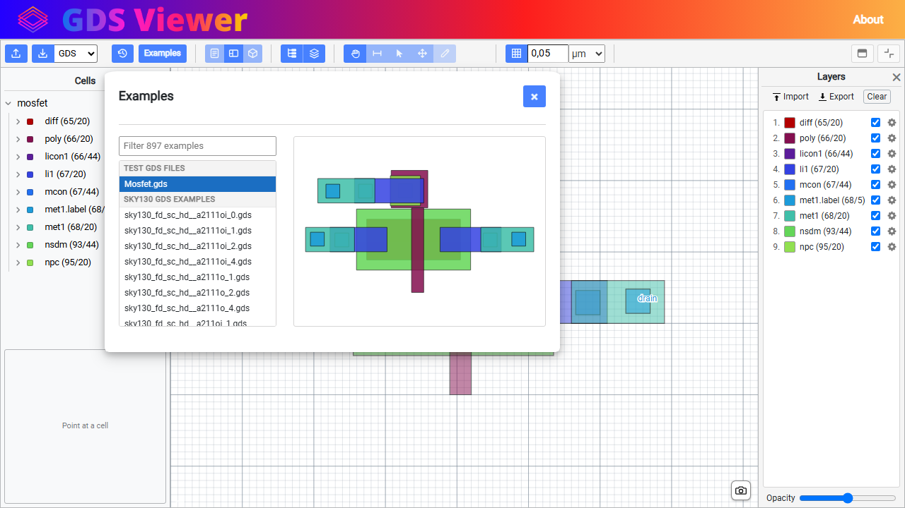

The list is filtered as you type and each row previews as you point at it, so a cell can be found by looking
rather than by remembering its name. Choosing one puts it in the address — `?file=sky130_fd_sc_hd__nand2_1` —
so it can be bookmarked or sent to someone, and the QR button carries it onto a phone.

Uploading clears that, since a file off your own machine is not something a link can reach.

## The 2D editor

The layout as SVG: drag to pan, scroll to zoom, adjustable opacity so stacked layers can be seen through.
Twenty thousand shapes pan at the screen's own frame rate.


`TEXT` elements are drawn as pin labels in their layer's color — `gate`, `source` and `drain` above — and
justified about their anchor the way the file asks.

A real standard cell is denser, and the same view holds it:

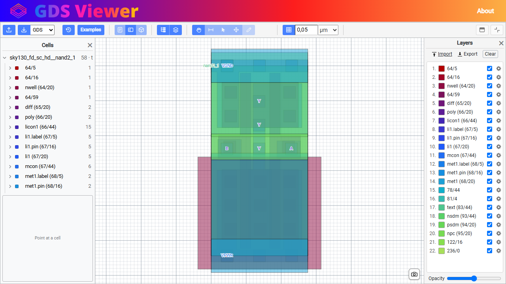

Twenty-two layers, pins named `A`, `B`, `Y`, `VPWR` and `VGND`, all of it drawn from the file's own numbers.

## Layers

**A layer is a layer/datatype pair**, the way every layout tool treats it — so `67/20` and `67/5` are separate
rows with their own colors, rather than one "layer 67" hiding drawn geometry and pins together.

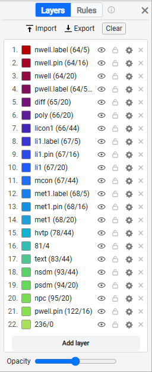

Each row can be switched off, renamed, recolored, hatched, given a role and given a real height and thickness:

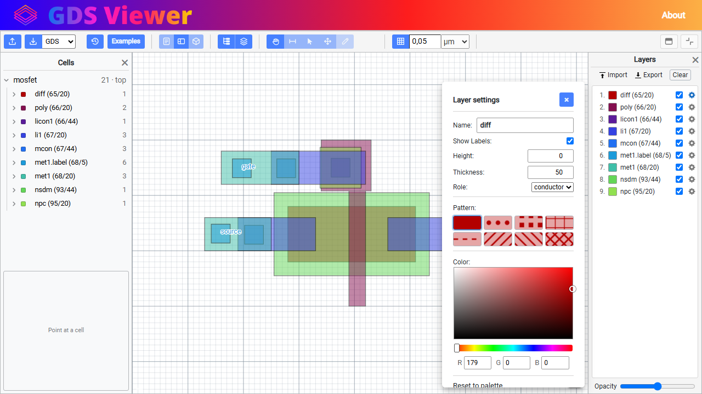

**Nothing in a GDSII file says what its layers mean.** `65/20` is a number; that it is diffusion is PDK data,
which is why KLayout wants a `.lyp` and Magic its techfile. So the names above came from a layermap — a CSV of
`layer,datatype,name` with further columns for color, height, thickness, role and fill — loaded with
**Import**, or from `?layermap=` in the address. **Export** hands back the open file's own layers in that
format, every column filled in, so a mapping is edited rather than typed from nothing.

Names persist between visits and across files, since the numbers mean the same thing throughout a technology.

The heading above the list is a switch: the same panel also holds the [design rules](#design-rules) the
layout is checked against, and only one of the two is ever wanted at a time.

### Fill patterns

Color runs out before layers do. A file with twenty-two of them has shades that are genuinely hard to tell
apart, so a layer can be given a **hatch** — dots, a grid, diagonals, crosshatch — drawn over its color. The
marks can be given a color of their own and a size in screen pixels, because a stipple is judged at the size
it is actually seen at rather than in the layout's units.

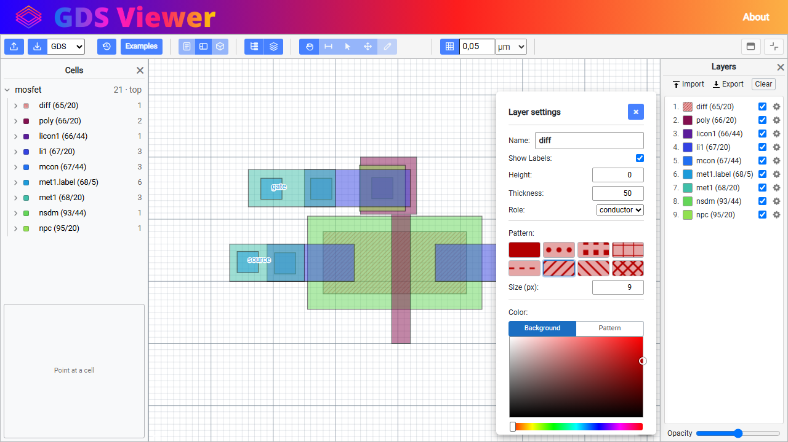

## Design rules

**The same panel, showing what the layout is allowed to be rather than what it is.** The heading is a pair
of names with the live one lit — press *Rules* and the deck comes up, press *Layers* and the rows come back.
They are never both wanted at once, so they share one panel rather than taking the width twice over.

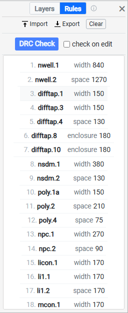

A **deck** is a small text file you supply: `width`, `space`, `enclosure`, `area`, `density` and off-grid
rules over layers the deck itself derives. **There is no standard file to download** — design rules have no
interchange format, so a foundry supporting three tools ships three separately maintained decks and nothing
converts between them. **Load sky130A example** brings up a working 30-rule starter deck; **Import** takes
your own, and **Export** hands back the text that came in rather than the parse printed out, so comments and
blank lines survive the round trip.

**DRC Check** runs it. **check on edit** runs it again after every change — and with it off, an edit *takes
the last result off the drawing* rather than leaving it: a marker is a claim about where something is, and
the moment the geometry under it moves the claim is about a layout that no longer exists.

What it finds is marked on the drawing, counted per rule, and said in one line over the view:

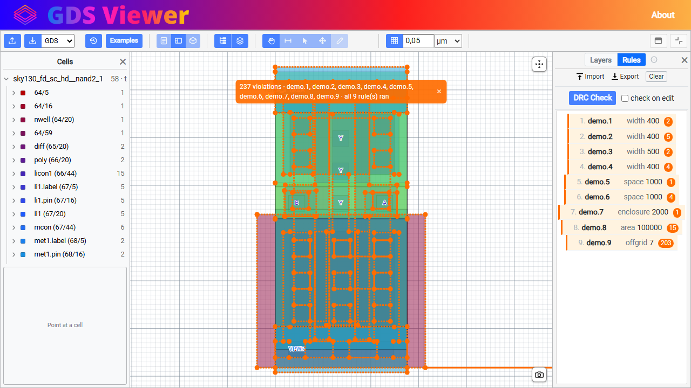

Every fault is drawn in the same orange as the rule row that found it, so the list and the marks read as one
thing. Clicking a flagged row frames the view on the first fault under it.

**A rule this build cannot measure is refused by name, not skipped.** It stays in the list, marked *not
measurable*, and every result from that deck says *"not fully checked"* — because a count of faults is only
an answer when every rule actually ran. That is the whole reason the format is a fixed vocabulary rather
than an expression language.

> **Not a signoff tool.** It catches the obvious against the rules you give it. The picture above uses a
> deliberately failing deck, because the bundled cells are signed-off layout and a correct deck finds
> nothing in them — the right answer, and a poor demonstration.

The ⓘ beside the heading explains all of this in the app, and hands you a guide written to be given to an AI
along with your PDK's rule document — see [WRITING-A-DECK.md](../wwwroot/resources/WRITING-A-DECK.md). The
same check runs without a browser: `gds drc cell.gds --deck sky130A.drc`.

## The cell tree

The file's own structure, docked down the side: every cell, what places it, and what is in it — down to the
individual shapes and where they sit.

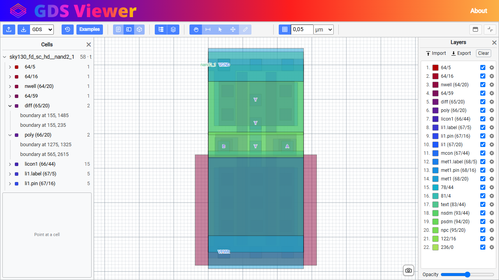

A cell placed by two different parents appears under both, and is marked the second time. That is where this
parts company with a folder tree: a directory is in one place, and a GDS cell is genuinely shared, so showing
it once would mean picking a parent to call the real one.

Right-clicking a row offers rename, copy and delete.

## Selecting and editing

Click a shape and the panel says what it is: its layer, the cell it lives in, its corner count, its area in
both units, where it sits and how big it is — in microns, typed and re-typed to move or resize it exactly.

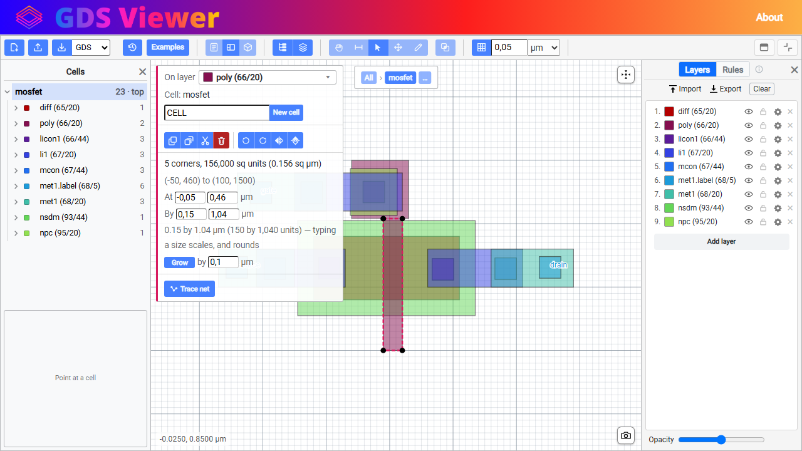

From there: copy, cut, delete, four kinds of turn, grow or shrink by a number, group into a new cell, and
**Trace net**. Drag a band across several and the panel gains combine, line up and space out.

**Editing happens in a cell.** A shape on screen may be one of a thousand instances, and moving it moves all
thousand — so the breadcrumb above the view says which cell the edit will land in, and the layout around it is
drawn faded because it is not what the pointer is for.

Every edit is undoable, and **the undo stack survives a refresh**: close the tab mid-edit, come back, and it is
still there to take back.

## Drawing

Five shapes under the pencil — rectangle, polygon, ellipse, path, label — each drawn as well as named, because
the shapes those five words name are the one thing about them that can be shown rather than said.

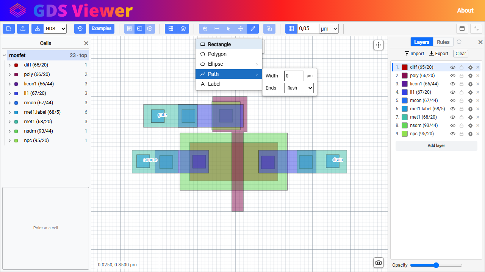

A shape's own settings hang off its own row: a path has a width and an end style, an ellipse a side count. They
appear when you point at the row that has them, rather than sitting in the toolbar asking a question about
paths at all times.

**A layout format has no curves.** GDSII knows boundaries and paths and nothing else, so an ellipse is a
many-sided polygon and how many sides is a decision rather than a detail — which is why the count is a control,
and why it says what it costs: at 64 sides each one falls about a tenth of a percent of the radius inside a
true curve.

A label is typed where it lands rather than into a box in the toolbar, and a path is clicked turn by turn and
drawn at its real width.

## The grid

A grid to see and to snap to, in real units. Below, the box reads `0,5 µm`, and the dropdown beside it takes
nanometers, microns, millimeters or raw database units.

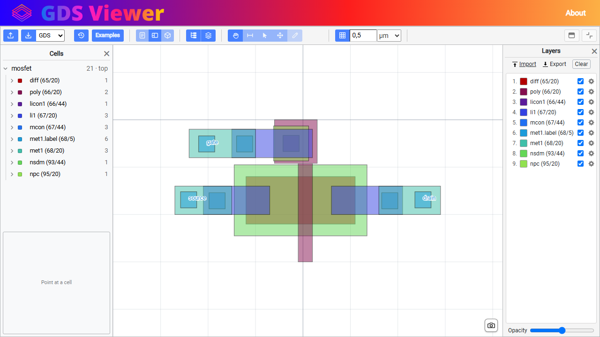

It **starts at the file's own grid** rather than at a round number somebody picked: a layout drawn on 5
database units gets a 5-unit grid, so the first thing you draw lands where the rest of the file already is.
Drawing can also snap to what is already there — a corner or an edge of a neighboring shape.

## Measuring

The ruler: drag from anywhere to anywhere, and it reads the distance in database units and in microns, with
the two deltas underneath. Below, `2102.38 units (2.1024 µm)` across `dx 1900 dy 900`.

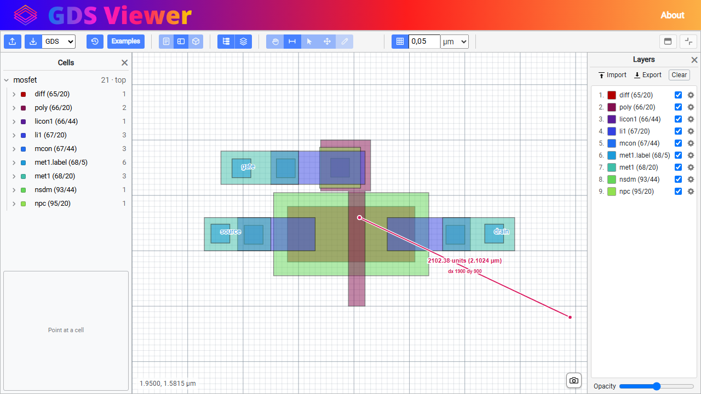

The deltas follow the *file* rather than the picture. This view maps GDSII's upward Y straight onto SVG's
downward Y, so what is drawn is flipped and a point that looks higher has the smaller number — a measurement
agreeing with the picture would disagree with every coordinate in the text view and in the download.

The same measurement is [available from the command line](CLI.md#gds-measure), computed the same way.

## Tracing a net

Choose a shape on a conductor and **Trace net** walks everything electrically joined to it — up through vias,
across layers, as far as the connection goes. Below: six shapes across `66/20`, `66/44`, `67/20`, `67/44` and
`68/20`, and the label sitting on them says the net is `"gate"`.

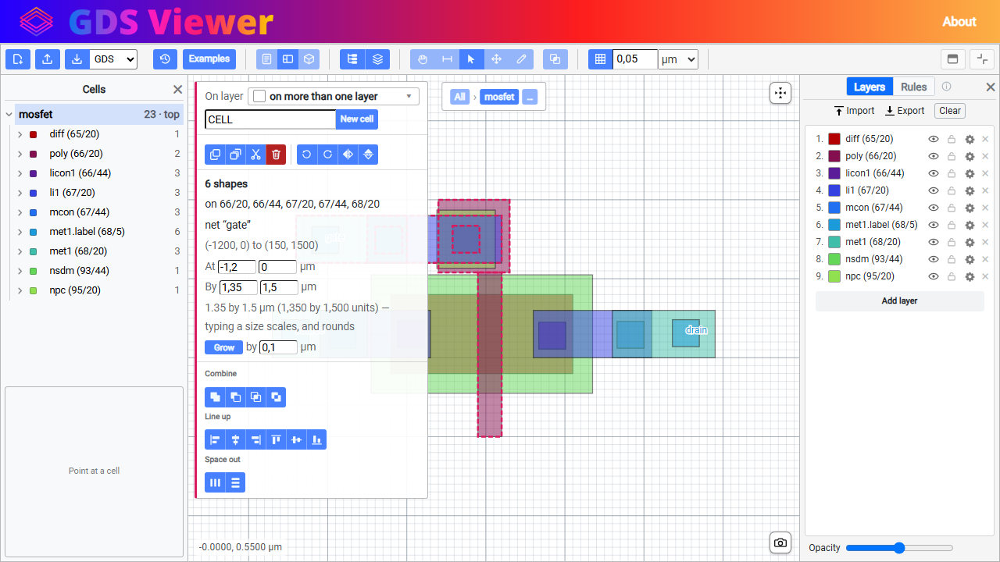

**It needs a layermap.** Nothing in a GDSII file records which of its numbers carry a net and which join what
they overlap, so without the `role` column no layer takes part and the button grays out with a tooltip saying
why. The mapping the app ships with covers the bundled examples, which is why the button is live here.

The net comes back as an ordinary **selection**, so everything that already works on one works on it.

## The 3D view

Every layer extruded to its thickness and stacked in space — orbit it, drag it, and pull the **Distance**
slider to spread the stack out or close it up. The slider moves the layers as you drag rather than when you
let go.


With a layermap carrying real heights and thicknesses, that stack is the wafer's rather than an even spacing:
a contact sits between the two layers it joins because the process table says where it is.

Pin labels come too, as camera-facing billboards so they stay readable from any angle. Scene backgrounds and a
cinematic orbit are in the toolbar, along with **STL, OBJ and GLTF export** — and **VR and AR** buttons, which
say `NOT SUPPORTED` on a machine with no headset, as above.

## The text editor

The raw record stream, one record per line, in a Monaco editor with GDSII syntax highlighting and per-record
autocomplete. `HEADER`, `BGNLIB`, `LIBNAME`, `UNITS`, then every structure and every element.


**It is editable and it saves back into the file.** Change a coordinate, save, and the layout redraws from it;
download and you get a real GDSII file with the change in it. A line that cannot be read is refused with its
line number and the file is left untouched — the whole save is refused rather than half applied, so a mistake
costs the save and not the layout.

Reading it is worth it on its own: this is what the format actually is, and every other view in the app is
built from these records.

## Formats in and out

Three formats, read and written, all through the same model:

| | In | Out |
|---|---|---|
| **GDSII** | ✓ | ✓ byte-exact for a file read in |
| **OASIS** (SEMI P39) | ✓ | ✓ hierarchy kept |
| **DXF** | ✓ text and binary | ✓ release 12 |

**Which format a file is comes off its first bytes rather than its extension**, so a `.oas` mailed as `.gds`
still opens. The dropdown beside the download button chooses what comes back out, starting on whichever the
file arrived as — so opening a `.gds` and saving it as `.oas` is a conversion, and so is the reverse.

Cells stay cells. The hierarchy is kept rather than flattened, which is most of the reason to write OASIS at
all.

The 2D view also downloads as **SVG**, and the 3D view as **STL, OBJ or GLTF**.

## Coming back later

Close the tab, come back, and the file is still open — with your edit in it, your layers still hidden, named
and colored, the sliders where you left them, and undo still able to take the edit back. Kept in your browser
in IndexedDB; nothing is uploaded.

**History** beside Examples lists the files you have opened, so a file you uploaded an hour ago is one click
away rather than gone.

It is an installable **PWA** with no CDN dependencies — Monaco and three.js are vendored into the app — so it
keeps working offline once installed.

## Embedding, and the command line

The app drops into somebody else's page in an `<iframe>` with its whole opening state set from the address —
which file, which view, how much of the app is offered, the grid, the tool in hand, your own files in the
picker, and a layermap to name the layers. See [Embedding](../README.md#embedding) for every parameter and an
iframe to copy.

And everything here that is not a gesture over a picture is available from a terminal: `gds` reads, checks,
names layers, draws, extrudes, combines, converts, lists cells, traces nets and measures. See
[the CLI guide](CLI.md).
